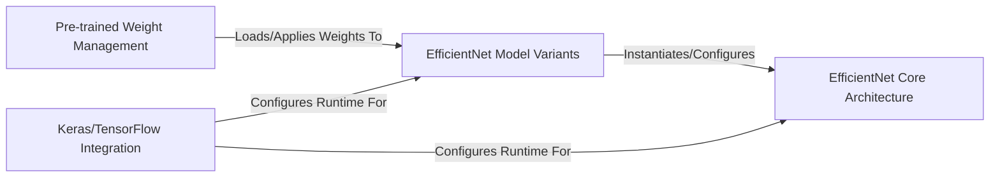

## Details

The `efficientnet` project provides a robust, modular architecture for deploying EfficientNet models within Keras and TensorFlow. At its core, the **EfficientNet Core Architecture** defines the fundamental model structure. This blueprint is then specialized by **EfficientNet Model Variants**, which offer pre-configured models (B0-B7, L2) tailored for different computational needs. To enable immediate use, the **Pre-trained Weight Management** component handles the crucial task of loading and applying pre-trained weights, ensuring models are ready for inference or fine-tuning. Finally, the **Keras/TensorFlow Integration** component acts as an essential bridge, registering custom layers and activations to guarantee the models function seamlessly within the Keras/TensorFlow ecosystem. This design promotes high reusability and simplifies the integration of state-of-the-art EfficientNet models into various AI/ML applications.

### EfficientNet Core Architecture [[Expand]](./EfficientNet_Core_Architecture.md)
Defines the foundational design principles of EfficientNet, including compound scaling and core building blocks.

**Related Classes/Methods**:

- <a href="https://github.com/qubvel/efficientnet/blob/master/efficientnet/model.py#L248-L460" target="_blank" rel="noopener noreferrer">`EfficientNet`:248-460</a>
- <a href="https://github.com/qubvel/efficientnet/blob/master/efficientnet/model.py#L161-L245" target="_blank" rel="noopener noreferrer">`mb_conv_block`:161-245</a>
- <a href="https://github.com/qubvel/efficientnet/blob/master/efficientnet/model.py#L143-L152" target="_blank" rel="noopener noreferrer">`round_filters`:143-152</a>
- <a href="https://github.com/qubvel/efficientnet/blob/master/efficientnet/model.py#L155-L158" target="_blank" rel="noopener noreferrer">`round_repeats`:155-158</a>
- <a href="https://github.com/qubvel/efficientnet/blob/master/efficientnet/model.py#L99-L117" target="_blank" rel="noopener noreferrer">`get_swish`:99-117</a>

### EfficientNet Model Variants
Pre-configured instantiations of the EfficientNet core model (e.g., B0-B7, L2) with optimized parameters.

**Related Classes/Methods**:

- <a href="https://github.com/qubvel/efficientnet/blob/master/efficientnet/keras.py" target="_blank" rel="noopener noreferrer">`EfficientNetB0`</a>
- <a href="https://github.com/qubvel/efficientnet/blob/master/efficientnet/keras.py" target="_blank" rel="noopener noreferrer">`EfficientNetB1`</a>
- <a href="https://github.com/qubvel/efficientnet/blob/master/efficientnet/keras.py" target="_blank" rel="noopener noreferrer">`EfficientNetB2`</a>
- <a href="https://github.com/qubvel/efficientnet/blob/master/efficientnet/keras.py" target="_blank" rel="noopener noreferrer">`EfficientNetB3`</a>
- <a href="https://github.com/qubvel/efficientnet/blob/master/efficientnet/keras.py" target="_blank" rel="noopener noreferrer">`EfficientNetB4`</a>
- <a href="https://github.com/qubvel/efficientnet/blob/master/efficientnet/keras.py" target="_blank" rel="noopener noreferrer">`EfficientNetB5`</a>
- <a href="https://github.com/qubvel/efficientnet/blob/master/efficientnet/keras.py" target="_blank" rel="noopener noreferrer">`EfficientNetB6`</a>
- <a href="https://github.com/qubvel/efficientnet/blob/master/efficientnet/keras.py" target="_blank" rel="noopener noreferrer">`EfficientNetB7`</a>
- <a href="https://github.com/qubvel/efficientnet/blob/master/efficientnet/keras.py" target="_blank" rel="noopener noreferrer">`EfficientNetL2`</a>

### Pre-trained Weight Management
Manages the loading, grouping, and application of pre-trained model weights from TensorFlow checkpoints.

**Related Classes/Methods**:

- <a href="https://github.com/qubvel/efficientnet/blob/master/scripts/load_efficientnet.py#L90-L118" target="_blank" rel="noopener noreferrer">`convert_tensorflow_model`:90-118</a>
- <a href="https://github.com/qubvel/efficientnet/blob/master/scripts/load_efficientnet.py#L79-L87" target="_blank" rel="noopener noreferrer">`load_weights`:79-87</a>
- <a href="https://github.com/qubvel/efficientnet/blob/master/scripts/load_efficientnet.py#L42-L76" target="_blank" rel="noopener noreferrer">`group_weights`:42-76</a>
- <a href="https://github.com/qubvel/efficientnet/blob/master/scripts/load_efficientnet.py#L27-L39" target="_blank" rel="noopener noreferrer">`_get_model_by_name`:27-39</a>

### Keras/TensorFlow Integration
Handles the registration of custom objects required by EfficientNet models within Keras and TensorFlow.

**Related Classes/Methods**:

- <a href="https://github.com/qubvel/efficientnet/blob/master/efficientnet/__init__.py#L62-L74" target="_blank" rel="noopener noreferrer">`init_keras_custom_objects`:62-74</a>
- <a href="https://github.com/qubvel/efficientnet/blob/master/efficientnet/__init__.py#L77-L86" target="_blank" rel="noopener noreferrer">`init_tfkeras_custom_objects`:77-86</a>
- <a href="https://github.com/qubvel/efficientnet/blob/master/efficientnet/__init__.py#L36-L46" target="_blank" rel="noopener noreferrer">`inject_keras_modules`:36-46</a>
- <a href="https://github.com/qubvel/efficientnet/blob/master/efficientnet/__init__.py#L49-L59" target="_blank" rel="noopener noreferrer">`inject_tfkeras_modules`:49-59</a>

### [FAQ](https://github.com/CodeBoarding/GeneratedOnBoardings/tree/main?tab=readme-ov-file#faq)