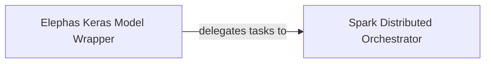

## Details

The Elephas Keras API subsystem is primarily defined by the elephas.ml_model and elephas.spark_model modules. These modules encapsulate the core logic for integrating Keras models with Apache Spark for distributed deep learning.

### Elephas Keras Model Wrapper
This component acts as the user-facing interface for integrating Keras models into the Elephas framework. It is responsible for wrapping standard Keras models, enabling their serialization and deserialization, and preparing them for distributed processing. It also provides high-level APIs for tasks such as feature extraction and prediction within the Elephas context, abstracting away the complexities of Spark integration from the Keras model definition.

**Related Classes/Methods**:

- <a href="https://github.com/maxpumperla/elephas/blob/master/elephas/ml_model.py#L24-L126" target="_blank" rel="noopener noreferrer">`ElephasEstimator`:24-126</a>
- <a href="https://github.com/maxpumperla/elephas/blob/master/elephas/ml_model.py#L135-L248" target="_blank" rel="noopener noreferrer">`ElephasTransformer`:135-248</a>

### Spark Distributed Orchestrator
This is the core orchestration component responsible for managing and executing distributed deep learning tasks across the Spark cluster. It handles the distribution of Keras models and data partitions to worker nodes, initiates Spark jobs (e.g., training, prediction), and aggregates results (e.g., updated model weights, predictions) from the workers. It provides direct integration with Spark's RDD, MLlib, and ML APIs, serving as the bridge between the Keras model and the Spark distributed environment.

**Related Classes/Methods**:

- <a href="https://github.com/maxpumperla/elephas/blob/master/elephas/spark_model.py#L23-L264" target="_blank" rel="noopener noreferrer">`SparkModel`:23-264</a>
- <a href="https://github.com/maxpumperla/elephas/blob/master/elephas/spark_model.py#L280-L320" target="_blank" rel="noopener noreferrer">`SparkMLlibModel`:280-320</a>
- <a href="https://github.com/maxpumperla/elephas/blob/master/elephas/spark_model.py#L108-L110" target="_blank" rel="noopener noreferrer">`master_network`:108-110</a>

### [FAQ](https://github.com/CodeBoarding/GeneratedOnBoardings/tree/main?tab=readme-ov-file#faq)