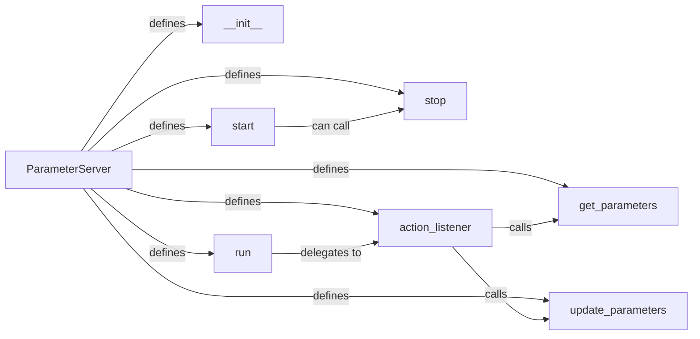

## Details

The `Parameter Server` subsystem is a critical component within Elephas, designed to manage and synchronize model parameters in a distributed deep learning environment. It embodies the central coordination point for data parallelism, ensuring all worker nodes operate with a consistent and up-to-date global model.

### ParameterServer
The core entity of the subsystem, responsible for centralizing and synchronizing model parameters (weights and gradients) across worker nodes. It acts as the authoritative source for the global model state, enabling data parallelism by providing workers with the current model and integrating their computed updates.

**Related Classes/Methods**:

- <a href="https://github.com/maxpumperla/elephas/blob/master/elephas/parameter/server.py" target="_blank" rel="noopener noreferrer">`elephas.parameter.server.ParameterServer`</a>

### __init__
Initializes the `ParameterServer` instance. This includes setting up the underlying communication mechanism (e.g., a Flask web service) that will listen for incoming requests from worker nodes, and initializing the model parameters.

**Related Classes/Methods**:

- <a href="https://github.com/maxpumperla/elephas/blob/master/elephas/parameter/server.py" target="_blank" rel="noopener noreferrer">`elephas.parameter.server.ParameterServer:__init__`</a>

### start
Initiates the server's operation, bringing it online to actively listen for and process parameter requests from worker nodes. It sets up the server to begin accepting connections.

**Related Classes/Methods**:

- <a href="https://github.com/maxpumperla/elephas/blob/master/elephas/parameter/server.py" target="_blank" rel="noopener noreferrer">`elephas.parameter.server.ParameterServer:start`</a>

### stop
Halts the server's operation, ensuring a graceful shutdown. This involves releasing resources and closing communication channels to prevent leaks or orphaned processes.

**Related Classes/Methods**:

- <a href="https://github.com/maxpumperla/elephas/blob/master/elephas/parameter/server.py" target="_blank" rel="noopener noreferrer">`elephas.parameter.server.ParameterServer:stop`</a>

### run
Executes the server's continuous operation loop. It is responsible for keeping the server alive, constantly listening for incoming requests, and delegating their processing to the appropriate handlers.

**Related Classes/Methods**:

- <a href="https://github.com/maxpumperla/elephas/blob/master/elephas/parameter/server.py" target="_blank" rel="noopener noreferrer">`elephas.parameter.server.ParameterServer:run`</a>

### action_listener
Acts as the primary request handler for incoming HTTP requests from worker nodes. It interprets the request's intent, determining whether it's for retrieving the current model parameters or for updating them with gradients/weights from a worker.

**Related Classes/Methods**:

- <a href="https://github.com/maxpumperla/elephas/blob/master/elephas/parameter/server.py" target="_blank" rel="noopener noreferrer">`elephas.parameter.server.ParameterServer:action_listener`</a>

### get_parameters
Provides the current global model parameters (weights) to requesting worker nodes. This ensures that all workers are training with the most up-to-date model state, crucial for synchronized distributed training.

**Related Classes/Methods**:

- <a href="https://github.com/maxpumperla/elephas/blob/master/elephas/parameter/server.py" target="_blank" rel="noopener noreferrer">`elephas.parameter.server.ParameterServer:get_parameters`</a>

### update_parameters
Incorporates parameter updates (e.g., gradients or updated weights) received from worker nodes into the global model state. This is crucial for synchronizing the model across the distributed training process, typically by applying an aggregation strategy.

**Related Classes/Methods**:

- <a href="https://github.com/maxpumperla/elephas/blob/master/elephas/parameter/server.py" target="_blank" rel="noopener noreferrer">`elephas.parameter.server.ParameterServer:update_parameters`</a>

### [FAQ](https://github.com/CodeBoarding/GeneratedOnBoardings/tree/main?tab=readme-ov-file#faq)