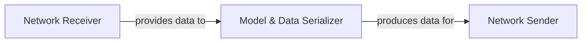

## Details

The `Serialization & Communication Layer` subsystem is critical for enabling distributed deep learning in Elephas by managing the conversion of Keras models and data for network transfer and handling all inter-node communication within the Spark ecosystem.

### Model & Data Serializer
Responsible for converting Keras models, weights, gradients, and training configurations into a compact, network-transferable byte format. It also handles the deserialization of incoming byte streams back into usable Python/Keras objects. This is fundamental for packaging deep learning artifacts for distributed execution across Spark nodes.

**Related Classes/Methods**:

- <a href="https://github.com/maxpumperla/elephas/blob/master/elephas/utils/serialization.py" target="_blank" rel="noopener noreferrer">`elephas.utils.serialization`</a>

### Network Sender
Manages the transmission of serialized data over network sockets. It ensures that the byte streams generated by the `Model & Data Serializer` are reliably sent from one node (e.g., Spark driver) to another (e.g., Spark worker). This component facilitates the outbound flow of models and training instructions.

**Related Classes/Methods**:

- <a href="https://github.com/maxpumperla/elephas/blob/master/elephas/utils/sockets.py" target="_blank" rel="noopener noreferrer">`elephas.utils.sockets:send`</a>

### Network Receiver
Orchestrates the reception of incoming serialized data from network sockets. It handles the listening process and manages the flow of incoming byte streams from remote nodes (e.g., Spark workers sending gradients or updated weights back to the driver). This component includes internal mechanisms like `_receive_all` to ensure complete message reception.

**Related Classes/Methods**:

- <a href="https://github.com/maxpumperla/elephas/blob/master/elephas/utils/sockets.py" target="_blank" rel="noopener noreferrer">`elephas.utils.sockets:receive`</a>
- <a href="https://github.com/maxpumperla/elephas/blob/master/elephas/utils/sockets.py" target="_blank" rel="noopener noreferrer">`elephas.utils.sockets:_receive_all`</a>

### [FAQ](https://github.com/CodeBoarding/GeneratedOnBoardings/tree/main?tab=readme-ov-file#faq)