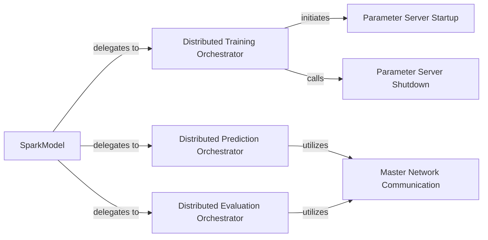

## Details

The `Spark Driver Orchestrator` subsystem in Elephas is responsible for managing the overall distributed deep learning workflow from the Spark driver. This includes orchestrating data distribution, broadcasting models, and managing the lifecycle of the Parameter Server, which is crucial for parameter synchronization during distributed training.

### SparkModel
The primary user-facing API and entry point for integrating Keras models with Spark. It encapsulates the Keras model and provides high-level methods for distributed training, prediction, and evaluation.

**Related Classes/Methods**:

- <a href="https://github.com/maxpumperla/elephas/blob/master/elephas/spark_model.py#L23-L264" target="_blank" rel="noopener noreferrer">`elephas.spark_model.SparkModel`:23-264</a>

### Distributed Training Orchestrator
The core orchestrator for the distributed model training workflow. It manages the entire training lifecycle from the Spark driver, including data partitioning, model distribution, and gradient aggregation.

**Related Classes/Methods**:

- <a href="https://github.com/maxpumperla/elephas/blob/master/elephas/spark_model.py" target="_blank" rel="noopener noreferrer">`elephas.spark_model.SparkModel._fit`</a>

### Distributed Prediction Orchestrator
The internal method responsible for orchestrating distributed predictions across the Spark cluster, applying the trained model to new data in parallel.

**Related Classes/Methods**:

- <a href="https://github.com/maxpumperla/elephas/blob/master/elephas/spark_model.py" target="_blank" rel="noopener noreferrer">`elephas.spark_model.SparkModel._predict`</a>

### Distributed Evaluation Orchestrator
The internal method responsible for orchestrating distributed model evaluation on the Spark cluster, assessing model performance on distributed datasets.

**Related Classes/Methods**:

- <a href="https://github.com/maxpumperla/elephas/blob/master/elephas/spark_model.py" target="_blank" rel="noopener noreferrer">`elephas.spark_model.SparkModel._evaluate`</a>

### Parameter Server Startup
Manages the startup of the Parameter Server on the Spark driver. This server is critical for sharing and synchronizing model parameters during distributed training.

**Related Classes/Methods**:

- <a href="https://github.com/maxpumperla/elephas/blob/master/elephas/spark_model.py" target="_blank" rel="noopener noreferrer">`elephas.spark_model.SparkModel.start_server`</a>

### Parameter Server Shutdown
Manages the graceful shutdown of the Parameter Server process on the Spark driver, ensuring proper resource release.

**Related Classes/Methods**:

- <a href="https://github.com/maxpumperla/elephas/blob/master/elephas/spark_model.py" target="_blank" rel="noopener noreferrer">`elephas.spark_model.SparkModel.stop_server`</a>

### Master Network Communication
A mechanism or component within `SparkModel` that facilitates distributed predictions and evaluations by providing model access or communication channels to worker nodes.

**Related Classes/Methods**:

- <a href="https://github.com/maxpumperla/elephas/blob/master/elephas/spark_model.py" target="_blank" rel="noopener noreferrer">`elephas.spark_model.SparkModel.master_network`</a>

### [FAQ](https://github.com/CodeBoarding/GeneratedOnBoardings/tree/main?tab=readme-ov-file#faq)