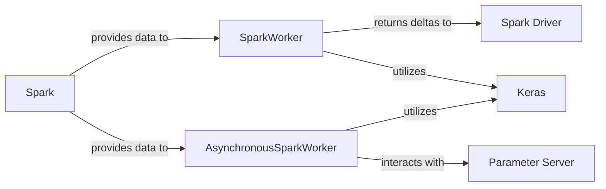

## Details

The core of this distributed deep learning subsystem revolves around two primary worker types: `SparkWorker` for synchronous training and `AsynchronousSparkWorker` for asynchronous training, both operating within the `Spark` distributed computing environment. `Spark` provides the necessary data partitions to these workers. The `SparkWorker` performs local training on its data partition, utilizing `Keras` for model operations, and then sends calculated weight deltas back to the `Spark Driver` for aggregation. In contrast, the `AsynchronousSparkWorker`, also leveraging `Keras` for training, interacts directly with a `Parameter Server` to fetch the latest model parameters and push its updates, enabling a more decoupled and potentially faster training paradigm. This architecture efficiently distributes deep learning workloads across a Spark cluster, supporting both synchronous and asynchronous training strategies.

### SparkWorker
This component is responsible for executing synchronous deep learning training on a specific data partition on a Spark worker node. It deserializes the Keras model, compiles it, sets its weights, performs local training, and calculates the weight deltas (gradients) to be sent back to the Spark Driver for aggregation.

**Related Classes/Methods**:

- <a href="https://github.com/maxpumperla/elephas/blob/master/elephas/worker.py#L11-L49" target="_blank" rel="noopener noreferrer">`SparkWorker`:11-49</a>

### AsynchronousSparkWorker
This component handles asynchronous deep learning training on a data partition on a Spark worker node. Unlike the synchronous worker, it directly interacts with a Parameter Server to fetch the latest model parameters before training and push its calculated weight deltas after training, enabling more flexible and potentially faster distributed training.

**Related Classes/Methods**:

- <a href="https://github.com/maxpumperla/elephas/blob/master/elephas/worker.py#L52-L131" target="_blank" rel="noopener noreferrer">`AsynchronousSparkWorker`:52-131</a>

### Spark Driver
The central orchestrator of Spark applications, responsible for coordinating tasks, aggregating results (such as weight deltas from SparkWorker instances), and managing the overall distributed training process.

**Related Classes/Methods**: _None_

### Spark
The distributed computing framework that provides the environment and manages data partitions across worker nodes, enabling `SparkWorker` and `AsynchronousSparkWorker` components to process data in parallel.

**Related Classes/Methods**: _None_

### Keras
A high-level deep learning API utilized by both `SparkWorker` and `AsynchronousSparkWorker` for defining, compiling, and training neural network models within the distributed environment.

**Related Classes/Methods**: _None_

### Parameter Server [[Expand]](./Parameter_Server.md)
A dedicated component in asynchronous distributed training that maintains and manages the global model parameters. It serves as a central repository for `AsynchronousSparkWorker` instances to fetch the latest model weights and push their calculated updates.

**Related Classes/Methods**: _None_

### [FAQ](https://github.com/CodeBoarding/GeneratedOnBoardings/tree/main?tab=readme-ov-file#faq)