```mermaid
graph LR
    Elephas_Keras_API["Elephas Keras API"]
    Spark_Driver_Orchestrator["Spark Driver Orchestrator"]
    Parameter_Server["Parameter Server"]
    Spark_Worker_Executor["Spark Worker Executor"]
    Serialization_Communication_Layer["Serialization & Communication Layer"]
    Elephas_Keras_API -- "passes Keras Model Definition and initiates Distributed Task" --> Spark_Driver_Orchestrator
    Spark_Driver_Orchestrator -- "starts, manages, and broadcasts initial model to" --> Parameter_Server
    Spark_Driver_Orchestrator -- "distributes data partitions and orchestrates training/inference for" --> Spark_Worker_Executor
    Spark_Worker_Executor -- "sends gradient updates to and fetches updated parameters from" --> Parameter_Server
    Parameter_Server -- "uses for parameter synchronization communication" --> Serialization_Communication_Layer
    Serialization_Communication_Layer -- "is used by for parameter synchronization communication" --> Parameter_Server
    Spark_Worker_Executor -- "uses for model/data transfer and parameter synchronization" --> Serialization_Communication_Layer
    Serialization_Communication_Layer -- "is used by for model/data transfer and parameter synchronization" --> Spark_Worker_Executor
    Spark_Driver_Orchestrator -- "uses for model serialization/deserialization" --> Serialization_Communication_Layer
    click Elephas_Keras_API href "https://github.com/CodeBoarding/GeneratedOnBoardings/blob/main/elephas/Elephas_Keras_API.md" "Details"
    click Spark_Driver_Orchestrator href "https://github.com/CodeBoarding/GeneratedOnBoardings/blob/main/elephas/Spark_Driver_Orchestrator.md" "Details"
    click Parameter_Server href "https://github.com/CodeBoarding/GeneratedOnBoardings/blob/main/elephas/Parameter_Server.md" "Details"
    click Spark_Worker_Executor href "https://github.com/CodeBoarding/GeneratedOnBoardings/blob/main/elephas/Spark_Worker_Executor.md" "Details"
    click Serialization_Communication_Layer href "https://github.com/CodeBoarding/GeneratedOnBoardings/blob/main/elephas/Serialization_Communication_Layer.md" "Details"
```

## Details

The `elephas` architecture facilitates distributed deep learning by integrating Keras with Apache Spark. It operates on a client-server model where the Spark Driver Orchestrator acts as the central coordinator, managing the lifecycle of a dedicated Parameter Server and distributing tasks to Spark Worker Executors. Users interact through the Elephas Keras API to define their models, which are then prepared for distributed execution. The Parameter Server centralizes model parameter synchronization, enabling workers to share gradient updates and fetch global model states. All data and model transfers between these distributed components are underpinned by a robust Serialization & Communication Layer, ensuring efficient and scalable deep learning training and inference within the Spark ecosystem.

### Elephas Keras API [[Expand]](./Elephas_Keras_API.md)
The user-facing interface for defining and initiating distributed Keras models and tasks.

**Related Classes/Methods**:

- <a href="https://github.com/maxpumperla/elephas/blob/master/elephas/ml_model.py" target="_blank" rel="noopener noreferrer">`elephas.ml_model`</a>
- <a href="https://github.com/maxpumperla/elephas/blob/master/elephas/spark_model.py" target="_blank" rel="noopener noreferrer">`elephas.spark_model`</a>

### Spark Driver Orchestrator [[Expand]](./Spark_Driver_Orchestrator.md)
Manages the overall distributed deep learning workflow from the Spark driver, including data distribution, model broadcasting, and Parameter Server lifecycle.

**Related Classes/Methods**:

- <a href="https://github.com/maxpumperla/elephas/blob/master/elephas/spark_model.py" target="_blank" rel="noopener noreferrer">`elephas.spark_model`</a>

### Parameter Server [[Expand]](./Parameter_Server.md)
A dedicated service for centralizing and synchronizing model parameters (weights and gradients) across worker nodes.

**Related Classes/Methods**:

- <a href="https://github.com/maxpumperla/elephas/blob/master/elephas/parameter/server.py" target="_blank" rel="noopener noreferrer">`elephas.parameter.server`</a>

### Spark Worker Executor [[Expand]](./Spark_Worker_Executor.md)
Executes local training or inference on data partitions on individual Spark worker nodes, interacting with the Parameter Server for parameter synchronization.

**Related Classes/Methods**:

- <a href="https://github.com/maxpumperla/elephas/blob/master/elephas/worker.py" target="_blank" rel="noopener noreferrer">`elephas.worker`</a>

### Serialization & Communication Layer [[Expand]](./Serialization_Communication_Layer.md)
Provides the necessary mechanisms for converting Keras models, weights, and data for network transfer, and handles all inter-component communication.

**Related Classes/Methods**:

- <a href="https://github.com/maxpumperla/elephas/blob/master/elephas/utils/serialization.py" target="_blank" rel="noopener noreferrer">`elephas.utils.serialization`</a>
- <a href="https://github.com/maxpumperla/elephas/blob/master/elephas/utils/sockets.py" target="_blank" rel="noopener noreferrer">`elephas.utils.sockets`</a>

### [FAQ](https://github.com/CodeBoarding/GeneratedOnBoardings/tree/main?tab=readme-ov-file#faq)