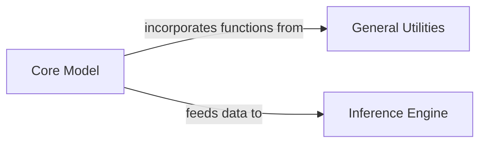

## Details

The Core Model component is fundamental to this project as it encapsulates the neural network architecture responsible for predicting protein structures. Its design follows the "Machine Learning Model Development and Inference" pattern by clearly separating the model's definition from other concerns.

### Core Model [[Expand]](./Core_Model.md)
This component defines the neural network architecture, including its layers, modules, and the forward pass logic. It's responsible for learning and predicting protein structures from input features. It leverages PyTorch and e3nn for building equivariant neural networks, which are crucial for handling 3D structural data.

**Related Classes/Methods**:

- `MLP` (43:43)
- `BesselBasis` (70:70)
- `RadialNN` (93:93)
- `LayerNorm` (139:139)
- `Emb` (172:172)

### General Utilities
Provides essential utility functions for calculations within the model's forward pass, such as computing structural metrics and loss functions.

**Related Classes/Methods**: _None_

### Inference Engine
Responsible for loading the trained Core Model and feeding it input data to predict protein structures.

**Related Classes/Methods**: _None_

### [FAQ](https://github.com/CodeBoarding/GeneratedOnBoardings/tree/main?tab=readme-ov-file#faq)