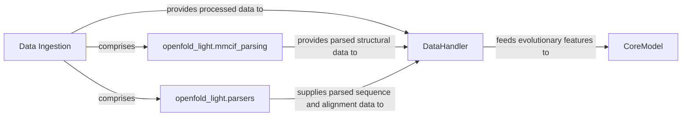

## Details

One paragraph explaining the functionality which is represented by this graph. What the main flow is and what is its purpose.

### Data Ingestion [[Expand]](./Data_Ingestion.md)
Responsible for the initial processing of raw biological data, involving parsing various file formats to extract essential information for downstream feature generation.

**Related Classes/Methods**: _None_

### openfold_light.mmcif_parsing
Module specifically designed for parsing Macromolecular Crystallographic Information File (MMCIF) data. It handles the complex structure of MMCIF files to extract atomic coordinates, chain identifiers, and other structural details of proteins. This is fundamental for processing experimental protein structures.

**Related Classes/Methods**: _None_

### openfold_light.parsers
Module provides general parsing capabilities for sequence and alignment data formats, such as FASTA, A3M, and Stockholm. It extracts sequence information, multiple sequence alignments (MSAs), and template hit data, which are critical for generating evolutionary features for protein folding models. It also includes functionality to convert Stockholm format to A3M.

**Related Classes/Methods**: _None_

### DataHandler
Component responsible for further processing of data, such as feature generation or protein object creation, after initial ingestion.

**Related Classes/Methods**: _None_

### CoreModel
Component that receives evolutionary features for protein folding models.

**Related Classes/Methods**: _None_

### [FAQ](https://github.com/CodeBoarding/GeneratedOnBoardings/tree/main?tab=readme-ov-file#faq)