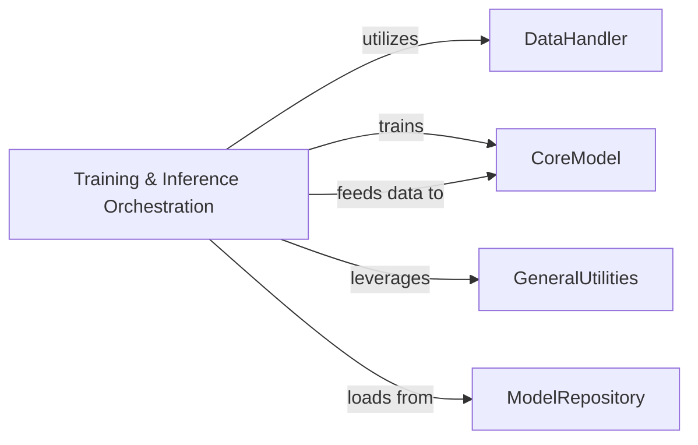

## Details

One paragraph explaining the functionality which is represented by this graph. What the main flow is and what is its purpose.

### Training & Inference Orchestration [[Expand]](./Training_Inference_Orchestration.md)
This component is responsible for orchestrating the entire machine learning workflow, encompassing both model training and inference. For training, it manages data loading, model optimization, loss calculation, and checkpointing. For inference, it handles loading trained models, preparing input data, executing predictions, and post-processing raw model outputs into structured protein data (e.g., PDB files). It acts as the primary control flow for the deep learning operations.

**Related Classes/Methods**:

- <a href="https://github.com/genentech/equifold/blob/main/run_inference.py#L1-L1" target="_blank" rel="noopener noreferrer">`run_inference.py` (1:1)</a>

### ModelRepository
Stores model configurations and weights, and saves trained model checkpoints.

**Related Classes/Methods**: _None_

### DataHandler
Handles data loading, preprocessing, and post-processing, including converting sequences to features and generating PDB files.

**Related Classes/Methods**:

- <a href="https://github.com/genentech/equifold/blob/main/utils_data.py#L1-L1" target="_blank" rel="noopener noreferrer">`utils_data.py` (1:1)</a>
- `sequence_to_feats` (1:1)
- `process_one` (1:1)
- `x_to_pdb` (1:1)

### CoreModel
Defines the neural network architecture and performs forward and backward passes for protein folding predictions.

**Related Classes/Methods**:

- <a href="https://github.com/genentech/equifold/blob/main/models.py#L1-L1" target="_blank" rel="noopener noreferrer">`models.py` (1:1)</a>
- `NN` (1:1)

### GeneralUtilities
Provides common helper functions for tasks like logging, metrics, coarse-graining, and other data transformations.

**Related Classes/Methods**: _None_

### [FAQ](https://github.com/CodeBoarding/GeneratedOnBoardings/tree/main?tab=readme-ov-file#faq)