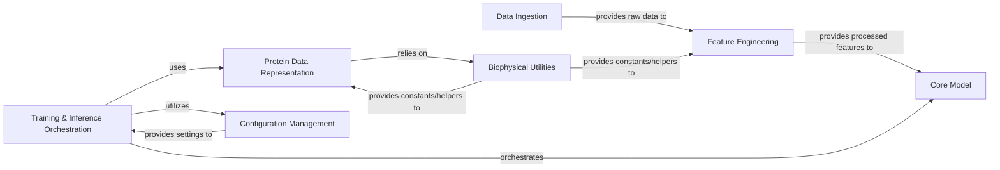

## Details

The `equifold` project, focused on Machine Learning Model Development and Inference in computational structural biology, exhibits a modular and data-centric architecture. The analysis of its Control Flow Graph (CFG) and source code reveals a clear separation of concerns, facilitating robust data pipelines and efficient model training/inference.

### Data Ingestion [[Expand]](./Data_Ingestion.md)
This component is responsible for parsing raw biological data from various file formats, including structural data (MMCIF) and sequence/alignment data (A3M, Stockholm, HHR). It extracts essential information such as atomic coordinates, chain identifiers, sequence data, and template hit information, preparing it for feature generation.

**Related Classes/Methods**:

- <a href="https://github.com/genentech/equifold/blob/main/openfold_light/mmcif_parsing.py#L1-L1" target="_blank" rel="noopener noreferrer">`openfold_light.mmcif_parsing` (1:1)</a>
- <a href="https://github.com/genentech/equifold/blob/main/openfold_light/parsers.py#L1-L1" target="_blank" rel="noopener noreferrer">`openfold_light.parsers` (1:1)</a>

### Feature Engineering [[Expand]](./Feature_Engineering.md)
This central component transforms the raw data ingested by the `Data Ingestion` module into a standardized set of numerical features suitable for the machine learning model. It generates sequence-based features, template features, and protein features from structural inputs, and prepares these as input tensors for the model.

**Related Classes/Methods**:

- <a href="https://github.com/genentech/equifold/blob/main/openfold_light/data_pipeline.py#L1-L1" target="_blank" rel="noopener noreferrer">`openfold_light.data_pipeline` (1:1)</a>

### Protein Data Representation
This component defines the internal data structures for representing protein information, including atoms, residues, and their coordinates. It also provides utilities for converting protein data to and from common formats (e.g., PDB strings) and for constructing protein objects from model predictions, facilitating downstream analysis and visualization.

**Related Classes/Methods**:

- <a href="https://github.com/genentech/equifold/blob/main/openfold_light/protein.py#L1-L1" target="_blank" rel="noopener noreferrer">`openfold_light.protein` (1:1)</a>

### Biophysical Utilities
This component serves as a repository for fundamental amino acid properties, stereochemical constants, and utility functions essential for structural calculations, data manipulation, and validation across the project. It provides foundational data and operations for other components.

**Related Classes/Methods**:

- <a href="https://github.com/genentech/equifold/blob/main/openfold_light/residue_constants.py#L1-L1" target="_blank" rel="noopener noreferrer">`openfold_light.residue_constants` (1:1)</a>

### Core Model [[Expand]](./Core_Model.md)
This is the heart of the machine learning system, defining the neural network architecture (e.g., OpenFold model). It encapsulates the layers, modules, and forward pass logic responsible for learning and predicting protein structures from the input features.

**Related Classes/Methods**:

- `openfold_light.model` (1:1)

### Training & Inference Orchestration [[Expand]](./Training_Inference_Orchestration.md)
This component manages the overall training and inference workflows. For training, it handles data loading, optimization, loss calculation, and model checkpointing. For inference, it orchestrates the prediction process, including loading models and running predictions on new data, and post-processes raw model outputs into structured protein data.

**Related Classes/Methods**:

- `openfold_light.train` (1:1)
- `openfold_light.inference` (1:1)
- `openfold_light.run_inference` (1:1)

### Configuration Management
This component centralizes the management of all configurable parameters for the project, including model hyperparameters, data paths, training settings, and inference options. It ensures that the system can be easily configured and adapted without modifying source code, promoting reproducibility.

**Related Classes/Methods**:

- `openfold_light.config` (1:1)

### [FAQ](https://github.com/CodeBoarding/GeneratedOnBoardings/tree/main?tab=readme-ov-file#faq)