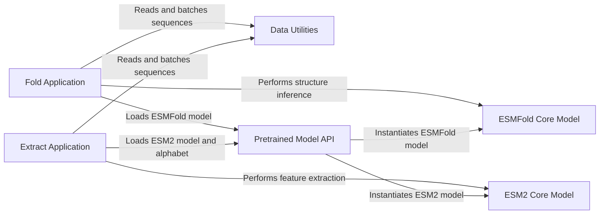

## Component Details

This system provides two main applications: protein structure prediction (Fold Application) and protein sequence feature extraction (Extract Application). Both applications leverage pre-trained ESM models and utilize shared data utilities for handling biological sequence data. The Fold Application specifically uses the ESMFold Core Model for structure inference, while the Extract Application uses the ESM2 Core Model for feature extraction. The Pretrained Model API acts as a central point for loading and initializing these models.

### Fold Application
The primary application for predicting protein structures using the ESMFold model. It handles command-line arguments, data input, model initialization, inference, and output generation.

**Related Classes/Methods**:

- <a href="https://github.com/facebookresearch/esm/blob/master/scripts/fold.py#L198-L201" target="_blank" rel="noopener noreferrer">`esm.scripts.fold.main` (198:201)</a>
- <a href="https://github.com/facebookresearch/esm/blob/master/scripts/fold.py#L124-L195" target="_blank" rel="noopener noreferrer">`esm.scripts.fold.run` (124:195)</a>
- <a href="https://github.com/facebookresearch/esm/blob/master/scripts/fold.py#L81-L121" target="_blank" rel="noopener noreferrer">`esm.scripts.fold.create_parser` (81:121)</a>
- <a href="https://github.com/facebookresearch/esm/blob/master/scripts/fold.py#L56-L62" target="_blank" rel="noopener noreferrer">`esm.scripts.fold.init_model_on_gpu_with_cpu_offloading` (56:62)</a>
- <a href="https://github.com/facebookresearch/esm/blob/master/scripts/fold.py#L37-L53" target="_blank" rel="noopener noreferrer">`esm.scripts.fold.enable_cpu_offloading` (37:53)</a>
- <a href="https://github.com/facebookresearch/esm/blob/master/scripts/fold.py#L65-L78" target="_blank" rel="noopener noreferrer">`esm.scripts.fold.create_batched_sequence_datasest` (65:78)</a>

### Extract Application
The primary application for extracting sequence representations and contacts from protein sequences using ESM models. It manages input data, model loading, batch processing, and saving extracted features.

**Related Classes/Methods**:

- <a href="https://github.com/facebookresearch/esm/blob/master/scripts/extract.py#L133-L136" target="_blank" rel="noopener noreferrer">`esm.scripts.extract.main` (133:136)</a>
- <a href="https://github.com/facebookresearch/esm/blob/master/scripts/extract.py#L62-L130" target="_blank" rel="noopener noreferrer">`esm.scripts.extract.run` (62:130)</a>
- <a href="https://github.com/facebookresearch/esm/blob/master/scripts/extract.py#L14-L59" target="_blank" rel="noopener noreferrer">`esm.scripts.extract.create_parser` (14:59)</a>

### Data Utilities
Provides core functionalities for handling biological sequence data, including reading FASTA files, creating batched datasets, and converting sequences for model input.

**Related Classes/Methods**:

- <a href="https://github.com/facebookresearch/esm/blob/master/esm/data.py#L338-L348" target="_blank" rel="noopener noreferrer">`esm.data.read_fasta` (338:348)</a>
- <a href="https://github.com/facebookresearch/esm/blob/master/esm/data.py#L24-L56" target="_blank" rel="noopener noreferrer">`esm.data.FastaBatchedDataset.from_file` (24:56)</a>
- <a href="https://github.com/facebookresearch/esm/blob/master/esm/data.py#L64-L87" target="_blank" rel="noopener noreferrer">`esm.data.FastaBatchedDataset.get_batch_indices` (64:87)</a>
- <a href="https://github.com/facebookresearch/esm/blob/master/esm/data.py#L135-L139" target="_blank" rel="noopener noreferrer">`esm.data.Alphabet.get_batch_converter` (135:139)</a>

### Pretrained Model API
An interface for loading and initializing pre-trained ESM models (like ESMFold and ESM2) and their associated alphabets, abstracting away the details of model weights and configurations.

**Related Classes/Methods**:

- <a href="https://github.com/facebookresearch/esm/blob/master/esm/pretrained.py#L410-L419" target="_blank" rel="noopener noreferrer">`esm.pretrained.esmfold_v1` (410:419)</a>
- <a href="https://github.com/facebookresearch/esm/blob/master/esm/pretrained.py#L23-L27" target="_blank" rel="noopener noreferrer">`esm.pretrained.load_model_and_alphabet` (23:27)</a>

### ESMFold Core Model
The fundamental deep learning model architecture specifically designed for protein structure prediction, encapsulating the forward pass for inference and output processing (e.g., PDB generation).

**Related Classes/Methods**:

- <a href="https://github.com/facebookresearch/esm/blob/master/esm/esmfold/v1/esmfold.py#L49-L363" target="_blank" rel="noopener noreferrer">`esm.esmfold.v1.esmfold.ESMFold` (49:363)</a>

### ESM2 Core Model
The fundamental deep learning model architecture for generating protein sequence representations and potentially contacts, serving as a base for various downstream tasks.

**Related Classes/Methods**:

- <a href="https://github.com/facebookresearch/esm/blob/master/esm/model/esm2.py#L13-L146" target="_blank" rel="noopener noreferrer">`esm.model.esm2.ESM2` (13:146)</a>

### [FAQ](https://github.com/CodeBoarding/GeneratedOnBoardings/tree/main?tab=readme-ov-file#faq)