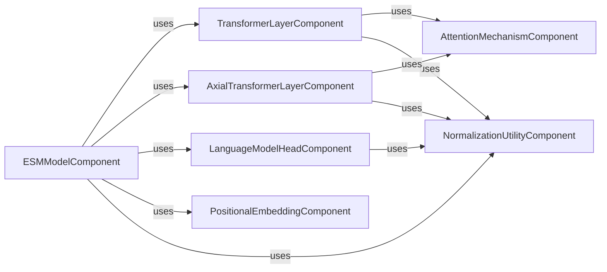

## Component Details

The Core Neural Network Infrastructure provides the foundational building blocks for various transformer architectures within the project. It encompasses fundamental neural network layers such as multi-head attention, normalization layers, feed-forward networks, and rotary positional embeddings. This subsystem is crucial for constructing complex protein language models by orchestrating the interactions between these core components.

### TransformerLayerComponent
Encapsulates the standard Transformer Layer, including self-attention and feed-forward networks, along with layer normalization. It's a fundamental building block for sequence modeling.

**Related Classes/Methods**:

- <a href="https://github.com/facebookresearch/esm/blob/master/esm/modules.py#L83-L141" target="_blank" rel="noopener noreferrer">`esm.esm.modules.TransformerLayer` (83:141)</a>
- <a href="https://github.com/facebookresearch/esm/blob/master/esm/multihead_attention.py#L67-L507" target="_blank" rel="noopener noreferrer">`esm.esm.multihead_attention.MultiheadAttention` (67:507)</a>
- <a href="https://github.com/facebookresearch/esm/blob/master/esm/modules.py#L71-L79" target="_blank" rel="noopener noreferrer">`esm.esm.modules.ESM1bLayerNorm` (71:79)</a>
- <a href="https://github.com/facebookresearch/esm/blob/master/esm/modules.py#L43-L64" target="_blank" rel="noopener noreferrer">`esm.esm.modules.ESM1LayerNorm` (43:64)</a>
- <a href="https://github.com/facebookresearch/esm/blob/master/esm/modules.py#L16-L23" target="_blank" rel="noopener noreferrer">`esm.esm.modules.gelu` (16:23)</a>

### AxialTransformerLayerComponent
Implements an Axial MSA Transformer block, which includes row and column self-attention mechanisms and a feed-forward network, all wrapped in normalized residual blocks. It's designed for processing multiple sequence alignments.

**Related Classes/Methods**:

- <a href="https://github.com/facebookresearch/esm/blob/master/esm/modules.py#L144-L220" target="_blank" rel="noopener noreferrer">`esm.esm.modules.AxialTransformerLayer` (144:220)</a>
- <a href="https://github.com/facebookresearch/esm/blob/master/esm/axial_attention.py#L10-L129" target="_blank" rel="noopener noreferrer">`esm.esm.axial_attention.RowSelfAttention` (10:129)</a>
- <a href="https://github.com/facebookresearch/esm/blob/master/esm/axial_attention.py#L132-L238" target="_blank" rel="noopener noreferrer">`esm.esm.axial_attention.ColumnSelfAttention` (132:238)</a>
- <a href="https://github.com/facebookresearch/esm/blob/master/esm/modules.py#L359-L391" target="_blank" rel="noopener noreferrer">`esm.esm.modules.NormalizedResidualBlock` (359:391)</a>

### AttentionMechanismComponent
Provides various attention mechanisms, including multi-head attention and axial self-attention (row and column). It also includes utilities for rotary positional embeddings.

**Related Classes/Methods**:

- <a href="https://github.com/facebookresearch/esm/blob/master/esm/multihead_attention.py#L67-L507" target="_blank" rel="noopener noreferrer">`esm.esm.multihead_attention.MultiheadAttention` (67:507)</a>
- <a href="https://github.com/facebookresearch/esm/blob/master/esm/axial_attention.py#L10-L129" target="_blank" rel="noopener noreferrer">`esm.esm.axial_attention.RowSelfAttention` (10:129)</a>
- <a href="https://github.com/facebookresearch/esm/blob/master/esm/axial_attention.py#L132-L238" target="_blank" rel="noopener noreferrer">`esm.esm.axial_attention.ColumnSelfAttention` (132:238)</a>
- <a href="https://github.com/facebookresearch/esm/blob/master/esm/rotary_embedding.py#L22-L68" target="_blank" rel="noopener noreferrer">`esm.esm.rotary_embedding.RotaryEmbedding` (22:68)</a>
- <a href="https://github.com/facebookresearch/esm/blob/master/esm/rotary_embedding.py#L15-L19" target="_blank" rel="noopener noreferrer">`esm.esm.rotary_embedding.apply_rotary_pos_emb` (15:19)</a>
- <a href="https://github.com/facebookresearch/esm/blob/master/esm/rotary_embedding.py#L10-L12" target="_blank" rel="noopener noreferrer">`esm.esm.rotary_embedding.rotate_half` (10:12)</a>

### NormalizationUtilityComponent
Provides common utility functions and normalization layers, such as ESM1bLayerNorm, ESM1LayerNorm, and the GELU activation function, which are used across different transformer architectures.

**Related Classes/Methods**:

- <a href="https://github.com/facebookresearch/esm/blob/master/esm/modules.py#L71-L79" target="_blank" rel="noopener noreferrer">`esm.esm.modules.ESM1bLayerNorm` (71:79)</a>
- <a href="https://github.com/facebookresearch/esm/blob/master/esm/modules.py#L43-L64" target="_blank" rel="noopener noreferrer">`esm.esm.modules.ESM1LayerNorm` (43:64)</a>
- <a href="https://github.com/facebookresearch/esm/blob/master/esm/modules.py#L16-L23" target="_blank" rel="noopener noreferrer">`esm.esm.modules.gelu` (16:23)</a>
- <a href="https://github.com/facebookresearch/esm/blob/master/esm/modules.py#L359-L391" target="_blank" rel="noopener noreferrer">`esm.esm.modules.NormalizedResidualBlock` (359:391)</a>

### LanguageModelHeadComponent
Implements the Roberta Language Model Head, responsible for the final prediction layer in language models, often involving a linear transformation and activation.

**Related Classes/Methods**:

- <a href="https://github.com/facebookresearch/esm/blob/master/esm/modules.py#L297-L313" target="_blank" rel="noopener noreferrer">`esm.esm.modules.RobertaLMHead` (297:313)</a>

### PositionalEmbeddingComponent
Handles different types of positional embeddings, including sinusoidal and learned embeddings, which are crucial for encoding sequence order information in transformer models.

**Related Classes/Methods**:

- <a href="https://github.com/facebookresearch/esm/blob/master/esm/modules.py#L259-L294" target="_blank" rel="noopener noreferrer">`esm.esm.modules.SinusoidalPositionalEmbedding` (259:294)</a>
- <a href="https://github.com/facebookresearch/esm/blob/master/esm/modules.py#L223-L256" target="_blank" rel="noopener noreferrer">`esm.esm.modules.LearnedPositionalEmbedding` (223:256)</a>

### ESMModelComponent
Represents the top-level ESM models, including ESM2, MSATransformer, and ProteinBertModel (ESM1/ESM1b variants). It orchestrates the initialization and integration of various sub-modules like transformer layers, attention mechanisms, and prediction heads to form complete protein language models.

**Related Classes/Methods**:

- <a href="https://github.com/facebookresearch/esm/blob/master/esm/model/esm2.py#L13-L146" target="_blank" rel="noopener noreferrer">`esm.esm.model.esm2.ESM2` (13:146)</a>
- <a href="https://github.com/facebookresearch/esm/blob/master/esm/model/msa_transformer.py#L20-L237" target="_blank" rel="noopener noreferrer">`esm.esm.model.msa_transformer.MSATransformer` (20:237)</a>
- <a href="https://github.com/facebookresearch/esm/blob/master/esm/model/esm1.py#L21-L199" target="_blank" rel="noopener noreferrer">`esm.esm.model.esm1.ProteinBertModel` (21:199)</a>
- <a href="https://github.com/facebookresearch/esm/blob/master/esm/modules.py#L316-L356" target="_blank" rel="noopener noreferrer">`esm.esm.modules.ContactPredictionHead` (316:356)</a>

### [FAQ](https://github.com/CodeBoarding/GeneratedOnBoardings/tree/main?tab=readme-ov-file#faq)