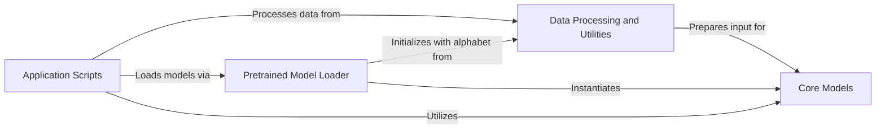

## Component Details

This graph illustrates the architecture of the ESM project, focusing on how data is processed, models are loaded, core models are structured, and applications utilize these components. The main flow involves application scripts initiating tasks, which then leverage data processing utilities to prepare input. Pretrained model loaders are used to load the necessary core models, which then perform the primary computational tasks. Data processing also directly prepares input for the core models.

### Data Processing and Utilities
Manages the input data for the models, including reading sequence data from FASTA files, batching sequences for efficient processing, and defining the alphabet (vocabulary) used for tokenization. It also includes general data utilities for various tasks.

**Related Classes/Methods**:

- <a href="https://github.com/facebookresearch/esm/blob/master/esm/data.py#L18-L87" target="_blank" rel="noopener noreferrer">`esm.data.FastaBatchedDataset` (18:87)</a>
- <a href="https://github.com/facebookresearch/esm/blob/master/esm/data.py#L338-L348" target="_blank" rel="noopener noreferrer">`esm.data.read_fasta` (338:348)</a>
- <a href="https://github.com/facebookresearch/esm/blob/master/esm/data.py#L351-L377" target="_blank" rel="noopener noreferrer">`esm.data.read_alignment_lines` (351:377)</a>
- <a href="https://github.com/facebookresearch/esm/blob/master/esm/data.py#L380-L492" target="_blank" rel="noopener noreferrer">`esm.data.ESMStructuralSplitDataset` (380:492)</a>
- <a href="https://github.com/facebookresearch/esm/blob/master/esm/data.py#L90-L249" target="_blank" rel="noopener noreferrer">`esm.data.Alphabet` (90:249)</a>
- <a href="https://github.com/facebookresearch/esm/blob/master/esm/data.py#L299-L335" target="_blank" rel="noopener noreferrer">`esm.data.MSABatchConverter` (299:335)</a>
- <a href="https://github.com/facebookresearch/esm/blob/master/esm/data.py#L252-L296" target="_blank" rel="noopener noreferrer">`esm.data.BatchConverter` (252:296)</a>
- <a href="https://github.com/facebookresearch/esm/blob/master/esm/inverse_folding/util.py#L219-L322" target="_blank" rel="noopener noreferrer">`esm.inverse_folding.util.CoordBatchConverter` (219:322)</a>

### Pretrained Model Loader
Responsible for loading pre-trained ESM models and their corresponding alphabets, handling different model versions and their specific initialization requirements.

**Related Classes/Methods**:

- <a href="https://github.com/facebookresearch/esm/blob/master/esm/pretrained.py#L84-L160" target="_blank" rel="noopener noreferrer">`esm.pretrained._load_model_and_alphabet_core_v1` (84:160)</a>
- <a href="https://github.com/facebookresearch/esm/blob/master/esm/pretrained.py#L163-L182" target="_blank" rel="noopener noreferrer">`esm.pretrained._load_model_and_alphabet_core_v2` (163:182)</a>
- <a href="https://github.com/facebookresearch/esm/blob/master/esm/pretrained.py#L23-L27" target="_blank" rel="noopener noreferrer">`esm.pretrained.load_model_and_alphabet` (23:27)</a>
- <a href="https://github.com/facebookresearch/esm/blob/master/esm/pretrained.py#L410-L419" target="_blank" rel="noopener noreferrer">`esm.pretrained.esmfold_v1` (410:419)</a>

### Core Models
Encapsulates the core neural network architectures, such as ESM2 and ProteinBertModel, which are used for various tasks like protein language modeling.

**Related Classes/Methods**:

- <a href="https://github.com/facebookresearch/esm/blob/master/esm/model/esm2.py#L13-L146" target="_blank" rel="noopener noreferrer">`esm.model.esm2.ESM2` (13:146)</a>
- <a href="https://github.com/facebookresearch/esm/blob/master/esm/model/esm1.py#L21-L199" target="_blank" rel="noopener noreferrer">`esm.model.esm1.ProteinBertModel` (21:199)</a>

### Application Scripts
Provides entry points for end-user applications, such as protein folding prediction and feature extraction from sequences, orchestrating the use of data handling, tokenization, and core models.

**Related Classes/Methods**:

- <a href="https://github.com/facebookresearch/esm/blob/master/scripts/fold.py#L124-L195" target="_blank" rel="noopener noreferrer">`esm.scripts.fold.run` (124:195)</a>
- <a href="https://github.com/facebookresearch/esm/blob/master/scripts/extract.py#L62-L130" target="_blank" rel="noopener noreferrer">`esm.scripts.extract.run` (62:130)</a>

### [FAQ](https://github.com/CodeBoarding/GeneratedOnBoardings/tree/main?tab=readme-ov-file#faq)