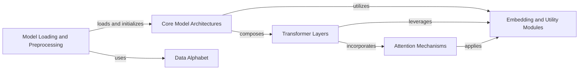

## Component Details

The ESM Language Models subsystem implements the core ESM protein language models, including ESM1, ESM2, and MSA Transformer. It defines their overall architecture, initialization, and forward pass for sequence and multiple sequence alignment (MSA) based tasks. The subsystem is structured around components for model loading, core model architectures, transformer layers, attention mechanisms, embedding and utility modules, and data alphabet management.

### Model Loading and Preprocessing
This component is responsible for loading pre-trained ESM models and their associated alphabet data. It handles both local file loading and downloading models from a hub, orchestrating the core loading logic and any necessary data transformations or version upgrades.

**Related Classes/Methods**:

- <a href="https://github.com/facebookresearch/esm/blob/master/esm/pretrained.py#L23-L27" target="_blank" rel="noopener noreferrer">`esm.esm.pretrained.load_model_and_alphabet` (23:27)</a>
- <a href="https://github.com/facebookresearch/esm/blob/master/esm/pretrained.py#L66-L76" target="_blank" rel="noopener noreferrer">`esm.esm.pretrained.load_model_and_alphabet_local` (66:76)</a>
- <a href="https://github.com/facebookresearch/esm/blob/master/esm/pretrained.py#L61-L63" target="_blank" rel="noopener noreferrer">`esm.esm.pretrained.load_model_and_alphabet_hub` (61:63)</a>
- <a href="https://github.com/facebookresearch/esm/blob/master/esm/pretrained.py#L51-L58" target="_blank" rel="noopener noreferrer">`esm.esm.pretrained._download_model_and_regression_data` (51:58)</a>
- <a href="https://github.com/facebookresearch/esm/blob/master/esm/pretrained.py#L185-L220" target="_blank" rel="noopener noreferrer">`esm.esm.pretrained.load_model_and_alphabet_core` (185:220)</a>
- <a href="https://github.com/facebookresearch/esm/blob/master/esm/pretrained.py#L84-L160" target="_blank" rel="noopener noreferrer">`esm.esm.pretrained._load_model_and_alphabet_core_v1` (84:160)</a>
- <a href="https://github.com/facebookresearch/esm/blob/master/esm/pretrained.py#L163-L182" target="_blank" rel="noopener noreferrer">`esm.esm.pretrained._load_model_and_alphabet_core_v2` (163:182)</a>
- <a href="https://github.com/facebookresearch/esm/blob/master/esm/pretrained.py#L223-L228" target="_blank" rel="noopener noreferrer">`esm.esm.pretrained.esm1_t34_670M_UR50S` (223:228)</a>
- <a href="https://github.com/facebookresearch/esm/blob/master/esm/pretrained.py#L272-L277" target="_blank" rel="noopener noreferrer">`esm.esm.pretrained.esm_msa1_t12_100M_UR50S` (272:277)</a>
- <a href="https://github.com/facebookresearch/esm/blob/master/esm/pretrained.py#L349-L354" target="_blank" rel="noopener noreferrer">`esm.esm.pretrained.esm2_t6_8M_UR50D` (349:354)</a>

### Core Model Architectures
This component defines the main protein language model architectures, including ESM2, MSA Transformer, and ProteinBertModel (ESM1/ESM1b). These classes encapsulate the overall structure of the models, integrating various layers and modules to process protein sequences and predict properties.

**Related Classes/Methods**:

- <a href="https://github.com/facebookresearch/esm/blob/master/esm/model/esm2.py#L13-L146" target="_blank" rel="noopener noreferrer">`esm.esm.model.esm2.ESM2` (13:146)</a>
- <a href="https://github.com/facebookresearch/esm/blob/master/esm/model/msa_transformer.py#L20-L237" target="_blank" rel="noopener noreferrer">`esm.esm.model.msa_transformer.MSATransformer` (20:237)</a>
- <a href="https://github.com/facebookresearch/esm/blob/master/esm/model/esm1.py#L21-L199" target="_blank" rel="noopener noreferrer">`esm.esm.model.esm1.ProteinBertModel` (21:199)</a>

### Transformer Layers
This component provides the fundamental building blocks for transformer-based models, including standard TransformerLayer and specialized AxialTransformerLayer for handling sequence and multiple sequence alignment data. It also includes the NormalizedResidualBlock for constructing residual connections within these layers.

**Related Classes/Methods**:

- <a href="https://github.com/facebookresearch/esm/blob/master/esm/modules.py#L83-L141" target="_blank" rel="noopener noreferrer">`esm.esm.modules.TransformerLayer` (83:141)</a>
- <a href="https://github.com/facebookresearch/esm/blob/master/esm/modules.py#L144-L220" target="_blank" rel="noopener noreferrer">`esm.esm.modules.AxialTransformerLayer` (144:220)</a>
- <a href="https://github.com/facebookresearch/esm/blob/master/esm/modules.py#L359-L391" target="_blank" rel="noopener noreferrer">`esm.esm.modules.NormalizedResidualBlock` (359:391)</a>

### Attention Mechanisms
This component implements various attention mechanisms crucial for transformer models. It includes MultiheadAttention for general sequence processing and specialized RowSelfAttention and ColumnSelfAttention for axial attention in MSA Transformer models, enabling efficient processing of large protein alignments.

**Related Classes/Methods**:

- <a href="https://github.com/facebookresearch/esm/blob/master/esm/multihead_attention.py#L67-L507" target="_blank" rel="noopener noreferrer">`esm.esm.multihead_attention.MultiheadAttention` (67:507)</a>
- <a href="https://github.com/facebookresearch/esm/blob/master/esm/axial_attention.py#L10-L129" target="_blank" rel="noopener noreferrer">`esm.esm.axial_attention.RowSelfAttention` (10:129)</a>
- <a href="https://github.com/facebookresearch/esm/blob/master/esm/axial_attention.py#L132-L238" target="_blank" rel="noopener noreferrer">`esm.esm.axial_attention.ColumnSelfAttention` (132:238)</a>

### Embedding and Utility Modules
This component comprises various utility layers and embedding functions used across the ESM models. This includes normalization layers (ESM1bLayerNorm), output heads (RobertaLMHead, ContactPredictionHead), positional embeddings (SinusoidalPositionalEmbedding, LearnedPositionalEmbedding, RotaryEmbedding), and activation/helper functions (gelu, apc, symmetrize, utils_softmax).

**Related Classes/Methods**:

- <a href="https://github.com/facebookresearch/esm/blob/master/esm/modules.py#L43-L44" target="_blank" rel="noopener noreferrer">`esm.esm.modules.ESM1bLayerNorm` (43:44)</a>
- <a href="https://github.com/facebookresearch/esm/blob/master/esm/modules.py#L297-L313" target="_blank" rel="noopener noreferrer">`esm.esm.modules.RobertaLMHead` (297:313)</a>
- <a href="https://github.com/facebookresearch/esm/blob/master/esm/modules.py#L316-L356" target="_blank" rel="noopener noreferrer">`esm.esm.modules.ContactPredictionHead` (316:356)</a>
- <a href="https://github.com/facebookresearch/esm/blob/master/esm/modules.py#L259-L294" target="_blank" rel="noopener noreferrer">`esm.esm.modules.SinusoidalPositionalEmbedding` (259:294)</a>
- <a href="https://github.com/facebookresearch/esm/blob/master/esm/modules.py#L223-L256" target="_blank" rel="noopener noreferrer">`esm.esm.modules.LearnedPositionalEmbedding` (223:256)</a>
- <a href="https://github.com/facebookresearch/esm/blob/master/esm/rotary_embedding.py#L22-L68" target="_blank" rel="noopener noreferrer">`esm.esm.rotary_embedding.RotaryEmbedding` (22:68)</a>
- <a href="https://github.com/facebookresearch/esm/blob/master/esm/modules.py#L16-L23" target="_blank" rel="noopener noreferrer">`esm.esm.modules.gelu` (16:23)</a>
- <a href="https://github.com/facebookresearch/esm/blob/master/esm/modules.py#L31-L40" target="_blank" rel="noopener noreferrer">`esm.esm.modules.apc` (31:40)</a>
- <a href="https://github.com/facebookresearch/esm/blob/master/esm/modules.py#L26-L28" target="_blank" rel="noopener noreferrer">`esm.esm.modules.symmetrize` (26:28)</a>
- <a href="https://github.com/facebookresearch/esm/blob/master/esm/multihead_attention.py#L17-L21" target="_blank" rel="noopener noreferrer">`esm.esm.multihead_attention.utils_softmax` (17:21)</a>

### Data Alphabet
This component is responsible for managing the alphabet of amino acids, providing a mapping between characters and numerical representations. It is essential for converting protein sequences into a format suitable for model input and for interpreting model outputs.

**Related Classes/Methods**:

- <a href="https://github.com/facebookresearch/esm/blob/master/esm/data.py#L90-L249" target="_blank" rel="noopener noreferrer">`esm.data.Alphabet` (90:249)</a>

### [FAQ](https://github.com/CodeBoarding/GeneratedOnBoardings/tree/main?tab=readme-ov-file#faq)