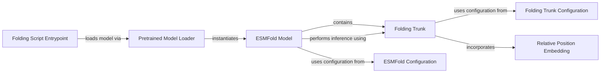

## Component Details

The ESMFold Structure Prediction System is designed for predicting 3D protein structures from amino acid sequences. It leverages a Pretrained Model Loader to load various ESMFold models, which are then instantiated as the central ESMFold Model. This model integrates language model representations with a core Folding Trunk, iteratively refining the protein structure. The system's behavior and architecture are guided by dedicated ESMFold Configuration and Folding Trunk Configuration components. The Folding Trunk further incorporates Relative Position Embedding for spatial relationship capture. The entire process is orchestrated via a Folding Script Entrypoint, which initiates the model loading and inference tasks.

### Pretrained Model Loader
This component is responsible for loading various pre-trained ESMFold models, either from local file paths or from a remote model hub. It handles the deserialization of model configurations and states, and then initializes the ESMFold model with the loaded parameters.

**Related Classes/Methods**:

- <a href="https://github.com/facebookresearch/esm/blob/master/esm/pretrained.py#L399-L407" target="_blank" rel="noopener noreferrer">`esm.esm.pretrained.esmfold_v0` (399:407)</a>
- <a href="https://github.com/facebookresearch/esm/blob/master/esm/pretrained.py#L410-L419" target="_blank" rel="noopener noreferrer">`esm.esm.pretrained.esmfold_v1` (410:419)</a>
- <a href="https://github.com/facebookresearch/esm/blob/master/esm/pretrained.py#L421-L430" target="_blank" rel="noopener noreferrer">`esm.esm.pretrained.esmfold_structure_module_only_8M` (421:430)</a>
- <a href="https://github.com/facebookresearch/esm/blob/master/esm/pretrained.py#L433-L442" target="_blank" rel="noopener noreferrer">`esm.esm.pretrained.esmfold_structure_module_only_8M_270K` (433:442)</a>
- <a href="https://github.com/facebookresearch/esm/blob/master/esm/pretrained.py#L445-L454" target="_blank" rel="noopener noreferrer">`esm.esm.pretrained.esmfold_structure_module_only_35M` (445:454)</a>
- <a href="https://github.com/facebookresearch/esm/blob/master/esm/pretrained.py#L457-L466" target="_blank" rel="noopener noreferrer">`esm.esm.pretrained.esmfold_structure_module_only_35M_270K` (457:466)</a>
- <a href="https://github.com/facebookresearch/esm/blob/master/esm/pretrained.py#L469-L478" target="_blank" rel="noopener noreferrer">`esm.esm.pretrained.esmfold_structure_module_only_150M` (469:478)</a>
- <a href="https://github.com/facebookresearch/esm/blob/master/esm/pretrained.py#L481-L490" target="_blank" rel="noopener noreferrer">`esm.esm.pretrained.esmfold_structure_module_only_150M_270K` (481:490)</a>
- <a href="https://github.com/facebookresearch/esm/blob/master/esm/pretrained.py#L493-L502" target="_blank" rel="noopener noreferrer">`esm.esm.pretrained.esmfold_structure_module_only_650M` (493:502)</a>
- <a href="https://github.com/facebookresearch/esm/blob/master/esm/pretrained.py#L505-L514" target="_blank" rel="noopener noreferrer">`esm.esm.pretrained.esmfold_structure_module_only_650M_270K` (505:514)</a>
- <a href="https://github.com/facebookresearch/esm/blob/master/esm/pretrained.py#L517-L526" target="_blank" rel="noopener noreferrer">`esm.esm.pretrained.esmfold_structure_module_only_3B` (517:526)</a>
- <a href="https://github.com/facebookresearch/esm/blob/master/esm/pretrained.py#L529-L538" target="_blank" rel="noopener noreferrer">`esm.esm.pretrained.esmfold_structure_module_only_3B_270K` (529:538)</a>
- <a href="https://github.com/facebookresearch/esm/blob/master/esm/pretrained.py#L541-L551" target="_blank" rel="noopener noreferrer">`esm.esm.pretrained.esmfold_structure_module_only_15B` (541:551)</a>
- `esm.esm.pretrained.esmfold_structure_module_only_15B_270K` (full file reference)
- <a href="https://github.com/facebookresearch/esm/blob/master/esm/esmfold/v1/pretrained.py#L12-L37" target="_blank" rel="noopener noreferrer">`esm.esmfold.v1.pretrained._load_model` (12:37)</a>

### ESMFold Model
The central deep learning model for protein structure prediction. It integrates language model representations with a folding trunk, manages the overall inference pipeline, and provides methods for predicting protein structures from amino acid sequences.

**Related Classes/Methods**:

- <a href="https://github.com/facebookresearch/esm/blob/master/esm/esmfold/v1/esmfold.py#L49-L363" target="_blank" rel="noopener noreferrer">`esm.esmfold.v1.esmfold.ESMFold` (49:363)</a>
- <a href="https://github.com/facebookresearch/esm/blob/master/esm/esmfold/v1/esmfold.py#L50-L103" target="_blank" rel="noopener noreferrer">`esm.esmfold.v1.esmfold.ESMFold.__init__` (50:103)</a>
- <a href="https://github.com/facebookresearch/esm/blob/master/esm/esmfold/v1/esmfold.py#L151-L277" target="_blank" rel="noopener noreferrer">`esm.esmfold.v1.esmfold.ESMFold.forward` (151:277)</a>
- <a href="https://github.com/facebookresearch/esm/blob/master/esm/esmfold/v1/esmfold.py#L280-L338" target="_blank" rel="noopener noreferrer">`esm.esmfold.v1.esmfold.ESMFold.infer` (280:338)</a>
- <a href="https://github.com/facebookresearch/esm/blob/master/esm/esmfold/v1/esmfold.py#L344-L347" target="_blank" rel="noopener noreferrer">`esm.esmfold.v1.esmfold.ESMFold.infer_pdbs` (344:347)</a>
- <a href="https://github.com/facebookresearch/esm/blob/master/esm/esmfold/v1/esmfold.py#L349-L351" target="_blank" rel="noopener noreferrer">`esm.esmfold.v1.esmfold.ESMFold.infer_pdb` (349:351)</a>
- <a href="https://github.com/facebookresearch/esm/blob/master/esm/esmfold/v1/esmfold.py#L353-L359" target="_blank" rel="noopener noreferrer">`esm.esmfold.v1.esmfold.ESMFold.set_chunk_size` (353:359)</a>
- <a href="https://github.com/facebookresearch/esm/blob/master/esm/esmfold/v1/esmfold.py#L106-L111" target="_blank" rel="noopener noreferrer">`esm.esmfold.v1.esmfold.ESMFold._af2_to_esm` (106:111)</a>
- <a href="https://github.com/facebookresearch/esm/blob/master/esm/esmfold/v1/esmfold.py#L113-L115" target="_blank" rel="noopener noreferrer">`esm.esmfold.v1.esmfold.ESMFold._af2_idx_to_esm_idx` (113:115)</a>
- <a href="https://github.com/facebookresearch/esm/blob/master/esm/esmfold/v1/esmfold.py#L146-L149" target="_blank" rel="noopener noreferrer">`esm.esmfold.v1.esmfold.ESMFold._mask_inputs_to_esm` (146:149)</a>
- <a href="https://github.com/facebookresearch/esm/blob/master/esm/esmfold/v1/esmfold.py#L117-L144" target="_blank" rel="noopener noreferrer">`esm.esmfold.v1.esmfold.ESMFold._compute_language_model_representations` (117:144)</a>

### Folding Trunk
A core module within the ESMFold model responsible for the iterative refinement of protein structure. It processes sequence and pairwise features through a series of attention blocks and a dedicated structure module to predict atomic coordinates.

**Related Classes/Methods**:

- <a href="https://github.com/facebookresearch/esm/blob/master/esm/esmfold/v1/trunk.py#L109-L242" target="_blank" rel="noopener noreferrer">`esm.esmfold.v1.trunk.FoldingTrunk` (109:242)</a>
- <a href="https://github.com/facebookresearch/esm/blob/master/esm/esmfold/v1/trunk.py#L110-L147" target="_blank" rel="noopener noreferrer">`esm.esmfold.v1.trunk.FoldingTrunk.__init__` (110:147)</a>
- <a href="https://github.com/facebookresearch/esm/blob/master/esm/esmfold/v1/trunk.py#L156-L222" target="_blank" rel="noopener noreferrer">`esm.esmfold.v1.trunk.FoldingTrunk.forward` (156:222)</a>
- <a href="https://github.com/facebookresearch/esm/blob/master/esm/esmfold/v1/trunk.py#L149-L154" target="_blank" rel="noopener noreferrer">`esm.esmfold.v1.trunk.FoldingTrunk.set_chunk_size` (149:154)</a>
- <a href="https://github.com/facebookresearch/esm/blob/master/esm/esmfold/v1/trunk.py#L225-L242" target="_blank" rel="noopener noreferrer">`esm.esmfold.v1.trunk.FoldingTrunk.distogram` (225:242)</a>

### ESMFold Configuration
This component defines the architectural parameters and hyperparameters specifically for the ESMFold model, guiding its construction and behavior.

**Related Classes/Methods**:

- <a href="https://github.com/facebookresearch/esm/blob/master/esm/esmfold/v1/esmfold.py#L28-L30" target="_blank" rel="noopener noreferrer">`esm.esmfold.v1.esmfold.ESMFoldConfig` (28:30)</a>

### Folding Trunk Configuration
This component defines the architectural parameters and hyperparameters specifically for the Folding Trunk module, influencing its internal structure and operations.

**Related Classes/Methods**:

- <a href="https://github.com/facebookresearch/esm/blob/master/esm/esmfold/v1/trunk.py#L35-L50" target="_blank" rel="noopener noreferrer">`esm.esmfold.v1.trunk.FoldingTrunkConfig` (35:50)</a>

### Relative Position Embedding
A utility module used by the Folding Trunk to generate and incorporate relative positional embeddings, which are crucial for capturing spatial relationships between amino acids in the protein structure.

**Related Classes/Methods**:

- <a href="https://github.com/facebookresearch/esm/blob/master/esm/esmfold/v1/trunk.py#L74-L106" target="_blank" rel="noopener noreferrer">`esm.esmfold.v1.trunk.RelativePosition` (74:106)</a>

### Folding Script Entrypoint
This component serves as the main script for initiating the protein folding process. It orchestrates the loading of models and execution of inference tasks.

**Related Classes/Methods**:

- <a href="https://github.com/facebookresearch/esm/blob/master/scripts/fold.py#L124-L195" target="_blank" rel="noopener noreferrer">`esm.scripts.fold.run` (124:195)</a>

### [FAQ](https://github.com/CodeBoarding/GeneratedOnBoardings/tree/main?tab=readme-ov-file#faq)