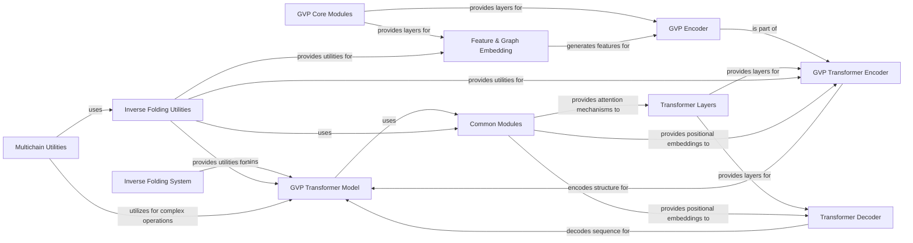

## Component Details

This architecture describes the Inverse Folding System, a comprehensive set of modules designed for inverse protein folding. The main flow involves processing protein structural information using Geometric Vector Perceptron (GVP) layers, extracting relevant features, encoding them through a GVP Transformer Encoder, and then decoding sequence information using a Transformer Decoder to predict amino acid sequences. Utility modules support data handling, loss calculation, and specialized operations for multichain protein complexes.

### Inverse Folding System
Provides a comprehensive set of modules for inverse protein folding, encompassing Geometric Vector Perceptron (GVP) layers for structural information processing, feature extraction from protein coordinates, transformer architectures for sequence prediction, and utility functions for data handling, loss calculation, and sequence scoring.

**Related Classes/Methods**:

- <a href="https://github.com/facebookresearch/esm/blob/master/esm/inverse_folding/gvp_transformer.py#L23-L139" target="_blank" rel="noopener noreferrer">`esm.esm.inverse_folding.gvp_transformer.GVPTransformerModel` (23:139)</a>

### GVP Core Modules
Handles fundamental Geometric Vector Perceptron operations, including normalization, convolutions, and basic neural network layers adapted for geometric data.

**Related Classes/Methods**:

- <a href="https://github.com/facebookresearch/esm/blob/master/esm/inverse_folding/gvp_modules.py#L112-L187" target="_blank" rel="noopener noreferrer">`esm.esm.inverse_folding.gvp_modules.GVP` (112:187)</a>
- <a href="https://github.com/facebookresearch/esm/blob/master/esm/inverse_folding/gvp_modules.py#L146-L187" target="_blank" rel="noopener noreferrer">`esm.esm.inverse_folding.gvp_modules.GVP.forward` (146:187)</a>
- <a href="https://github.com/facebookresearch/esm/blob/master/esm/inverse_folding/gvp_modules.py#L78-L87" target="_blank" rel="noopener noreferrer">`esm.esm.inverse_folding.gvp_modules._norm_no_nan` (78:87)</a>
- <a href="https://github.com/facebookresearch/esm/blob/master/esm/inverse_folding/gvp_modules.py#L214-L233" target="_blank" rel="noopener noreferrer">`esm.esm.inverse_folding.gvp_modules.Dropout` (214:233)</a>
- <a href="https://github.com/facebookresearch/esm/blob/master/esm/inverse_folding/gvp_modules.py#L219-L222" target="_blank" rel="noopener noreferrer">`esm.esm.inverse_folding.gvp_modules.Dropout.__init__` (219:222)</a>
- <a href="https://github.com/facebookresearch/esm/blob/master/esm/inverse_folding/gvp_modules.py#L224-L233" target="_blank" rel="noopener noreferrer">`esm.esm.inverse_folding.gvp_modules.Dropout.forward` (224:233)</a>
- <a href="https://github.com/facebookresearch/esm/blob/master/esm/inverse_folding/gvp_modules.py#L235-L264" target="_blank" rel="noopener noreferrer">`esm.esm.inverse_folding.gvp_modules.LayerNorm` (235:264)</a>
- <a href="https://github.com/facebookresearch/esm/blob/master/esm/inverse_folding/gvp_modules.py#L247-L264" target="_blank" rel="noopener noreferrer">`esm.esm.inverse_folding.gvp_modules.LayerNorm.forward` (247:264)</a>
- <a href="https://github.com/facebookresearch/esm/blob/master/esm/inverse_folding/gvp_modules.py#L266-L327" target="_blank" rel="noopener noreferrer">`esm.esm.inverse_folding.gvp_modules.GVPConv` (266:327)</a>
- <a href="https://github.com/facebookresearch/esm/blob/master/esm/inverse_folding/gvp_modules.py#L283-L308" target="_blank" rel="noopener noreferrer">`esm.esm.inverse_folding.gvp_modules.GVPConv.__init__` (283:308)</a>
- <a href="https://github.com/facebookresearch/esm/blob/master/esm/inverse_folding/gvp_modules.py#L310-L320" target="_blank" rel="noopener noreferrer">`esm.esm.inverse_folding.gvp_modules.GVPConv.forward` (310:320)</a>
- <a href="https://github.com/facebookresearch/esm/blob/master/esm/inverse_folding/gvp_modules.py#L322-L327" target="_blank" rel="noopener noreferrer">`esm.esm.inverse_folding.gvp_modules.GVPConv.message` (322:327)</a>
- <a href="https://github.com/facebookresearch/esm/blob/master/esm/inverse_folding/gvp_modules.py#L330-L474" target="_blank" rel="noopener noreferrer">`esm.esm.inverse_folding.gvp_modules.GVPConvLayer` (330:474)</a>
- <a href="https://github.com/facebookresearch/esm/blob/master/esm/inverse_folding/gvp_modules.py#L348-L400" target="_blank" rel="noopener noreferrer">`esm.esm.inverse_folding.gvp_modules.GVPConvLayer.__init__` (348:400)</a>
- <a href="https://github.com/facebookresearch/esm/blob/master/esm/inverse_folding/gvp_modules.py#L402-L474" target="_blank" rel="noopener noreferrer">`esm.esm.inverse_folding.gvp_modules.GVPConvLayer.forward` (402:474)</a>
- <a href="https://github.com/facebookresearch/esm/blob/master/esm/inverse_folding/gvp_modules.py#L190-L212" target="_blank" rel="noopener noreferrer">`esm.esm.inverse_folding.gvp_modules._VDropout` (190:212)</a>
- <a href="https://github.com/facebookresearch/esm/blob/master/esm/inverse_folding/gvp_modules.py#L89-L100" target="_blank" rel="noopener noreferrer">`esm.esm.inverse_folding.gvp_modules._split` (89:100)</a>
- <a href="https://github.com/facebookresearch/esm/blob/master/esm/inverse_folding/gvp_modules.py#L44-L55" target="_blank" rel="noopener noreferrer">`esm.esm.inverse_folding.gvp_modules.tuple_cat` (44:55)</a>
- <a href="https://github.com/facebookresearch/esm/blob/master/esm/inverse_folding/gvp_modules.py#L102-L110" target="_blank" rel="noopener noreferrer">`esm.esm.inverse_folding.gvp_modules._merge` (102:110)</a>
- <a href="https://github.com/facebookresearch/esm/blob/master/esm/inverse_folding/gvp_modules.py#L37-L42" target="_blank" rel="noopener noreferrer">`esm.esm.inverse_folding.gvp_modules.tuple_sum` (37:42)</a>
- <a href="https://github.com/facebookresearch/esm/blob/master/esm/inverse_folding/gvp_modules.py#L57-L63" target="_blank" rel="noopener noreferrer">`esm.esm.inverse_folding.gvp_modules.tuple_index` (57:63)</a>

### Feature & Graph Embedding
Responsible for extracting various features from protein structures (dihedrals, orientations, sidechains, distances) and embedding them into a graph representation suitable for GVP models.

**Related Classes/Methods**:

- <a href="https://github.com/facebookresearch/esm/blob/master/esm/inverse_folding/features.py#L76-L184" target="_blank" rel="noopener noreferrer">`esm.esm.inverse_folding.features.GVPInputFeaturizer` (76:184)</a>
- <a href="https://github.com/facebookresearch/esm/blob/master/esm/inverse_folding/features.py#L79-L92" target="_blank" rel="noopener noreferrer">`esm.esm.inverse_folding.features.GVPInputFeaturizer.get_node_features` (79:92)</a>
- <a href="https://github.com/facebookresearch/esm/blob/master/esm/inverse_folding/features.py#L95-L100" target="_blank" rel="noopener noreferrer">`esm.esm.inverse_folding.features.GVPInputFeaturizer._orientations` (95:100)</a>
- <a href="https://github.com/facebookresearch/esm/blob/master/esm/inverse_folding/features.py#L103-L109" target="_blank" rel="noopener noreferrer">`esm.esm.inverse_folding.features.GVPInputFeaturizer._sidechains` (103:109)</a>
- <a href="https://github.com/facebookresearch/esm/blob/master/esm/inverse_folding/features.py#L112-L135" target="_blank" rel="noopener noreferrer">`esm.esm.inverse_folding.features.GVPInputFeaturizer._dihedrals` (112:135)</a>
- <a href="https://github.com/facebookresearch/esm/blob/master/esm/inverse_folding/features.py#L156-L184" target="_blank" rel="noopener noreferrer">`esm.esm.inverse_folding.features.GVPInputFeaturizer._dist` (156:184)</a>
- <a href="https://github.com/facebookresearch/esm/blob/master/esm/inverse_folding/features.py#L208-L255" target="_blank" rel="noopener noreferrer">`esm.esm.inverse_folding.features.DihedralFeatures` (208:255)</a>
- <a href="https://github.com/facebookresearch/esm/blob/master/esm/inverse_folding/features.py#L209-L216" target="_blank" rel="noopener noreferrer">`esm.esm.inverse_folding.features.DihedralFeatures.__init__` (209:216)</a>
- <a href="https://github.com/facebookresearch/esm/blob/master/esm/inverse_folding/features.py#L218-L223" target="_blank" rel="noopener noreferrer">`esm.esm.inverse_folding.features.DihedralFeatures.forward` (218:223)</a>
- <a href="https://github.com/facebookresearch/esm/blob/master/esm/inverse_folding/features.py#L258-L351" target="_blank" rel="noopener noreferrer">`esm.esm.inverse_folding.features.GVPGraphEmbedding` (258:351)</a>
- <a href="https://github.com/facebookresearch/esm/blob/master/esm/inverse_folding/features.py#L260-L279" target="_blank" rel="noopener noreferrer">`esm.esm.inverse_folding.features.GVPGraphEmbedding.__init__` (260:279)</a>
- <a href="https://github.com/facebookresearch/esm/blob/master/esm/inverse_folding/features.py#L281-L297" target="_blank" rel="noopener noreferrer">`esm.esm.inverse_folding.features.GVPGraphEmbedding.forward` (281:297)</a>
- <a href="https://github.com/facebookresearch/esm/blob/master/esm/inverse_folding/features.py#L299-L351" target="_blank" rel="noopener noreferrer">`esm.esm.inverse_folding.features.GVPGraphEmbedding.get_edge_features` (299:351)</a>
- <a href="https://github.com/facebookresearch/esm/blob/master/esm/inverse_folding/features.py#L187-L205" target="_blank" rel="noopener noreferrer">`esm.esm.inverse_folding.features.Normalize` (187:205)</a>
- <a href="https://github.com/facebookresearch/esm/blob/master/esm/inverse_folding/features.py#L138-L153" target="_blank" rel="noopener noreferrer">`esm.esm.inverse_folding.features.GVPInputFeaturizer._positional_embeddings` (138:153)</a>

### GVP Encoder
Encodes protein graph representations using GVP layers, processing node and edge features to produce a rich structural embedding.

**Related Classes/Methods**:

- <a href="https://github.com/facebookresearch/esm/blob/master/esm/inverse_folding/gvp_encoder.py#L17-L55" target="_blank" rel="noopener noreferrer">`esm.esm.inverse_folding.gvp_encoder.GVPEncoder` (17:55)</a>
- <a href="https://github.com/facebookresearch/esm/blob/master/esm/inverse_folding/gvp_encoder.py#L19-L44" target="_blank" rel="noopener noreferrer">`esm.esm.inverse_folding.gvp_encoder.GVPEncoder.__init__` (19:44)</a>
- <a href="https://github.com/facebookresearch/esm/blob/master/esm/inverse_folding/gvp_encoder.py#L46-L55" target="_blank" rel="noopener noreferrer">`esm.esm.inverse_folding.gvp_encoder.GVPEncoder.forward` (46:55)</a>

### Transformer Layers
Provides generic self-attention and feed-forward network layers used in both encoder and decoder parts of the transformer architecture.

**Related Classes/Methods**:

- <a href="https://github.com/facebookresearch/esm/blob/master/esm/inverse_folding/transformer_layer.py#L16-L110" target="_blank" rel="noopener noreferrer">`esm.esm.inverse_folding.transformer_layer.TransformerEncoderLayer` (16:110)</a>
- <a href="https://github.com/facebookresearch/esm/blob/master/esm/inverse_folding/transformer_layer.py#L24-L41" target="_blank" rel="noopener noreferrer">`esm.esm.inverse_folding.transformer_layer.TransformerEncoderLayer.__init__` (24:41)</a>
- <a href="https://github.com/facebookresearch/esm/blob/master/esm/inverse_folding/transformer_layer.py#L49-L55" target="_blank" rel="noopener noreferrer">`esm.esm.inverse_folding.transformer_layer.TransformerEncoderLayer.build_self_attention` (49:55)</a>
- <a href="https://github.com/facebookresearch/esm/blob/master/esm/inverse_folding/transformer_layer.py#L60-L110" target="_blank" rel="noopener noreferrer">`esm.esm.inverse_folding.transformer_layer.TransformerEncoderLayer.forward` (60:110)</a>
- <a href="https://github.com/facebookresearch/esm/blob/master/esm/inverse_folding/transformer_layer.py#L113-L303" target="_blank" rel="noopener noreferrer">`esm.esm.inverse_folding.transformer_layer.TransformerDecoderLayer` (113:303)</a>
- <a href="https://github.com/facebookresearch/esm/blob/master/esm/inverse_folding/transformer_layer.py#L123-L176" target="_blank" rel="noopener noreferrer">`esm.esm.inverse_folding.transformer_layer.TransformerDecoderLayer.__init__` (123:176)</a>
- <a href="https://github.com/facebookresearch/esm/blob/master/esm/inverse_folding/transformer_layer.py#L184-L194" target="_blank" rel="noopener noreferrer">`esm.esm.inverse_folding.transformer_layer.TransformerDecoderLayer.build_self_attention` (184:194)</a>
- <a href="https://github.com/facebookresearch/esm/blob/master/esm/inverse_folding/transformer_layer.py#L196-L204" target="_blank" rel="noopener noreferrer">`esm.esm.inverse_folding.transformer_layer.TransformerDecoderLayer.build_encoder_attention` (196:204)</a>
- <a href="https://github.com/facebookresearch/esm/blob/master/esm/inverse_folding/transformer_layer.py#L209-L303" target="_blank" rel="noopener noreferrer">`esm.esm.inverse_folding.transformer_layer.TransformerDecoderLayer.forward` (209:303)</a>
- <a href="https://github.com/facebookresearch/esm/blob/master/esm/inverse_folding/transformer_layer.py#L43-L44" target="_blank" rel="noopener noreferrer">`esm.esm.inverse_folding.transformer_layer.TransformerEncoderLayer.build_fc1` (43:44)</a>
- <a href="https://github.com/facebookresearch/esm/blob/master/esm/inverse_folding/transformer_layer.py#L46-L47" target="_blank" rel="noopener noreferrer">`esm.esm.inverse_folding.transformer_layer.TransformerEncoderLayer.build_fc2` (46:47)</a>
- <a href="https://github.com/facebookresearch/esm/blob/master/esm/inverse_folding/transformer_layer.py#L57-L58" target="_blank" rel="noopener noreferrer">`esm.esm.inverse_folding.transformer_layer.TransformerEncoderLayer.residual_connection` (57:58)</a>
- <a href="https://github.com/facebookresearch/esm/blob/master/esm/inverse_folding/transformer_layer.py#L178-L179" target="_blank" rel="noopener noreferrer">`esm.esm.inverse_folding.transformer_layer.TransformerDecoderLayer.build_fc1` (178:179)</a>
- <a href="https://github.com/facebookresearch/esm/blob/master/esm/inverse_folding/transformer_layer.py#L181-L182" target="_blank" rel="noopener noreferrer">`esm.esm.inverse_folding.transformer_layer.TransformerDecoderLayer.build_fc2` (181:182)</a>
- <a href="https://github.com/facebookresearch/esm/blob/master/esm/inverse_folding/transformer_layer.py#L206-L207" target="_blank" rel="noopener noreferrer">`esm.esm.inverse_folding.transformer_layer.TransformerDecoderLayer.residual_connection` (206:207)</a>

### Transformer Decoder
Decodes sequence information, typically predicting amino acids, based on the encoded structural features from the GVP encoder.

**Related Classes/Methods**:

- <a href="https://github.com/facebookresearch/esm/blob/master/esm/inverse_folding/transformer_decoder.py#L23-L227" target="_blank" rel="noopener noreferrer">`esm.esm.inverse_folding.transformer_decoder.TransformerDecoder` (23:227)</a>
- <a href="https://github.com/facebookresearch/esm/blob/master/esm/inverse_folding/transformer_decoder.py#L36-L78" target="_blank" rel="noopener noreferrer">`esm.esm.inverse_folding.transformer_decoder.TransformerDecoder.__init__` (36:78)</a>
- <a href="https://github.com/facebookresearch/esm/blob/master/esm/inverse_folding/transformer_decoder.py#L88-L89" target="_blank" rel="noopener noreferrer">`esm.esm.inverse_folding.transformer_decoder.TransformerDecoder.build_decoder_layer` (88:89)</a>
- <a href="https://github.com/facebookresearch/esm/blob/master/esm/inverse_folding/transformer_decoder.py#L91-L125" target="_blank" rel="noopener noreferrer">`esm.esm.inverse_folding.transformer_decoder.TransformerDecoder.forward` (91:125)</a>
- <a href="https://github.com/facebookresearch/esm/blob/master/esm/inverse_folding/transformer_decoder.py#L127-L209" target="_blank" rel="noopener noreferrer">`esm.esm.inverse_folding.transformer_decoder.TransformerDecoder.extract_features` (127:209)</a>
- <a href="https://github.com/facebookresearch/esm/blob/master/esm/inverse_folding/transformer_decoder.py#L215-L227" target="_blank" rel="noopener noreferrer">`esm.esm.inverse_folding.transformer_decoder.TransformerDecoder.buffered_future_mask` (215:227)</a>
- <a href="https://github.com/facebookresearch/esm/blob/master/esm/inverse_folding/transformer_decoder.py#L18-L20" target="_blank" rel="noopener noreferrer">`esm.esm.inverse_folding.transformer_decoder.fill_with_neg_inf` (18:20)</a>
- <a href="https://github.com/facebookresearch/esm/blob/master/esm/inverse_folding/transformer_decoder.py#L80-L86" target="_blank" rel="noopener noreferrer">`esm.esm.inverse_folding.transformer_decoder.TransformerDecoder.build_output_projection` (80:86)</a>
- <a href="https://github.com/facebookresearch/esm/blob/master/esm/inverse_folding/transformer_decoder.py#L211-L213" target="_blank" rel="noopener noreferrer">`esm.esm.inverse_folding.transformer_decoder.TransformerDecoder.output_layer` (211:213)</a>

### GVP Transformer Encoder
Combines GVP encoding with a transformer-like structure to process protein sequences and structures, often incorporating positional embeddings and rotation frames.

**Related Classes/Methods**:

- <a href="https://github.com/facebookresearch/esm/blob/master/esm/inverse_folding/gvp_transformer_encoder.py#L22-L183" target="_blank" rel="noopener noreferrer">`esm.esm.inverse_folding.gvp_transformer_encoder.GVPTransformerEncoder` (22:183)</a>
- <a href="https://github.com/facebookresearch/esm/blob/master/esm/inverse_folding/gvp_transformer_encoder.py#L33-L67" target="_blank" rel="noopener noreferrer">`esm.esm.inverse_folding.gvp_transformer_encoder.GVPTransformerEncoder.__init__` (33:67)</a>
- <a href="https://github.com/facebookresearch/esm/blob/master/esm/inverse_folding/gvp_transformer_encoder.py#L69-L70" target="_blank" rel="noopener noreferrer">`esm.esm.inverse_folding.gvp_transformer_encoder.GVPTransformerEncoder.build_encoder_layer` (69:70)</a>
- <a href="https://github.com/facebookresearch/esm/blob/master/esm/inverse_folding/gvp_transformer_encoder.py#L72-L120" target="_blank" rel="noopener noreferrer">`esm.esm.inverse_folding.gvp_transformer_encoder.GVPTransformerEncoder.forward_embedding` (72:120)</a>
- <a href="https://github.com/facebookresearch/esm/blob/master/esm/inverse_folding/gvp_transformer_encoder.py#L122-L183" target="_blank" rel="noopener noreferrer">`esm.esm.inverse_folding.gvp_transformer_encoder.GVPTransformerEncoder.forward` (122:183)</a>

### GVP Transformer Model
The main inverse folding model, orchestrating the GVP encoder and transformer decoder to perform sequence design given a protein backbone.

**Related Classes/Methods**:

- <a href="https://github.com/facebookresearch/esm/blob/master/esm/inverse_folding/gvp_transformer.py#L23-L139" target="_blank" rel="noopener noreferrer">`esm.esm.inverse_folding.gvp_transformer.GVPTransformerModel` (23:139)</a>
- <a href="https://github.com/facebookresearch/esm/blob/master/esm/inverse_folding/gvp_transformer.py#L31-L43" target="_blank" rel="noopener noreferrer">`esm.esm.inverse_folding.gvp_transformer.GVPTransformerModel.__init__` (31:43)</a>
- <a href="https://github.com/facebookresearch/esm/blob/master/esm/inverse_folding/gvp_transformer.py#L60-L66" target="_blank" rel="noopener noreferrer">`esm.esm.inverse_folding.gvp_transformer.GVPTransformerModel.build_embedding` (60:66)</a>
- <a href="https://github.com/facebookresearch/esm/blob/master/esm/inverse_folding/gvp_transformer.py#L46-L48" target="_blank" rel="noopener noreferrer">`esm.esm.inverse_folding.gvp_transformer.GVPTransformerModel.build_encoder` (46:48)</a>
- <a href="https://github.com/facebookresearch/esm/blob/master/esm/inverse_folding/gvp_transformer.py#L51-L57" target="_blank" rel="noopener noreferrer">`esm.esm.inverse_folding.gvp_transformer.GVPTransformerModel.build_decoder` (51:57)</a>
- <a href="https://github.com/facebookresearch/esm/blob/master/esm/inverse_folding/gvp_transformer.py#L68-L85" target="_blank" rel="noopener noreferrer">`esm.esm.inverse_folding.gvp_transformer.GVPTransformerModel.forward` (68:85)</a>
- <a href="https://github.com/facebookresearch/esm/blob/master/esm/inverse_folding/gvp_transformer.py#L87-L139" target="_blank" rel="noopener noreferrer">`esm.esm.inverse_folding.gvp_transformer.GVPTransformerModel.sample` (87:139)</a>

### Inverse Folding Utilities
A collection of helper functions for data preparation, coordinate handling, normalization, and loss calculation specific to inverse folding tasks.

**Related Classes/Methods**:

- <a href="https://github.com/facebookresearch/esm/blob/master/esm/inverse_folding/util.py#L61-L73" target="_blank" rel="noopener noreferrer">`esm.esm.inverse_folding.util.extract_coords_from_structure` (61:73)</a>
- <a href="https://github.com/facebookresearch/esm/blob/master/esm/inverse_folding/util.py#L76-L87" target="_blank" rel="noopener noreferrer">`esm.esm.inverse_folding.util.load_coords` (76:87)</a>
- <a href="https://github.com/facebookresearch/esm/blob/master/esm/inverse_folding/util.py#L107-L121" target="_blank" rel="noopener noreferrer">`esm.esm.inverse_folding.util.get_sequence_loss` (107:121)</a>
- <a href="https://github.com/facebookresearch/esm/blob/master/esm/inverse_folding/util.py#L124-L130" target="_blank" rel="noopener noreferrer">`esm.esm.inverse_folding.util.score_sequence` (124:130)</a>
- <a href="https://github.com/facebookresearch/esm/blob/master/esm/inverse_folding/util.py#L133-L142" target="_blank" rel="noopener noreferrer">`esm.esm.inverse_folding.util.get_encoder_output` (133:142)</a>
- <a href="https://github.com/facebookresearch/esm/blob/master/esm/inverse_folding/util.py#L161-L179" target="_blank" rel="noopener noreferrer">`esm.esm.inverse_folding.util.get_rotation_frames` (161:179)</a>
- <a href="https://github.com/facebookresearch/esm/blob/master/esm/inverse_folding/util.py#L210-L216" target="_blank" rel="noopener noreferrer">`esm.esm.inverse_folding.util.normalize` (210:216)</a>
- <a href="https://github.com/facebookresearch/esm/blob/master/esm/inverse_folding/util.py#L182-L187" target="_blank" rel="noopener noreferrer">`esm.esm.inverse_folding.util.nan_to_num` (182:187)</a>
- <a href="https://github.com/facebookresearch/esm/blob/master/esm/inverse_folding/util.py#L219-L322" target="_blank" rel="noopener noreferrer">`esm.esm.inverse_folding.util.CoordBatchConverter` (219:322)</a>
- <a href="https://github.com/facebookresearch/esm/blob/master/esm/inverse_folding/util.py#L220-L266" target="_blank" rel="noopener noreferrer">`esm.esm.inverse_folding.util.CoordBatchConverter.__call__` (220:266)</a>
- <a href="https://github.com/facebookresearch/esm/blob/master/esm/inverse_folding/util.py#L268-L293" target="_blank" rel="noopener noreferrer">`esm.esm.inverse_folding.util.CoordBatchConverter.from_lists` (268:293)</a>
- <a href="https://github.com/facebookresearch/esm/blob/master/esm/inverse_folding/util.py#L90-L104" target="_blank" rel="noopener noreferrer">`esm.esm.inverse_folding.util.get_atom_coords_residuewise` (90:104)</a>
- <a href="https://github.com/facebookresearch/esm/blob/master/esm/inverse_folding/util.py#L26-L58" target="_blank" rel="noopener noreferrer">`esm.esm.inverse_folding.util.load_structure` (26:58)</a>
- <a href="https://github.com/facebookresearch/esm/blob/master/esm/inverse_folding/util.py#L202-L207" target="_blank" rel="noopener noreferrer">`esm.esm.inverse_folding.util.norm` (202:207)</a>
- <a href="https://github.com/facebookresearch/esm/blob/master/esm/inverse_folding/util.py#L190-L199" target="_blank" rel="noopener noreferrer">`esm.esm.inverse_folding.util.rbf` (190:199)</a>
- <a href="https://github.com/facebookresearch/esm/blob/master/esm/inverse_folding/util.py#L296-L322" target="_blank" rel="noopener noreferrer">`esm.esm.inverse_folding.util.CoordBatchConverter.collate_dense_tensors` (296:322)</a>
- <a href="https://github.com/facebookresearch/esm/blob/master/esm/inverse_folding/gvp_utils.py#L8-L46" target="_blank" rel="noopener noreferrer">`esm.esm.inverse_folding.gvp_utils.flatten_graph` (8:46)</a>
- <a href="https://github.com/facebookresearch/esm/blob/master/esm/inverse_folding/gvp_utils.py#L49-L65" target="_blank" rel="noopener noreferrer">`esm.esm.inverse_folding.gvp_utils.unflatten_graph` (49:65)</a>

### Multichain Utilities
Provides specialized functions for handling and processing protein complexes with multiple chains in the context of inverse folding.

**Related Classes/Methods**:

- <a href="https://github.com/facebookresearch/esm/blob/master/esm/inverse_folding/multichain_util.py#L19-L35" target="_blank" rel="noopener noreferrer">`esm.esm.inverse_folding.multichain_util.extract_coords_from_complex` (19:35)</a>
- <a href="https://github.com/facebookresearch/esm/blob/master/esm/inverse_folding/multichain_util.py#L38-L50" target="_blank" rel="noopener noreferrer">`esm.esm.inverse_folding.multichain_util.load_complex_coords` (38:50)</a>
- <a href="https://github.com/facebookresearch/esm/blob/master/esm/inverse_folding/multichain_util.py#L79-L103" target="_blank" rel="noopener noreferrer">`esm.esm.inverse_folding.multichain_util.sample_sequence_in_complex` (79:103)</a>
- <a href="https://github.com/facebookresearch/esm/blob/master/esm/inverse_folding/multichain_util.py#L106-L134" target="_blank" rel="noopener noreferrer">`esm.esm.inverse_folding.multichain_util.score_sequence_in_complex` (106:134)</a>
- <a href="https://github.com/facebookresearch/esm/blob/master/esm/inverse_folding/multichain_util.py#L137-L151" target="_blank" rel="noopener noreferrer">`esm.esm.inverse_folding.multichain_util.get_encoder_output_for_complex` (137:151)</a>
- <a href="https://github.com/facebookresearch/esm/blob/master/esm/inverse_folding/multichain_util.py#L53-L76" target="_blank" rel="noopener noreferrer">`esm.esm.inverse_folding.multichain_util._concatenate_coords` (53:76)</a>

### Common Modules
General-purpose modules used across different parts of the ESM library, such as positional embeddings and multi-head attention mechanisms.

**Related Classes/Methods**:

- <a href="https://github.com/facebookresearch/esm/blob/master/esm/modules.py#L259-L294" target="_blank" rel="noopener noreferrer">`esm.modules.SinusoidalPositionalEmbedding` (259:294)</a>
- <a href="https://github.com/facebookresearch/esm/blob/master/esm/multihead_attention.py#L67-L507" target="_blank" rel="noopener noreferrer">`esm.multihead_attention.MultiheadAttention` (67:507)</a>
- <a href="https://github.com/facebookresearch/esm/blob/master/esm/multihead_attention.py#L470-L475" target="_blank" rel="noopener noreferrer">`esm.multihead_attention.MultiheadAttention._set_input_buffer` (470:475)</a>
- <a href="https://github.com/facebookresearch/esm/blob/master/esm/multihead_attention.py#L460-L468" target="_blank" rel="noopener noreferrer">`esm.multihead_attention.MultiheadAttention._get_input_buffer` (460:468)</a>
- <a href="https://github.com/facebookresearch/esm/blob/master/esm/data.py#L252-L296" target="_blank" rel="noopener noreferrer">`esm.data.BatchConverter` (252:296)</a>
- <a href="https://github.com/facebookresearch/esm/blob/master/esm/data.py#L261-L296" target="_blank" rel="noopener noreferrer">`esm.data.BatchConverter.__call__` (261:296)</a>

### [FAQ](https://github.com/CodeBoarding/GeneratedOnBoardings/tree/main?tab=readme-ov-file#faq)