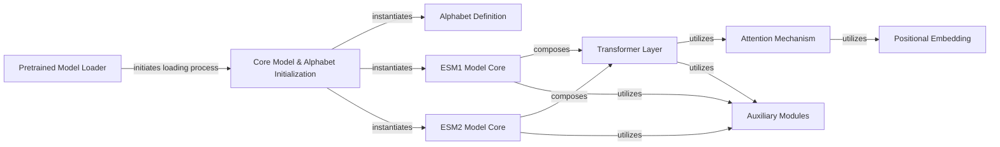

## Component Details

The Model Loading and Management subsystem is responsible for the entire lifecycle of ESM model acquisition and preparation. It begins with the 'Pretrained Model Loader' which acts as the entry point, deciding whether to load models from local files or download them from a hub. This component then feeds the raw model and regression data to the 'Core Model & Alphabet Initialization' component. This core component is crucial for instantiating the correct ESM model architecture (ESM1 or ESM2) and its associated 'Alphabet Definition', handling necessary state dictionary upgrades and validation. The 'ESM1 Model Core' and 'ESM2 Model Core' components represent the specific architectural implementations of these models, both of which are composed of 'Transformer Layer' components. The 'Transformer Layer' in turn utilizes the 'Attention Mechanism' and 'Positional Embedding' components to process sequential data. Finally, 'Auxiliary Modules' provide common neural network functionalities used across various parts of the ESM models.

### Pretrained Model Loader
This component is responsible for the initial loading of ESM models, determining whether to load from a local file path or the Hugging Face Hub. It orchestrates the download of model and regression data if necessary and prepares the data for core model initialization.

**Related Classes/Methods**:

- <a href="https://github.com/facebookresearch/esm/blob/master/esm/pretrained.py#L23-L27" target="_blank" rel="noopener noreferrer">`esm.pretrained.load_model_and_alphabet` (23:27)</a>
- <a href="https://github.com/facebookresearch/esm/blob/master/esm/pretrained.py#L66-L76" target="_blank" rel="noopener noreferrer">`esm.pretrained.load_model_and_alphabet_local` (66:76)</a>
- <a href="https://github.com/facebookresearch/esm/blob/master/esm/pretrained.py#L61-L63" target="_blank" rel="noopener noreferrer">`esm.pretrained.load_model_and_alphabet_hub` (61:63)</a>
- <a href="https://github.com/facebookresearch/esm/blob/master/esm/pretrained.py#L51-L58" target="_blank" rel="noopener noreferrer">`esm.pretrained._download_model_and_regression_data` (51:58)</a>
- <a href="https://github.com/facebookresearch/esm/blob/master/esm/pretrained.py#L45-L48" target="_blank" rel="noopener noreferrer">`esm.pretrained.load_regression_hub` (45:48)</a>
- <a href="https://github.com/facebookresearch/esm/blob/master/esm/pretrained.py#L30-L42" target="_blank" rel="noopener noreferrer">`esm.pretrained.load_hub_workaround` (30:42)</a>
- <a href="https://github.com/facebookresearch/esm/blob/master/esm/pretrained.py#L17-L20" target="_blank" rel="noopener noreferrer">`esm.pretrained._has_regression_weights` (17:20)</a>

### Core Model & Alphabet Initialization
This component handles the core logic for instantiating the protein language model and its associated alphabet. It differentiates between ESM1 and ESM2 architectures and performs necessary state dictionary upgrades and validation before loading the model weights.

**Related Classes/Methods**:

- <a href="https://github.com/facebookresearch/esm/blob/master/esm/pretrained.py#L185-L220" target="_blank" rel="noopener noreferrer">`esm.pretrained.load_model_and_alphabet_core` (185:220)</a>
- <a href="https://github.com/facebookresearch/esm/blob/master/esm/pretrained.py#L84-L160" target="_blank" rel="noopener noreferrer">`esm.pretrained._load_model_and_alphabet_core_v1` (84:160)</a>
- <a href="https://github.com/facebookresearch/esm/blob/master/esm/pretrained.py#L163-L182" target="_blank" rel="noopener noreferrer">`esm.pretrained._load_model_and_alphabet_core_v2` (163:182)</a>

### Alphabet Definition
This component defines the mapping between amino acid characters and their numerical indices, crucial for tokenizing protein sequences. It provides methods for creating an alphabet instance from a given model architecture and retrieving indices for specific characters.

**Related Classes/Methods**:

- <a href="https://github.com/facebookresearch/esm/blob/master/esm/data.py#L142-L173" target="_blank" rel="noopener noreferrer">`esm.data.Alphabet.from_architecture` (142:173)</a>
- <a href="https://github.com/facebookresearch/esm/blob/master/esm/data.py#L91-L121" target="_blank" rel="noopener noreferrer">`esm.data.Alphabet.__init__` (91:121)</a>
- <a href="https://github.com/facebookresearch/esm/blob/master/esm/data.py#L126-L127" target="_blank" rel="noopener noreferrer">`esm.data.Alphabet.get_idx` (126:127)</a>

### ESM1 Model Core
This component encapsulates the specific architecture and initialization procedures for the ESM1 family of protein language models, including variations like ESM1b. It defines the submodules and their configurations unique to these models.

**Related Classes/Methods**:

- <a href="https://github.com/facebookresearch/esm/blob/master/esm/model/esm1.py#L21-L199" target="_blank" rel="noopener noreferrer">`esm.model.esm1.ProteinBertModel` (21:199)</a>
- <a href="https://github.com/facebookresearch/esm/blob/master/esm/model/esm1.py#L48-L64" target="_blank" rel="noopener noreferrer">`esm.model.esm1.ProteinBertModel.__init__` (48:64)</a>
- <a href="https://github.com/facebookresearch/esm/blob/master/esm/model/esm1.py#L90-L104" target="_blank" rel="noopener noreferrer">`esm.model.esm1.ProteinBertModel._init_submodules_esm1b` (90:104)</a>
- <a href="https://github.com/facebookresearch/esm/blob/master/esm/model/esm1.py#L106-L113" target="_blank" rel="noopener noreferrer">`esm.model.esm1.ProteinBertModel._init_submodules_esm1` (106:113)</a>
- <a href="https://github.com/facebookresearch/esm/blob/master/esm/model/esm1.py#L66-L88" target="_blank" rel="noopener noreferrer">`esm.model.esm1.ProteinBertModel._init_submodules_common` (66:88)</a>

### ESM2 Model Core
This component defines the architecture and initialization specifics for the ESM2 family of protein language models. It sets up the unique submodules and configurations required for ESM2 models, distinct from the ESM1 architecture.

**Related Classes/Methods**:

- <a href="https://github.com/facebookresearch/esm/blob/master/esm/model/esm2.py#L13-L146" target="_blank" rel="noopener noreferrer">`esm.model.esm2.ESM2` (13:146)</a>
- <a href="https://github.com/facebookresearch/esm/blob/master/esm/model/esm2.py#L14-L38" target="_blank" rel="noopener noreferrer">`esm.model.esm2.ESM2.__init__` (14:38)</a>
- <a href="https://github.com/facebookresearch/esm/blob/master/esm/model/esm2.py#L40-L74" target="_blank" rel="noopener noreferrer">`esm.model.esm2.ESM2._init_submodules` (40:74)</a>

### Transformer Layer
This component represents a fundamental building block of the transformer architecture used in ESM models. It typically includes self-attention mechanisms and feed-forward networks, processing sequential data.

**Related Classes/Methods**:

- <a href="https://github.com/facebookresearch/esm/blob/master/esm/modules.py#L83-L141" target="_blank" rel="noopener noreferrer">`esm.modules.TransformerLayer` (83:141)</a>
- <a href="https://github.com/facebookresearch/esm/blob/master/esm/modules.py#L86-L100" target="_blank" rel="noopener noreferrer">`esm.modules.TransformerLayer.__init__` (86:100)</a>
- <a href="https://github.com/facebookresearch/esm/blob/master/esm/modules.py#L102-L117" target="_blank" rel="noopener noreferrer">`esm.modules.TransformerLayer._init_submodules` (102:117)</a>

### Attention Mechanism
This component implements the multi-head attention mechanism, a core part of transformer models. It allows the model to weigh the importance of different parts of the input sequence when processing each element.

**Related Classes/Methods**:

- <a href="https://github.com/facebookresearch/esm/blob/master/esm/multihead_attention.py#L67-L507" target="_blank" rel="noopener noreferrer">`esm.multihead_attention.MultiheadAttention` (67:507)</a>
- <a href="https://github.com/facebookresearch/esm/blob/master/esm/multihead_attention.py#L73-L133" target="_blank" rel="noopener noreferrer">`esm.multihead_attention.MultiheadAttention.__init__` (73:133)</a>
- <a href="https://github.com/facebookresearch/esm/blob/master/esm/multihead_attention.py#L138-L156" target="_blank" rel="noopener noreferrer">`esm.multihead_attention.MultiheadAttention.reset_parameters` (138:156)</a>

### Positional Embedding
This component provides positional information to the model, allowing it to understand the order of elements in a sequence. It includes various types of positional embeddings like learned, sinusoidal, and rotary embeddings.

**Related Classes/Methods**:

- <a href="https://github.com/facebookresearch/esm/blob/master/esm/modules.py#L223-L256" target="_blank" rel="noopener noreferrer">`esm.modules.LearnedPositionalEmbedding` (223:256)</a>
- <a href="https://github.com/facebookresearch/esm/blob/master/esm/modules.py#L259-L294" target="_blank" rel="noopener noreferrer">`esm.modules.SinusoidalPositionalEmbedding` (259:294)</a>
- <a href="https://github.com/facebookresearch/esm/blob/master/esm/modules.py#L267-L275" target="_blank" rel="noopener noreferrer">`esm.modules.SinusoidalPositionalEmbedding.forward` (267:275)</a>
- <a href="https://github.com/facebookresearch/esm/blob/master/esm/modules.py#L283-L294" target="_blank" rel="noopener noreferrer">`esm.modules.SinusoidalPositionalEmbedding.get_embedding` (283:294)</a>
- <a href="https://github.com/facebookresearch/esm/blob/master/esm/modules.py#L277-L281" target="_blank" rel="noopener noreferrer">`esm.modules.SinusoidalPositionalEmbedding.make_positions` (277:281)</a>
- <a href="https://github.com/facebookresearch/esm/blob/master/esm/rotary_embedding.py#L22-L68" target="_blank" rel="noopener noreferrer">`esm.rotary_embedding.RotaryEmbedding` (22:68)</a>
- <a href="https://github.com/facebookresearch/esm/blob/master/esm/rotary_embedding.py#L62-L68" target="_blank" rel="noopener noreferrer">`esm.rotary_embedding.RotaryEmbedding.forward` (62:68)</a>
- <a href="https://github.com/facebookresearch/esm/blob/master/esm/rotary_embedding.py#L46-L60" target="_blank" rel="noopener noreferrer">`esm.rotary_embedding.RotaryEmbedding._update_cos_sin_tables` (46:60)</a>
- <a href="https://github.com/facebookresearch/esm/blob/master/esm/rotary_embedding.py#L15-L19" target="_blank" rel="noopener noreferrer">`esm.rotary_embedding.apply_rotary_pos_emb` (15:19)</a>
- <a href="https://github.com/facebookresearch/esm/blob/master/esm/rotary_embedding.py#L10-L12" target="_blank" rel="noopener noreferrer">`esm.rotary_embedding.rotate_half` (10:12)</a>

### Auxiliary Modules
This component groups various common neural network modules used across different ESM model architectures. These include components like contact prediction heads, layer normalization, and the masked language model head.

**Related Classes/Methods**:

- <a href="https://github.com/facebookresearch/esm/blob/master/esm/modules.py#L316-L356" target="_blank" rel="noopener noreferrer">`esm.modules.ContactPredictionHead` (316:356)</a>
- `esm.modules.ESM1bLayerNorm` (full file reference)
- <a href="https://github.com/facebookresearch/esm/blob/master/esm/modules.py#L297-L313" target="_blank" rel="noopener noreferrer">`esm.modules.RobertaLMHead` (297:313)</a>
- <a href="https://github.com/facebookresearch/esm/blob/master/esm/modules.py#L300-L305" target="_blank" rel="noopener noreferrer">`esm.modules.RobertaLMHead.__init__` (300:305)</a>

### [FAQ](https://github.com/CodeBoarding/GeneratedOnBoardings/tree/main?tab=readme-ov-file#faq)