```mermaid
graph LR
    Model_Loading_and_Management["Model Loading and Management"]
    Core_Neural_Network_Infrastructure["Core Neural Network Infrastructure"]
    Data_Processing_and_Utilities["Data Processing and Utilities"]
    ESM_Language_Models["ESM Language Models"]
    ESMFold_Structure_Prediction_System["ESMFold Structure Prediction System"]
    Inverse_Folding_System["Inverse Folding System"]
    Application_Layer["Application Layer"]
    Application_Layer -- "uses" --> Model_Loading_and_Management
    Application_Layer -- "orchestrates" --> ESMFold_Structure_Prediction_System
    Application_Layer -- "orchestrates" --> ESM_Language_Models
    Model_Loading_and_Management -- "loads" --> ESM_Language_Models
    Model_Loading_and_Management -- "loads" --> ESMFold_Structure_Prediction_System
    Model_Loading_and_Management -- "utilizes" --> Data_Processing_and_Utilities
    ESM_Language_Models -- "builds upon" --> Core_Neural_Network_Infrastructure
    ESM_Language_Models -- "processes data with" --> Data_Processing_and_Utilities
    ESMFold_Structure_Prediction_System -- "builds upon" --> Core_Neural_Network_Infrastructure
    ESMFold_Structure_Prediction_System -- "leverages" --> ESM_Language_Models
    Inverse_Folding_System -- "builds upon" --> Core_Neural_Network_Infrastructure
    Inverse_Folding_System -- "processes data with" --> Data_Processing_and_Utilities
    click Model_Loading_and_Management href "https://github.com/CodeBoarding/GeneratedOnBoardings/blob/main//esm/Model Loading and Management.md" "Details"
    click Core_Neural_Network_Infrastructure href "https://github.com/CodeBoarding/GeneratedOnBoardings/blob/main//esm/Core Neural Network Infrastructure.md" "Details"
    click Data_Processing_and_Utilities href "https://github.com/CodeBoarding/GeneratedOnBoardings/blob/main//esm/Data Processing and Utilities.md" "Details"
    click ESM_Language_Models href "https://github.com/CodeBoarding/GeneratedOnBoardings/blob/main//esm/ESM Language Models.md" "Details"
    click ESMFold_Structure_Prediction_System href "https://github.com/CodeBoarding/GeneratedOnBoardings/blob/main//esm/ESMFold Structure Prediction System.md" "Details"
    click Inverse_Folding_System href "https://github.com/CodeBoarding/GeneratedOnBoardings/blob/main//esm/Inverse Folding System.md" "Details"
    click Application_Layer href "https://github.com/CodeBoarding/GeneratedOnBoardings/blob/main//esm/Application Layer.md" "Details"
```

## Component Details

The `esm` project provides a comprehensive suite of tools for protein language modeling and structure prediction. Its main flow involves loading pre-trained models, processing protein sequence data, and then applying these models for tasks such as sequence embedding, multiple sequence alignment (MSA) based analysis, 3D structure prediction via ESMFold, or inverse folding to design sequences for given structures. The architecture is modular, separating concerns like model loading, core neural network components, data handling, and specific model implementations (ESM, ESMFold, Inverse Folding) with an application layer orchestrating these functionalities.

### Model Loading and Management
Handles loading and managing various pre-trained ESM models and their associated alphabets, including local file loading and downloading from a hub. It serves as the primary entry point for users to obtain model instances.

**Related Classes/Methods**:

- <a href="https://github.com/facebookresearch/esm/blob/master/esm/pretrained.py#L23-L27" target="_blank" rel="noopener noreferrer">`esm.esm.pretrained.load_model_and_alphabet` (23:27)</a>

### Core Neural Network Infrastructure
Provides the fundamental neural network layers and modules, such as multi-head attention, normalization layers, feed-forward networks, and rotary positional embeddings, which serve as the building blocks for various transformer architectures within the project.

**Related Classes/Methods**:

- <a href="https://github.com/facebookresearch/esm/blob/master/esm/modules.py#L83-L141" target="_blank" rel="noopener noreferrer">`esm.esm.modules.TransformerLayer` (83:141)</a>

### Data Processing and Utilities
Manages the input data for the models, including reading sequence data from FASTA files, batching sequences for efficient processing, and defining the alphabet (vocabulary) used for tokenization. It also includes general data utilities for various tasks.

**Related Classes/Methods**:

- <a href="https://github.com/facebookresearch/esm/blob/master/esm/data.py#L18-L87" target="_blank" rel="noopener noreferrer">`esm.esm.data.FastaBatchedDataset` (18:87)</a>

### ESM Language Models
Implements the core ESM protein language models, including ESM1, ESM2, and MSA Transformer, defining their overall architecture, initialization, and forward pass for sequence and multiple sequence alignment (MSA) based tasks.

**Related Classes/Methods**:

- <a href="https://github.com/facebookresearch/esm/blob/master/esm/model/esm2.py#L13-L146" target="_blank" rel="noopener noreferrer">`esm.esm.model.esm2.ESM2` (13:146)</a>

### ESMFold Structure Prediction System
Contains the specialized modules and logic for the ESMFold model, designed for predicting 3D protein structures from amino acid sequences, including its unique folding trunk and related components for structural prediction and evaluation.

**Related Classes/Methods**:

- <a href="https://github.com/facebookresearch/esm/blob/master/esm/esmfold/v1/esmfold.py#L49-L363" target="_blank" rel="noopener noreferrer">`esm.esmfold.v1.esmfold.ESMFold` (49:363)</a>

### Inverse Folding System
Provides a comprehensive set of modules for inverse protein folding, encompassing Geometric Vector Perceptron (GVP) layers for structural information processing, feature extraction from protein coordinates, transformer architectures for sequence prediction, and utility functions for data handling, loss calculation, and sequence scoring.

**Related Classes/Methods**:

- <a href="https://github.com/facebookresearch/esm/blob/master/esm/inverse_folding/gvp_transformer.py#L23-L139" target="_blank" rel="noopener noreferrer">`esm.esm.inverse_folding.gvp_transformer.GVPTransformerModel` (23:139)</a>

### Application Layer
Contains the top-level scripts and functions that serve as entry points for users to perform specific tasks, such as protein folding or feature extraction, by orchestrating calls to other components.

**Related Classes/Methods**:

- <a href="https://github.com/facebookresearch/esm/blob/master/scripts/fold.py#L198-L201" target="_blank" rel="noopener noreferrer">`esm.scripts.fold.main` (198:201)</a>

### [FAQ](https://github.com/CodeBoarding/GeneratedOnBoardings/tree/main?tab=readme-ov-file#faq)