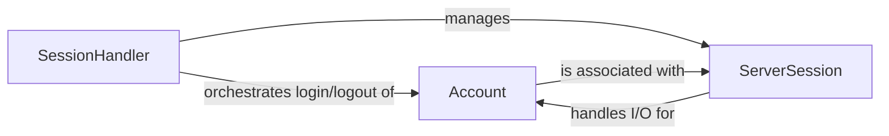

## Details

The Evennia server's core connection management revolves around three key components: `SessionHandler`, `ServerSession`, and `Account`. The `SessionHandler` acts as the central orchestrator, responsible for managing the lifecycle of all client connections, each represented by a `ServerSession`. Upon a client connecting, a `ServerSession` is established to handle the direct network input/output. The `SessionHandler` then facilitates the authentication process, linking the transient `ServerSession` to a persistent `Account` entity. This `Account` represents the user's identity and game state, allowing them to interact with the game world through their active `ServerSession`. This architecture ensures a clear separation between network communication, session management, and persistent user data, providing a robust foundation for the game's multi-user environment.

### Account
Represents the persistent user identity within the game. It stores authentication credentials, manages character ownership, and facilitates the "puppeting" (control) of in-game objects (e.g., player characters). An `Account` exists independently of a live connection.

**Related Classes/Methods**:

- <a href="https://github.com/evennia/evennia/blob/main/evennia/accounts/accounts.py" target="_blank" rel="noopener noreferrer">`evennia.accounts.accounts.Account`</a>

### ServerSession
Represents a single, transient network connection from a client to the Evennia server. It is responsible for the direct input and output of raw data for that specific connection, acting as the immediate interface between the network protocol layer (Portal) and the game's internal logic. A `ServerSession` is created upon connection and destroyed upon disconnection.

**Related Classes/Methods**:

- <a href="https://github.com/evennia/evennia/blob/main/evennia/server/serversession.py#L39-L497" target="_blank" rel="noopener noreferrer">`evennia.server.serversession.ServerSession`:39-497</a>

### SessionHandler
Acts as the central registry and orchestrator for all active `ServerSession` instances. It manages the entire lifecycle of client connections, from initial connection and authentication to data routing and disconnection. It serves as the primary nexus for connection management and the bridge between the network frontend (Portal) and the game's `Account` and `Object` systems.

**Related Classes/Methods**:

- <a href="https://github.com/evennia/evennia/blob/main/evennia/server/sessionhandler.py#L103-L285" target="_blank" rel="noopener noreferrer">`evennia.server.sessionhandler.SessionHandler`:103-285</a>

### [FAQ](https://github.com/CodeBoarding/GeneratedOnBoardings/tree/main?tab=readme-ov-file#faq)