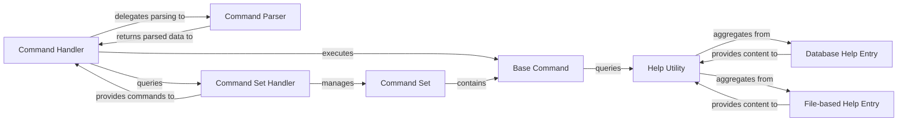

## Details

The `Command & Input Processing` subsystem in Evennia is responsible for receiving, parsing, and dispatching player and system commands, as well as managing the integrated help system. It acts as the primary interface between raw user input and the game's core logic.

### Command Handler
The orchestrator of the command processing flow. It receives raw input, delegates parsing, determines the target command, handles access checks, executes the command, and manages error reporting.

**Related Classes/Methods**:

- <a href="https://github.com/evennia/evennia/blob/main/evennia/commands/cmdhandler.py#L502-L800" target="_blank" rel="noopener noreferrer">`evennia.commands.cmdhandler.cmdhandler`:502-800</a>

### Command Parser
Analyzes raw input strings, breaking them down into a command key, arguments, and switches. It matches the input against available commands.

**Related Classes/Methods**:

- <a href="https://github.com/evennia/evennia/blob/main/evennia/commands/cmdparser.py#L114-L204" target="_blank" rel="noopener noreferrer">`evennia.commands.cmdparser.cmdparser`:114-204</a>

### Base Command
The foundational abstract class for all specific game commands. It defines the common interface and core logic for commands, including `key`, `aliases`, `help_category`, `check_perm`, and the `func` method for execution.

**Related Classes/Methods**:

- <a href="https://github.com/evennia/evennia/blob/main/evennia/commands/command.py" target="_blank" rel="noopener noreferrer">`evennia.commands.command`</a>

### Command Set
A collection or grouping of `Base Command` objects. Command Sets are dynamic and can be attached to various game entities (e.g., players, objects, rooms) to define the commands available in a specific context.

**Related Classes/Methods**:

- <a href="https://github.com/evennia/evennia/blob/main/evennia/commands/cmdset.py" target="_blank" rel="noopener noreferrer">`evennia.commands.cmdset`</a>

### Command Set Handler
Manages the loading, updating, and dynamic application of `CmdSet` objects to entities. It determines the effective set of commands available to a player or object at any given time.

**Related Classes/Methods**:

- <a href="https://github.com/evennia/evennia/blob/main/evennia/commands/cmdsethandler.py" target="_blank" rel="noopener noreferrer">`evennia.commands.cmdsethandler`</a>

### Help Utility
Provides the core functionality for the help system, including searching, retrieving, and aggregating help topics from various sources.

**Related Classes/Methods**:

- <a href="https://github.com/evennia/evennia/blob/main/evennia/help/utils.py" target="_blank" rel="noopener noreferrer">`evennia.help.utils`</a>

### Database Help Entry
Represents help topics stored persistently in the Evennia database. It includes fields for topic name, entry text, category, and access permissions.

**Related Classes/Methods**:

- <a href="https://github.com/evennia/evennia/blob/main/evennia/help/models.py" target="_blank" rel="noopener noreferrer">`evennia.help.models`</a>

### File-based Help Entry
Represents help topics loaded from static files (e.g., Markdown or plain text files).

**Related Classes/Methods**:

- <a href="https://github.com/evennia/evennia/blob/main/evennia/help/filehelp.py" target="_blank" rel="noopener noreferrer">`evennia.help.filehelp`</a>

### [FAQ](https://github.com/CodeBoarding/GeneratedOnBoardings/tree/main?tab=readme-ov-file#faq)