```mermaid
graph LR
    evennia_server_evennia_launcher["evennia.server.evennia_launcher"]
    evennia_server_service_ServerService["evennia.server.service.ServerService"]
    evennia_server_portal_service_PortalService["evennia.server.portal.service.PortalService"]
    evennia_server_sessionhandler_SessionHandler["evennia.server.sessionhandler.SessionHandler"]
    evennia_server_portal_portalsessionhandler_PortalSessionHandler["evennia.server.portal.portalsessionhandler.PortalSessionHandler"]
    evennia_server_amp_client_AMPClientFactory["evennia.server.amp_client.AMPClientFactory"]
    evennia_server_portal_amp_server_AMPServerProtocol["evennia.server.portal.amp_server.AMPServerProtocol"]
    evennia_server_webserver["evennia.server.webserver"]
    evennia_server_evennia_launcher -- "manages" --> evennia_server_service_ServerService
    evennia_server_evennia_launcher -- "manages" --> evennia_server_portal_service_PortalService
    evennia_server_service_ServerService -- "utilizes" --> evennia_server_amp_client_AMPClientFactory
    evennia_server_service_ServerService -- "interacts with" --> evennia_server_sessionhandler_SessionHandler
    evennia_server_portal_service_PortalService -- "manages" --> evennia_server_portal_amp_server_AMPServerProtocol
    evennia_server_portal_service_PortalService -- "interacts with" --> evennia_server_portal_portalsessionhandler_PortalSessionHandler
    evennia_server_sessionhandler_SessionHandler -- "sends output to" --> evennia_server_portal_portalsessionhandler_PortalSessionHandler
    evennia_server_portal_portalsessionhandler_PortalSessionHandler -- "sends input to" --> evennia_server_sessionhandler_SessionHandler
    evennia_server_amp_client_AMPClientFactory -- "sends data to" --> evennia_server_portal_amp_server_AMPServerProtocol
    evennia_server_portal_amp_server_AMPServerProtocol -- "receives data from" --> evennia_server_amp_client_AMPClientFactory
    evennia_server_service_ServerService -- "managed by" --> evennia_server_webserver
    evennia_server_portal_service_PortalService -- "managed by" --> evennia_server_webserver
```

## Details

The Evennia Core subsystem is the foundational layer of the Evennia game development framework, primarily responsible for managing the server's lifecycle, handling network communications, and orchestrating core game services. It embodies the "Game Server Core" and "Networking/Protocol Layer (Portal)" architectural patterns, providing a robust, extensible base for MUD development.

### evennia.server.evennia_launcher
The primary entry point and lifecycle manager for the entire Evennia application. It orchestrates the starting, stopping, reloading, and status monitoring of both the main game server (ServerService) and the network gateway (PortalService). This component aligns with the "Game Server Core" and "Framework-Oriented" patterns, acting as the overarching control mechanism.

**Related Classes/Methods**:

- <a href="https://github.com/evennia/evennia/blob/main/evennia/server/evennia_launcher.py" target="_blank" rel="noopener noreferrer">`evennia.server.evennia_launcher`</a>

### evennia.server.service.ServerService
The core game server process orchestrator. It manages the game world's lifecycle, loads and unloads game-specific sub-services (e.g., scripting engine, web server components), and handles server-side hooks and events. This is the heart of the "Game Server Core" and "Event-Driven Architecture" patterns.

**Related Classes/Methods**:

- <a href="https://github.com/evennia/evennia/blob/main/evennia/server/service.py" target="_blank" rel="noopener noreferrer">`evennia.server.service.ServerService`</a>

### evennia.server.portal.service.PortalService
The dedicated network gateway process. It is responsible for handling all incoming client connections, managing various network protocols (Telnet, WebSockets, SSH, etc.), and acting as the communication bridge between external clients and the internal ServerService. This embodies the "Networking/Protocol Layer (Portal)" and "Client-Server" patterns.

**Related Classes/Methods**:

- <a href="https://github.com/evennia/evennia/blob/main/evennia/server/portal/service.py" target="_blank" rel="noopener noreferrer">`evennia.server.portal.service.PortalService`</a>

### evennia.server.sessionhandler.SessionHandler
Manages logical game sessions on the Server side. It handles user logins, logouts, character selection, and routes processed game data (commands, output) between the game logic and the PortalSessionHandler. This is crucial for "Account & Character Management" and "Client-Server" interaction.

**Related Classes/Methods**:

- <a href="https://github.com/evennia/evennia/blob/main/evennia/server/sessionhandler.py#L103-L285" target="_blank" rel="noopener noreferrer">`evennia.server.sessionhandler.SessionHandler`:103-285</a>

### evennia.server.portal.portalsessionhandler.PortalSessionHandler
Manages raw network sessions on the Portal side. It handles direct client I/O, translates raw network data into a format consumable by the SessionHandler, and sends game output back to the clients. This is a key part of the "Networking/Protocol Layer" and "Client-Server" communication.

**Related Classes/Methods**:

- <a href="https://github.com/evennia/evennia/blob/main/evennia/server/portal/portalsessionhandler.py#L47-L493" target="_blank" rel="noopener noreferrer">`evennia.server.portal.portalsessionhandler.PortalSessionHandler`:47-493</a>

### evennia.server.amp_client.AMPClientFactory
Facilitates the Asynchronous Message Protocol (AMP) connection from the ServerService to the PortalService. It manages the client-side of this inter-process communication, ensuring reliable data exchange. This is a core part of the "Client-Server" (inter-process) and "Modular/Component-Based" communication.

**Related Classes/Methods**:

- <a href="https://github.com/evennia/evennia/blob/main/evennia/server/amp_client.py#L18-L95" target="_blank" rel="noopener noreferrer">`evennia.server.amp_client.AMPClientFactory`:18-95</a>

### evennia.server.portal.amp_server.AMPServerProtocol
Handles incoming AMP connections from the ServerService on the PortalService side. It processes messages from the server and routes them appropriately within the Portal. This complements AMPClientFactory for robust inter-process communication.

**Related Classes/Methods**:

- <a href="https://github.com/evennia/evennia/blob/main/evennia/server/portal/amp_server.py#L89-L502" target="_blank" rel="noopener noreferrer">`evennia.server.portal.amp_server.AMPServerProtocol`:89-502</a>

### evennia.server.webserver
Manages the built-in web server, supporting the web client and administrative interfaces. It integrates with both the ServerService (for game-related web content) and PortalService (for web client connections). This aligns with the "Web Interface/API" component.

**Related Classes/Methods**:

- <a href="https://github.com/evennia/evennia/blob/main/evennia/server/webserver.py" target="_blank" rel="noopener noreferrer">`evennia.server.webserver`</a>

### [FAQ](https://github.com/CodeBoarding/GeneratedOnBoardings/tree/main?tab=readme-ov-file#faq)