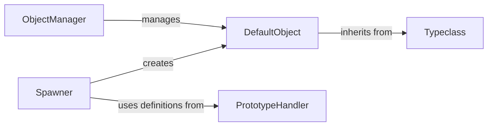

## Details

The Evennia object system is built upon a flexible Typeclass architecture, where Typeclass (implemented via TypeclassBase in evennia/typeclasses/models.py) provides the fundamental blueprint for all in-game entities. DefaultObject (evennia/objects/objects.py) serves as the concrete base for all game objects, inheriting the dynamic capabilities of the Typeclass system. Object creation is streamlined through the PrototypeHandler (evennia/prototypes/prototypes.py), which manages reusable object definitions, and the Spawner (evennia/prototypes/spawner.py), which instantiates DefaultObject instances from these prototypes. The ObjectManager (evennia/objects/manager.py) acts as the central interface for persistent storage, retrieval, and management of all DefaultObject instances within the game world. This modular design allows for highly customizable and dynamically extensible game content.

### Typeclass
The foundational component of Evennia's flexible object system. It provides the core mechanism for dynamically defining and extending the behaviors and data of all game entities. All in-game objects inherit from Typeclass, allowing for custom attributes, tags, and lockable properties, enabling highly customizable game logic.

**Related Classes/Methods**:

- <a href="https://github.com/evennia/evennia/blob/main/evennia/settings_default.py" target="_blank" rel="noopener noreferrer">`Typeclass`</a>

### DefaultObject
The primary representation of all in-game entities (e.g., characters, rooms, items, exits). It encapsulates core properties, handles basic interactions, movement, and messaging within the game world. DefaultObject instances are concrete manifestations of Typeclass definitions.

**Related Classes/Methods**:

- <a href="https://github.com/evennia/evennia/blob/main/evennia/__init__.py" target="_blank" rel="noopener noreferrer">`DefaultObject`</a>

### PrototypeHandler
Manages the definition, storage, retrieval, and validation of prototypes. Prototypes serve as templates for creating game objects, ensuring consistency and efficiency in the instantiation process by pre-defining properties and behaviors.

**Related Classes/Methods**:

- <a href="https://github.com/evennia/evennia/blob/main/evennia/prototypes/prototypes.py" target="_blank" rel="noopener noreferrer">`PrototypeHandler`</a>

### Spawner
Responsible for the actual instantiation of game objects based on prototype definitions. It interprets prototype data, applies inheritance rules, and creates new DefaultObject instances, populating the game world.

**Related Classes/Methods**:

- <a href="https://github.com/evennia/evennia/blob/main/evennia/prototypes/spawner.py" target="_blank" rel="noopener noreferrer">`Spawner`</a>

### ObjectManager
Provides the primary interface for querying, searching, and managing DefaultObject instances within the persistent game world. It handles database interactions for objects, allowing efficient retrieval and manipulation of game entities.

**Related Classes/Methods**:

- <a href="https://github.com/evennia/evennia/blob/main/evennia/objects/manager.py#L722-L723" target="_blank" rel="noopener noreferrer">`ObjectManager`:722-723</a>

### [FAQ](https://github.com/CodeBoarding/GeneratedOnBoardings/tree/main?tab=readme-ov-file#faq)