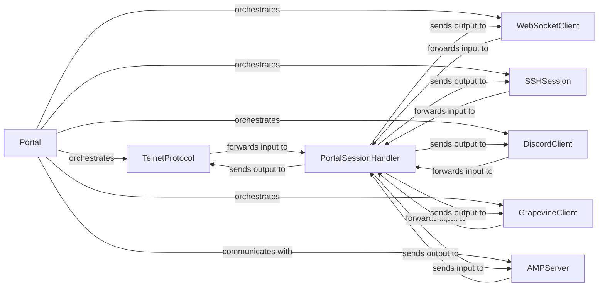

## Details

The Evennia server's `Portal` subsystem acts as the primary entry point for all client connections, orchestrating various network protocols. The `Portal` component initializes and manages different protocol handlers such as `TelnetProtocol`, `WebSocketClient`, `SSHSession`, `DiscordClient`, and `GrapevineClient`, which handle specific client types. All incoming client data from these protocols is forwarded to the `PortalSessionHandler`, which manages individual client sessions and abstracts the underlying network protocols. The `PortalSessionHandler` then routes this data to the `AMPServer` for secure and efficient inter-process communication with the main Evennia game server. Conversely, output from the `AMPServer` is sent back to the `PortalSessionHandler`, which then dispatches it to the appropriate client protocol handlers for transmission back to the clients. This architecture effectively decouples the network layer from the core game logic, enhancing scalability and maintainability.

### Portal [[Expand]](./Portal.md)
Initializes, registers, and manages all network listeners and protocol handlers. It orchestrates the overall lifecycle of network connections, acting as the central hub for all incoming and outgoing network traffic. This component is fundamental as the primary entry point for all client connections.

**Related Classes/Methods**:

- <a href="https://github.com/evennia/evennia/blob/main/evennia/contrib/base_systems/godotwebsocket/webclient.py" target="_blank" rel="noopener noreferrer">`Portal`</a>

### PortalSessionHandler
Manages individual client sessions, abstracts network protocols, and routes data between clients and the game server. It acts as an intermediary between the raw network protocols and the game logic, ensuring protocol independence for the core server.

**Related Classes/Methods**:

- <a href="https://github.com/evennia/evennia/blob/main/evennia/server/portal/portalsessionhandler.py#L47-L493" target="_blank" rel="noopener noreferrer">`PortalSessionHandler`:47-493</a>

### AMPServer
Implements the Asynchronous Messaging Protocol (AMP) for secure and efficient inter-process communication between the Portal and the main Evennia Server. This is crucial for decoupling the network layer from the core game logic, enhancing scalability and stability.

**Related Classes/Methods**:

- <a href="https://github.com/evennia/evennia/blob/main/evennia/server/portal/amp_server.py" target="_blank" rel="noopener noreferrer">`AMPServer`</a>

### TelnetProtocol
Implements the standard Telnet protocol, handling raw data transmission and option negotiation for traditional MUD clients. This is a core component given the project's MUD domain.

**Related Classes/Methods**:

- <a href="https://github.com/evennia/evennia/blob/main/evennia/server/portal/telnet.py#L77-L536" target="_blank" rel="noopener noreferrer">`TelnetProtocol`:77-536</a>

### WebSocketClient
Manages WebSocket connections for web-based clients, enabling real-time communication for browser-based game interfaces. This component supports modern web-based access, aligning with the "Web Interface/API" architectural pattern.

**Related Classes/Methods**:

- <a href="https://github.com/evennia/evennia/blob/main/evennia/contrib/base_systems/godotwebsocket/webclient.py#L19-L62" target="_blank" rel="noopener noreferrer">`WebSocketClient`:19-62</a>

### SSHSession
Provides secure shell (SSH) connectivity, handling authentication and data transfer for SSH clients, offering an alternative secure connection method. This enhances the security and flexibility of client connections.

**Related Classes/Methods**:

- <a href="https://github.com/evennia/evennia/blob/main/evennia/server/portal/ssh.py" target="_blank" rel="noopener noreferrer">`SSHSession`</a>

### DiscordClient
Integrates Evennia with Discord, translating Discord messages into game input and vice-versa, extending the game's reach to popular chat platforms. This component exemplifies the framework's extensibility and ability to integrate with external services.

**Related Classes/Methods**:

- <a href="https://github.com/evennia/evennia/blob/main/evennia/server/portal/discord.py#L219-L573" target="_blank" rel="noopener noreferrer">`DiscordClient`:219-573</a>

### GrapevineClient
Facilitates communication with the Grapevine inter-mud network for cross-game interactions, enabling players to connect with other MUDs. This component highlights the framework's support for the broader MUD ecosystem.

**Related Classes/Methods**:

- <a href="https://github.com/evennia/evennia/blob/main/evennia/server/portal/grapevine.py#L134-L364" target="_blank" rel="noopener noreferrer">`GrapevineClient`:134-364</a>

### [FAQ](https://github.com/CodeBoarding/GeneratedOnBoardings/tree/main?tab=readme-ov-file#faq)