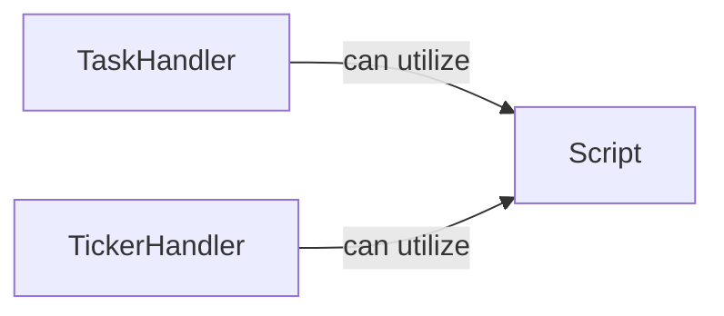

## Details

Initial analysis of Evennia components, focusing on Script, TaskHandler, and TickerHandler, with an emphasis on identifying source code references for improved traceability and diagram generation.

### Script
Represents a scriptable entity within the Evennia game world, capable of running arbitrary Python code at specified intervals or in response to events.

**Related Classes/Methods**:

- <a href="https://github.com/evennia/evennia/blob/main/evennia/scripts/scripts.py#L135-L674" target="_blank" rel="noopener noreferrer">`evennia.scripts.scripts.Script`:135-674</a>

### TaskHandler
Manages asynchronous tasks, allowing for deferred execution of functions or methods.

**Related Classes/Methods**: _None_

### TickerHandler
Handles time-based events and recurring tasks, crucial for scheduling in-game events.

**Related Classes/Methods**: _None_

### [FAQ](https://github.com/CodeBoarding/GeneratedOnBoardings/tree/main?tab=readme-ov-file#faq)