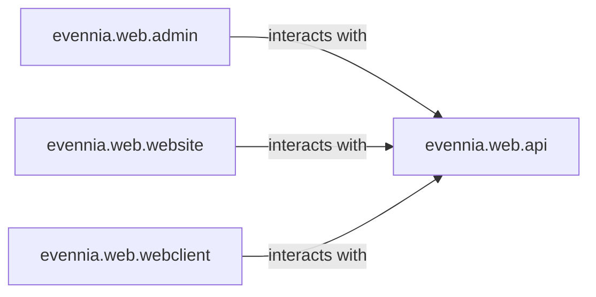

## Details

The evennia.web subsystem provides the web-based interfaces and functionalities for the Evennia game engine. It encompasses the administrative panel for game management, the public-facing website for general information, a real-time web client for interactive gameplay, and a programmatic API for external integrations. These components collectively enable web-based interaction with the Evennia server, catering to administrators, players, and external applications.

### evennia.web.admin
Provides a web-based administrative interface for game administrators and developers. This component is crucial for managing various Evennia game entities such as accounts, objects, and game configurations through a user-friendly web portal.

**Related Classes/Methods**:

- <a href="https://github.com/evennia/evennia/blob/main/evennia/web/admin" target="_blank" rel="noopener noreferrer">`evennia.web.admin`</a>

### evennia.web.website
Handles the public-facing website of the Evennia game. This component serves as a general information portal, providing news, game lore, community updates, and potentially player statistics or forums.

**Related Classes/Methods**:

- <a href="https://github.com/evennia/evennia/blob/main/evennia/web/website" target="_blank" rel="noopener noreferrer">`evennia.web.website`</a>

### evennia.web.webclient
Manages real-time, persistent connections for the primary web-based game client. This component typically utilizes WebSockets to enable interactive, low-latency gameplay directly from a web browser, offering a modern alternative to traditional telnet clients.

**Related Classes/Methods**:

- <a href="https://github.com/evennia/evennia/blob/main/evennia/web/webclient" target="_blank" rel="noopener noreferrer">`evennia.web.webclient`</a>

### evennia.web.api
Exposes Evennia's internal data and functionality programmatically through a well-defined API. This allows external applications, tools, or services to interact with the game engine, promoting extensibility and integration within the broader game ecosystem.

**Related Classes/Methods**:

- <a href="https://github.com/evennia/evennia/blob/main/evennia/web/api" target="_blank" rel="noopener noreferrer">`evennia.web.api`</a>

### [FAQ](https://github.com/CodeBoarding/GeneratedOnBoardings/tree/main?tab=readme-ov-file#faq)