```mermaid
graph LR
    Evennia_Core["Evennia Core"]
    Networking_Portal["Networking & Portal"]
    Account_Session_Management["Account & Session Management"]
    Game_World_Typeclasses["Game World & Typeclasses"]
    Command_Input_Processing["Command & Input Processing"]
    Communication_System["Communication System"]
    Scripting_Automation["Scripting & Automation"]
    Web_Interface["Web Interface"]
    Evennia_Core -- "manages" --> Networking_Portal
    Evennia_Core -- "manages" --> Account_Session_Management
    Evennia_Core -- "manages" --> Game_World_Typeclasses
    Evennia_Core -- "manages" --> Command_Input_Processing
    Evennia_Core -- "manages" --> Communication_System
    Evennia_Core -- "manages" --> Scripting_Automation
    Evennia_Core -- "manages" --> Web_Interface
    Networking_Portal -- "forwards connections to" --> Account_Session_Management
    Networking_Portal -- "sends input to" --> Command_Input_Processing
    Account_Session_Management -- "controls objects in" --> Game_World_Typeclasses
    Account_Session_Management -- "issues commands to" --> Command_Input_Processing
    Command_Input_Processing -- "interacts with" --> Game_World_Typeclasses
    Command_Input_Processing -- "sends messages via" --> Communication_System
    Game_World_Typeclasses -- "triggers scripts in" --> Scripting_Automation
    Scripting_Automation -- "modifies objects in" --> Game_World_Typeclasses
    Communication_System -- "sends messages to" --> Networking_Portal
    Web_Interface -- "accesses" --> Evennia_Core
    Web_Interface -- "accesses" --> Account_Session_Management
    Web_Interface -- "accesses" --> Game_World_Typeclasses
    click Evennia_Core href "https://github.com/CodeBoarding/GeneratedOnBoardings/blob/main/evennia/Evennia_Core.md" "Details"
    click Networking_Portal href "https://github.com/CodeBoarding/GeneratedOnBoardings/blob/main/evennia/Networking_Portal.md" "Details"
    click Account_Session_Management href "https://github.com/CodeBoarding/GeneratedOnBoardings/blob/main/evennia/Account_Session_Management.md" "Details"
    click Game_World_Typeclasses href "https://github.com/CodeBoarding/GeneratedOnBoardings/blob/main/evennia/Game_World_Typeclasses.md" "Details"
    click Command_Input_Processing href "https://github.com/CodeBoarding/GeneratedOnBoardings/blob/main/evennia/Command_Input_Processing.md" "Details"
    click Communication_System href "https://github.com/CodeBoarding/GeneratedOnBoardings/blob/main/evennia/Communication_System.md" "Details"
    click Scripting_Automation href "https://github.com/CodeBoarding/GeneratedOnBoardings/blob/main/evennia/Scripting_Automation.md" "Details"
    click Web_Interface href "https://github.com/CodeBoarding/GeneratedOnBoardings/blob/main/evennia/Web_Interface.md" "Details"
```

## Details

Evennia's architecture is a highly modular, event-driven framework centered around a core server. The Evennia Core acts as the central orchestrator, initializing and managing all primary services. External client interactions are handled by the Networking & Portal, which funnels raw input to the Command & Input Processing system. This system interprets player commands, which then interact with the Game World & Typeclasses to modify the game state or trigger actions. User identity and active connections are managed by Account & Session Management, linking network sessions to in-game entities. Dynamic game logic and background tasks are executed by the Scripting & Automation engine, often interacting with the game world. All in-game messaging is routed through the Communication System. A separate Web Interface provides administrative tools and a web-based client, offering an alternative access point to the server's functionalities and data. This clear separation of concerns allows for robust operation and extensive customization, making Evennia a flexible foundation for diverse MUD and text-based online game development.

### Evennia Core [[Expand]](./Evennia_Core.md)
The central orchestrator, managing the server's lifecycle and coordinating all primary services.

**Related Classes/Methods**:

- <a href="https://github.com/evennia/evennia/blob/main/evennia/server/evennia_launcher.py" target="_blank" rel="noopener noreferrer">`evennia.server.evennia_launcher`</a>
- <a href="https://github.com/evennia/evennia/blob/main/evennia/server/service.py" target="_blank" rel="noopener noreferrer">`evennia.server.service`</a>
- <a href="https://github.com/evennia/evennia/blob/main/evennia/server/server.py" target="_blank" rel="noopener noreferrer">`evennia.server.server`</a>

### Networking & Portal [[Expand]](./Networking_Portal.md)
Handles all external client connections and network protocols, translating raw data to game-ready input and vice-versa.

**Related Classes/Methods**:

- <a href="https://github.com/evennia/evennia/blob/main/evennia/server/portal/service.py" target="_blank" rel="noopener noreferrer">`evennia.server.portal.service`</a>
- <a href="https://github.com/evennia/evennia/blob/main/evennia/server/portal/portalsessionhandler.py" target="_blank" rel="noopener noreferrer">`evennia.server.portal.portalsessionhandler`</a>
- <a href="https://github.com/evennia/evennia/blob/main/evennia/server/portal/telnet.py" target="_blank" rel="noopener noreferrer">`evennia.server.portal.telnet`</a>
- <a href="https://github.com/evennia/evennia/blob/main/evennia/server/portal/webclient.py" target="_blank" rel="noopener noreferrer">`evennia.server.portal.webclient`</a>

### Account & Session Management [[Expand]](./Account_Session_Management.md)
Manages user authentication, account data, and active player sessions, linking network connections to in-game identities.

**Related Classes/Methods**:

- <a href="https://github.com/evennia/evennia/blob/main/evennia/accounts/accounts.py" target="_blank" rel="noopener noreferrer">`evennia.accounts.accounts`</a>
- <a href="https://github.com/evennia/evennia/blob/main/evennia/server/serversession.py" target="_blank" rel="noopener noreferrer">`evennia.server.serversession`</a>
- <a href="https://github.com/evennia/evennia/blob/main/evennia/server/sessionhandler.py" target="_blank" rel="noopener noreferrer">`evennia.server.sessionhandler`</a>

### Game World & Typeclasses [[Expand]](./Game_World_Typeclasses.md)
Defines and manages all in-game entities (objects, rooms, characters) using the flexible Typeclass system and facilitates their creation via prototypes.

**Related Classes/Methods**:

- <a href="https://github.com/evennia/evennia/blob/main/evennia/objects/objects.py" target="_blank" rel="noopener noreferrer">`evennia.objects.objects`</a>
- <a href="https://github.com/evennia/evennia/blob/main/evennia/typeclasses/models.py" target="_blank" rel="noopener noreferrer">`evennia.typeclasses.models`</a>
- <a href="https://github.com/evennia/evennia/blob/main/evennia/prototypes/prototypes.py" target="_blank" rel="noopener noreferrer">`evennia.prototypes.prototypes`</a>
- <a href="https://github.com/evennia/evennia/blob/main/evennia/prototypes/spawner.py" target="_blank" rel="noopener noreferrer">`evennia.prototypes.spawner`</a>

### Command & Input Processing [[Expand]](./Command_Input_Processing.md)
Parses player and system input, dispatching structured commands to the appropriate game logic handlers and managing the help system.

**Related Classes/Methods**:

- <a href="https://github.com/evennia/evennia/blob/main/evennia/commands/cmdhandler.py" target="_blank" rel="noopener noreferrer">`evennia.commands.cmdhandler`</a>
- <a href="https://github.com/evennia/evennia/blob/main/evennia/commands/cmdparser.py" target="_blank" rel="noopener noreferrer">`evennia.commands.cmdparser`</a>
- <a href="https://github.com/evennia/evennia/blob/main/evennia/commands/command.py" target="_blank" rel="noopener noreferrer">`evennia.commands.command`</a>
- <a href="https://github.com/evennia/evennia/blob/main/evennia/help/models.py" target="_blank" rel="noopener noreferrer">`evennia.help.models`</a>

### Communication System [[Expand]](./Communication_System.md)
Manages all in-game communication channels, including global chat, private messages, and custom channels, handling message storage, routing, and delivery.

**Related Classes/Methods**:

- <a href="https://github.com/evennia/evennia/blob/main/evennia/comms/comms.py" target="_blank" rel="noopener noreferrer">`evennia.comms.comms`</a>
- <a href="https://github.com/evennia/evennia/blob/main/evennia/comms/models.py" target="_blank" rel="noopener noreferrer">`evennia.comms.models`</a>

### Scripting & Automation [[Expand]](./Scripting_Automation.md)
Provides mechanisms for running background tasks, scheduled events, and dynamic game logic, enabling persistent and automated game world behaviors.

**Related Classes/Methods**:

- <a href="https://github.com/evennia/evennia/blob/main/evennia/scripts/scripts.py" target="_blank" rel="noopener noreferrer">`evennia.scripts.scripts`</a>
- <a href="https://github.com/evennia/evennia/blob/main/evennia/scripts/taskhandler.py" target="_blank" rel="noopener noreferrer">`evennia.scripts.taskhandler`</a>
- <a href="https://github.com/evennia/evennia/blob/main/evennia/scripts/tickerhandler.py" target="_blank" rel="noopener noreferrer">`evennia.scripts.tickerhandler`</a>

### Web Interface [[Expand]](./Web_Interface.md)
Offers web-based functionalities for Evennia, including administrative panels, a built-in web client, and a programmatic API for external applications.

**Related Classes/Methods**:

- <a href="https://github.com/evennia/evennia/blob/main/evennia/web/admin" target="_blank" rel="noopener noreferrer">`evennia.web.admin`</a>
- <a href="https://github.com/evennia/evennia/blob/main/evennia/web/website" target="_blank" rel="noopener noreferrer">`evennia.web.website`</a>
- <a href="https://github.com/evennia/evennia/blob/main/evennia/web/webclient" target="_blank" rel="noopener noreferrer">`evennia.web.webclient`</a>
- <a href="https://github.com/evennia/evennia/blob/main/evennia/web/api" target="_blank" rel="noopener noreferrer">`evennia.web.api`</a>

### [FAQ](https://github.com/CodeBoarding/GeneratedOnBoardings/tree/main?tab=readme-ov-file#faq)