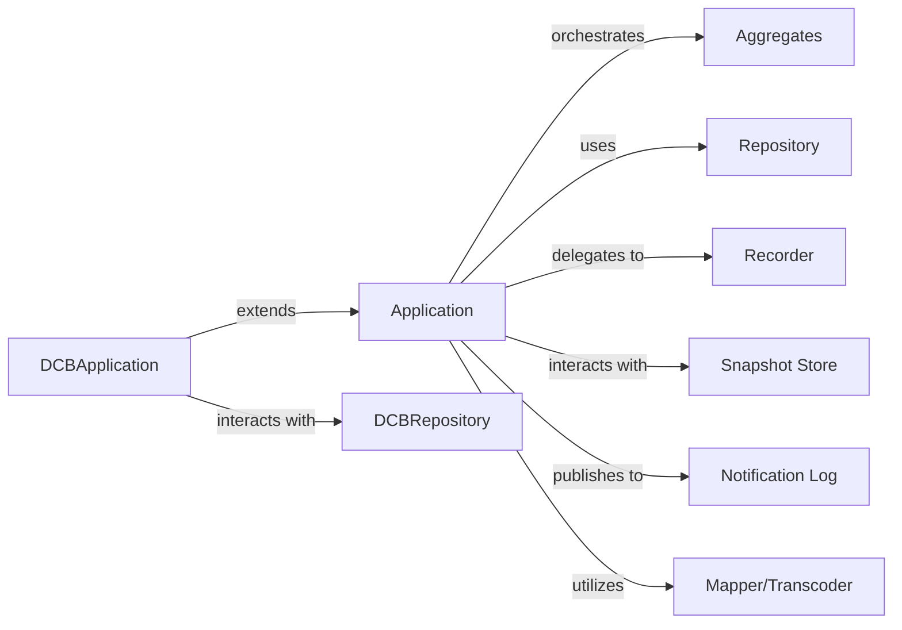

## Details

The `eventsourcing` project implements an Event Sourcing pattern, centered around the `Application` component. This component orchestrates the lifecycle of `Aggregates`, which are the core domain models emitting events. The `Application` utilizes a `Repository` to reconstruct and persist `Aggregates` from their event history. Domain events are durably stored by the `Recorder` and subsequently published to a `Notification Log` for consumption by other parts of the system. A `Snapshot Store` is employed to optimize aggregate loading performance. Data transformations, including serialization and deserialization of domain objects and events, are handled by `Mapper/Transcoder` components. The `DCBApplication` and `DCBRepository` represent specialized extensions for distributed command processing, demonstrating the framework's extensibility.

### Application
The core application service. It acts as the primary entry point for commands, orchestrating interactions between the domain model (Aggregates) and persistence mechanisms. It manages the loading, saving, and state changes of Aggregates, delegates event appending to the Recorder, interacts with the Snapshot Store, and publishes recorded events to the Notification Log. It also utilizes Mapper/Transcoder components for data transformation.

**Related Classes/Methods**:

- <a href="https://github.com/pyeventsourcing/eventsourcing/blob/9.5/eventsourcing/application.py#L604-L890" target="_blank" rel="noopener noreferrer">`eventsourcing.application.Application`:604-890</a>

### DCBApplication
A specialized extension of the Application component, likely designed for distributed command processing, showcasing the framework's pluggability and extensibility for specific deployment scenarios.

**Related Classes/Methods**:

- <a href="https://github.com/pyeventsourcing/eventsourcing/blob/9.5/eventsourcing/dcb/application.py#L28-L63" target="_blank" rel="noopener noreferrer">`eventsourcing.dcb.application.DCBApplication`:28-63</a>

### Aggregates
The core domain model components. Their lifecycle, including loading, state changes, and saving, is directly managed and orchestrated by the Application service. Aggregates are the source of domain events.

**Related Classes/Methods**:

- <a href="https://github.com/pyeventsourcing/eventsourcing/blob/9.5/eventsourcing/domain.py#L100-L200" target="_blank" rel="noopener noreferrer">`eventsourcing.domain.AggregateRoot`:100-200</a>

### Repository
A component used by the Application service to load and save Aggregates. It reconstructs Aggregates from their event history and persists their state changes.

**Related Classes/Methods**:

- <a href="https://github.com/pyeventsourcing/eventsourcing/blob/9.5/eventsourcing/application.py#L653-L656" target="_blank" rel="noopener noreferrer">`eventsourcing.application.Repository`:653-656</a>

### Recorder
The component responsible for persisting domain events. Events generated by Aggregates (and managed by the Application) are passed to the Recorder for durable storage in the event store.

**Related Classes/Methods**:

- <a href="https://github.com/pyeventsourcing/eventsourcing/blob/9.5/eventsourcing/persistence.py" target="_blank" rel="noopener noreferrer">`eventsourcing.persistence.Recorder`</a>

### Snapshot Store
A component where aggregate snapshots are managed and stored by the Application service. It's used to optimize performance by reducing the number of events that need to be replayed when reconstructing an Aggregate.

**Related Classes/Methods**:

- <a href="https://github.com/pyeventsourcing/eventsourcing/blob/9.5/eventsourcing/application.py#L300-L400" target="_blank" rel="noopener noreferrer">`eventsourcing.application.Snapshotting`:300-400</a>

### Notification Log
The mechanism through which recorded events are made available for consumption by other parts of the system, such as read models (projections) or external integrations. The Application publishes events to this log.

**Related Classes/Methods**:

- <a href="https://github.com/pyeventsourcing/eventsourcing/blob/9.5/eventsourcing/application.py#L423-L446" target="_blank" rel="noopener noreferrer">`eventsourcing.application.NotificationLog`:423-446</a>

### Mapper/Transcoder
Components responsible for handling data transformation, specifically for the serialization and deserialization of domain objects and events. They ensure that domain objects can be correctly stored and retrieved from persistence mechanisms.

**Related Classes/Methods**:

- <a href="https://github.com/pyeventsourcing/eventsourcing/blob/9.5/eventsourcing/persistence.py" target="_blank" rel="noopener noreferrer">`eventsourcing.persistence.Transcoder`</a>

### DCBRepository
A specialized repository used by DCBApplication for its persistence needs.

**Related Classes/Methods**:

- <a href="https://github.com/pyeventsourcing/eventsourcing/blob/9.5/eventsourcing/dcb/application.py#L66-L130" target="_blank" rel="noopener noreferrer">`eventsourcing.dcb.application.DCBRepository`:66-130</a>

### [FAQ](https://github.com/CodeBoarding/GeneratedOnBoardings/tree/main?tab=readme-ov-file#faq)