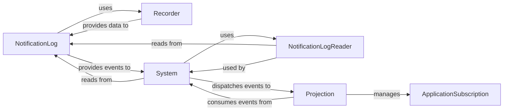

## Details

The `eventsourcing` subsystem centers around an event-driven architecture, with the `NotificationLog` acting as the immutable, ordered stream of all domain events. The `Recorder` component is responsible for the low-level persistence and retrieval of these events, abstracting the underlying storage mechanism for the `NotificationLog`. The `System` component serves as the primary event consumer, continuously reading raw notifications from the `NotificationLog` (via the `NotificationLogReader` abstraction) and transforming them into domain events. These events are then dispatched to various `Projection` instances. Each `Projection` is designed to consume specific events to build read models or manage long-running processes, maintaining its progress through the event stream via an `ApplicationSubscription`. This design ensures a clear separation of concerns, with a robust mechanism for event persistence, consumption, and projection management.

### NotificationLog
The foundational component representing a read-only, ordered stream of all recorded domain events. It acts as the primary source for event consumers, providing a consistent view of the system's history.

**Related Classes/Methods**:

- <a href="https://github.com/pyeventsourcing/eventsourcing/blob/9.5/eventsourcing/application.py#L423-L446" target="_blank" rel="noopener noreferrer">`eventsourcing.application.NotificationLog`:423-446</a>

### Recorder
Provides the underlying mechanism for `NotificationLog` to retrieve raw persisted event data. It abstracts the persistence details of the event store.

**Related Classes/Methods**:

- <a href="https://github.com/pyeventsourcing/eventsourcing/blob/9.5/eventsourcing/persistence.py#L470-L510" target="_blank" rel="noopener noreferrer">`eventsourcing.persistence.ApplicationRecorder`:470-510</a>

### System
The orchestrator for event consumption. It manages the continuous process of pulling raw notifications from the `NotificationLog`, converting them into domain events, and dispatching them to registered `Projection` instances. It embodies the active part of the event consumption pipeline.

**Related Classes/Methods**:

- <a href="https://github.com/pyeventsourcing/eventsourcing/blob/9.5/eventsourcing/system.py" target="_blank" rel="noopener noreferrer">`eventsourcing.system.System`</a>

### NotificationLogReader
Abstracts the reading process from `NotificationLog` specifically for the `System` component, providing a clean interface for event stream navigation. This component is an abstraction of the reading mechanism, primarily handled by the `NotificationLog`'s `read` methods, as utilized by the `System`.

**Related Classes/Methods**:

- <a href="https://github.com/pyeventsourcing/eventsourcing/blob/9.5/eventsourcing/application.py" target="_blank" rel="noopener noreferrer">`eventsourcing.application.NotificationLog.read`</a>

### Projection
A generic base component for consuming events and building read models (materialized views) or managing long-running processes (process managers). It defines the policy for how specific events are handled to update state or trigger actions.

**Related Classes/Methods**:

- <a href="https://github.com/pyeventsourcing/eventsourcing/blob/9.5/eventsourcing/projection.py" target="_blank" rel="noopener noreferrer">`eventsourcing.projection.Projection`</a>

### ApplicationSubscription
Manages the subscription state for `Projection` instances, ensuring correct event stream position and enabling resilient event processing. This is likely an internal mechanism or state managed by the `Projection` or `System` rather than a distinct class. It represents the persistent tracking of a projection's progress through the event stream.

**Related Classes/Methods**: _None_

### [FAQ](https://github.com/CodeBoarding/GeneratedOnBoardings/tree/main?tab=readme-ov-file#faq)