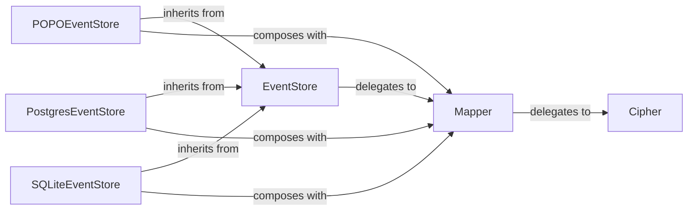

## Details

The `eventsourcing` persistence subsystem is designed around the `EventStore` abstraction, which defines the core contract for event and snapshot storage. This allows for flexible and pluggable persistence mechanisms. Concrete implementations like `POPOEventStore` (in-memory), `PostgresEventStore`, and `SQLiteEventStore` extend this base, providing diverse storage options. The `Mapper` component plays a crucial role in data transformation, handling serialization, compression, and encryption of events before they are persisted. It delegates cryptographic operations to the `Cipher` component, ensuring data confidentiality. This architecture promotes a clear separation of concerns, enabling different storage backends to be used interchangeably while maintaining consistent data handling and security.

### EventStore
Defines the contract for storing and retrieving domain events and snapshots. It acts as the primary interface for the Repository Pattern, abstracting the underlying persistence mechanism. This component is crucial for enabling pluggable persistence adapters.

**Related Classes/Methods**:

- <a href="https://github.com/pyeventsourcing/eventsourcing/blob/9.5/eventsourcing/persistence.py#L598-L652" target="_blank" rel="noopener noreferrer">`eventsourcing.persistence.EventStore`:598-652</a>

### Mapper
Handles the serialization, compression, and encryption/decryption of domain events and snapshots to and from their storable format. Ensures data integrity and security before persistence. It's a key component for data transformation and security.

**Related Classes/Methods**:

- <a href="https://github.com/pyeventsourcing/eventsourcing/blob/9.5/eventsourcing/persistence.py" target="_blank" rel="noopener noreferrer">`eventsourcing.persistence.Mapper`</a>

### Cipher
Provides the cryptographic services (encryption/decryption) required by the `Mapper` to secure sensitive event data. This component ensures the confidentiality of stored events.

**Related Classes/Methods**:

- <a href="https://github.com/pyeventsourcing/eventsourcing/blob/9.5/eventsourcing/cipher.py" target="_blank" rel="noopener noreferrer">`eventsourcing.cipher.Cipher`</a>

### POPOEventStore
An in-memory, Plain Old Python Object (POPO) based implementation of `EventStore`, primarily used for development, testing, or lightweight applications where disk persistence is not required. It provides a simple, non-persistent storage solution.

**Related Classes/Methods**:

- <a href="https://github.com/pyeventsourcing/eventsourcing/blob/9.5/eventsourcing/popo.py" target="_blank" rel="noopener noreferrer">`eventsourcing.popo.POPOEventStore`</a>

### PostgresEventStore
A concrete implementation of `EventStore` specifically for PostgreSQL databases, managing database-specific operations and optimizations. This component enables robust, persistent storage using PostgreSQL.

**Related Classes/Methods**:

- <a href="https://github.com/pyeventsourcing/eventsourcing/blob/9.5/eventsourcing/postgres.py" target="_blank" rel="noopener noreferrer">`eventsourcing.postgres.PostgresEventStore`</a>

### SQLiteEventStore
A concrete implementation of `EventStore` for SQLite databases, handling file-based or in-memory SQLite connections. This component offers a lightweight, file-based persistent storage option.

**Related Classes/Methods**:

- <a href="https://github.com/pyeventsourcing/eventsourcing/blob/9.5/eventsourcing/sqlite.py" target="_blank" rel="noopener noreferrer">`eventsourcing.sqlite.SQLiteEventStore`</a>

### [FAQ](https://github.com/CodeBoarding/GeneratedOnBoardings/tree/main?tab=readme-ov-file#faq)