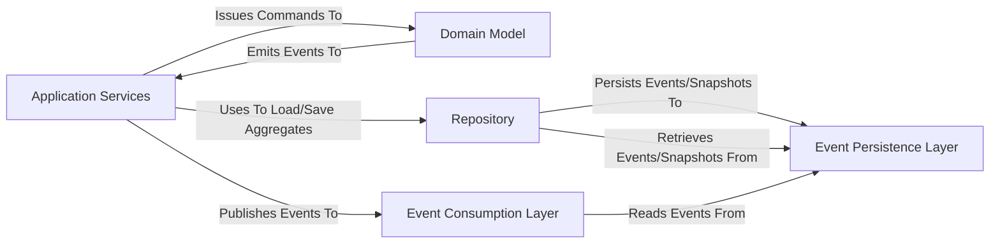

## Details

The `eventsourcing` project implements an Event Sourcing pattern, centralizing around a `Domain Model` that emits `Domain Events`. `Application Services` act as the command handlers, orchestrating interactions with the `Domain Model` and persisting events via the `Repository` into the `Event Persistence Layer`. The `Event Consumption Layer` provides read-only access to these events, enabling the construction of read models and the execution of long-running processes. This architecture ensures a clear separation of concerns, with data flow primarily originating from commands in `Application Services`, flowing through the `Domain Model` to generate events, and then being persisted and subsequently consumed for various purposes.

### Application Services [[Expand]](./Application_Services.md)
The primary entry point for commands, orchestrating interactions between the domain model and persistence. Manages the lifecycle of aggregates and publishes events.

**Related Classes/Methods**:

- <a href="https://github.com/pyeventsourcing/eventsourcing/blob/9.5/eventsourcing/application.py#L604-L890" target="_blank" rel="noopener noreferrer">`eventsourcing.application.Application`:604-890</a>
- <a href="https://github.com/pyeventsourcing/eventsourcing/blob/9.5/eventsourcing/dcb/application.py#L28-L63" target="_blank" rel="noopener noreferrer">`eventsourcing.dcb.application.DCBApplication`:28-63</a>

### Domain Model
Encapsulates core business logic, state, and behavior. Aggregates enforce invariants and are the source of truth for Domain Events.

**Related Classes/Methods**:

- <a href="https://github.com/pyeventsourcing/eventsourcing/blob/9.5/eventsourcing/domain.py#L1926-L1969" target="_blank" rel="noopener noreferrer">`eventsourcing.domain.Aggregate`:1926-1969</a>
- <a href="https://github.com/pyeventsourcing/eventsourcing/blob/9.5/eventsourcing/domain.py#L411-L429" target="_blank" rel="noopener noreferrer">`eventsourcing.domain.DomainEvent`:411-429</a>

### Repository
An abstraction layer for loading and saving Domain Aggregates, mediating between Application Services and the Event Persistence Layer.

**Related Classes/Methods**:

- <a href="https://github.com/pyeventsourcing/eventsourcing/blob/9.5/eventsourcing/application.py#L653-L656" target="_blank" rel="noopener noreferrer">`eventsourcing.application.Repository`:653-656</a>

### Event Persistence Layer [[Expand]](./Event_Persistence_Layer.md)
The foundational layer for storing and retrieving Domain Events and Snapshots. Includes the Event Store, Snapshot Store, Event Mapper/Transcoder for serialization, Security/Cipher for encryption, and pluggable Persistence Adapters.

**Related Classes/Methods**:

- <a href="https://github.com/pyeventsourcing/eventsourcing/blob/9.5/eventsourcing/persistence.py" target="_blank" rel="noopener noreferrer">`eventsourcing.persistence.Mapper`</a>
- <a href="https://github.com/pyeventsourcing/eventsourcing/blob/9.5/eventsourcing/persistence.py#L598-L652" target="_blank" rel="noopener noreferrer">`eventsourcing.persistence.EventStore`:598-652</a>
- <a href="https://github.com/pyeventsourcing/eventsourcing/blob/9.5/eventsourcing/popo.py" target="_blank" rel="noopener noreferrer">`eventsourcing.popo.POPOEventStore`</a>
- <a href="https://github.com/pyeventsourcing/eventsourcing/blob/9.5/eventsourcing/postgres.py" target="_blank" rel="noopener noreferrer">`eventsourcing.postgres.PostgresEventStore`</a>
- <a href="https://github.com/pyeventsourcing/eventsourcing/blob/9.5/eventsourcing/sqlite.py" target="_blank" rel="noopener noreferrer">`eventsourcing.sqlite.SQLiteEventStore`</a>
- <a href="https://github.com/pyeventsourcing/eventsourcing/blob/9.5/eventsourcing/cipher.py" target="_blank" rel="noopener noreferrer">`eventsourcing.cipher.Cipher`</a>

### Event Consumption Layer [[Expand]](./Event_Consumption_Layer.md)
Provides a read-only stream of all recorded events (Notification Log) for consumers like Projections (for read models) and Process Managers (for long-running processes).

**Related Classes/Methods**:

- <a href="https://github.com/pyeventsourcing/eventsourcing/blob/9.5/eventsourcing/application.py#L423-L446" target="_blank" rel="noopener noreferrer">`eventsourcing.application.NotificationLog`:423-446</a>
- <a href="https://github.com/pyeventsourcing/eventsourcing/blob/9.5/eventsourcing/projection.py" target="_blank" rel="noopener noreferrer">`eventsourcing.projection.Projection`</a>
- <a href="https://github.com/pyeventsourcing/eventsourcing/blob/9.5/eventsourcing/system.py" target="_blank" rel="noopener noreferrer">`eventsourcing.system.System`</a>

### [FAQ](https://github.com/CodeBoarding/GeneratedOnBoardings/tree/main?tab=readme-ov-file#faq)