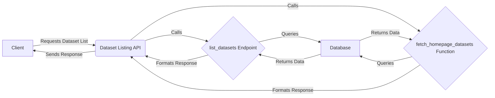

## Dataset Listing API Overview

This diagram illustrates the flow for listing datasets, including fetching datasets for the homepage.

### Component Descriptions:

*   **Client:** The user interface or application that requests the list of datasets.
    *   **Responsibility:** Initiates the request for dataset listing or homepage datasets.
    *   **Interaction:** Sends requests to the Dataset Listing API and receives the response.

*   **Dataset Listing API:** The main API endpoint for handling dataset listing requests.
    *   **Responsibility:** Routes requests to the appropriate function (either `list_datasets` or `fetch_homepage_datasets`), aggregates the data, and returns the response.
    *   **Interaction:** Receives requests from the Client, calls `list_datasets` and `fetch_homepage_datasets`, and sends the response back to the Client.
    *   **Relevant source files:** `repos.explorer.app-api.routes.dataset.list` (assumed)

*   **list_datasets Endpoint:** API endpoint to list datasets with pagination and filtering.
    *   **Responsibility:** Handles requests for listing datasets, applies pagination and filtering criteria, and queries the database.
    *   **Interaction:** Called by the Dataset Listing API, queries the Database, and returns data to the Dataset Listing API.
    *   **Relevant source files:** `repos.explorer.app-api.routes.dataset.list:list_datasets` (assumed)

*   **fetch_homepage_datasets Function:** Fetches datasets specifically for display on the homepage, applying specific criteria.
    *   **Responsibility:** Handles requests for fetching homepage datasets, applies specific criteria, and queries the database.
    *   **Interaction:** Called by the Dataset Listing API, queries the Database, and returns data to the Dataset Listing API.
    *   **Relevant source files:** `repos.explorer.app-api.routes.dataset.list:fetch_homepage_datasets` (assumed)

*   **Database:** The data storage system.
    *   **Responsibility:** Stores dataset information.
    *   **Interaction:** Receives queries from `list_datasets` and `fetch_homepage_datasets` and returns the requested data.
