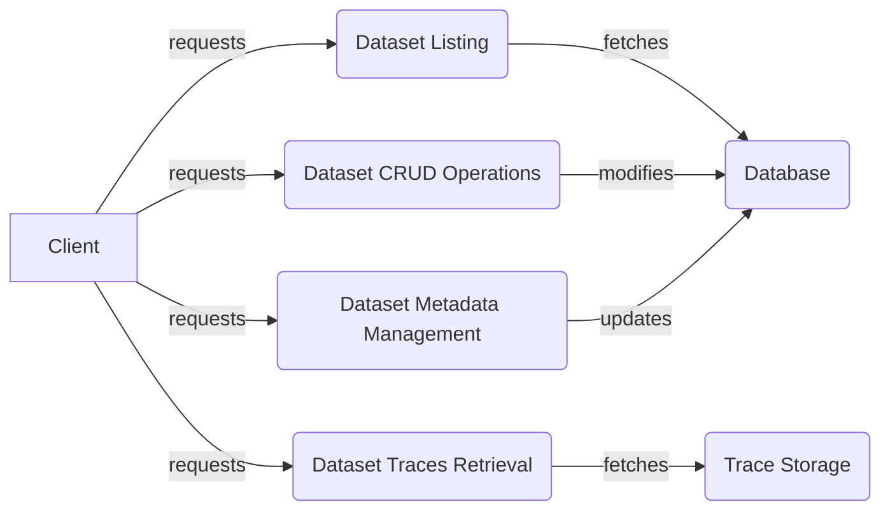

## Dataset Management API Overview

This document provides an overview of the Dataset Management API, which offers core functionalities for managing datasets, including CRUD operations and metadata handling. The API is structured around several key components that handle different aspects of dataset management.

### Data Flow Diagram

### Component Descriptions

*   **Dataset Listing:** This component handles requests for listing datasets, potentially with homepage-specific filtering. It fetches dataset information from the database and returns it to the client.
    *   Relevant source files:
        *   `repos.explorer.app-api.routes.dataset.list:list_datasets`
        *   `repos.explorer.app-api.routes.dataset.list.fetch_homepage_datasets`

*   **Dataset CRUD Operations:** This component provides functionalities to create, read, update, and delete datasets. It interacts with the database to perform these operations.
    *   Relevant source files:
        *   `repos.explorer.app-api.routes.dataset.crud:get_dataset_by_id`
        *   `repos.explorer.app-api.routes.dataset.crud:get_dataset_by_name`
        *   `repos.explorer.app-api.routes.dataset.crud:delete_dataset_by_id`
        *   `repos.explorer.app-api.routes.dataset.crud:delete_dataset_by_name`
        *   `repos.explorer.app-api.routes.dataset.crud:update_dataset_by_id`
        *   `repos.explorer.app-api.routes.dataset.crud:update_dataset_by_name`

*   **Dataset Metadata Management:** This component handles updating and validating dataset metadata. It defines metadata fields with specific types and validation rules. It updates the dataset metadata in the database.
    *   Relevant source files:
        *   `repos.explorer.app-api.routes.dataset_metadata:update_dataset_metadata`
        *   `repos.explorer.app-api.routes.dataset_metadata.TestReportField`
        *   `repos.explorer.app-api.routes.dataset_metadata.NonEmptyStringMetadataField`
        *   `repos.explorer.app-api.routes.dataset_metadata.PositiveNumber`
        *   `repos.explorer.app-api.routes.dataset_metadata.ReadOnlyMetadataField`
        *   `repos.explorer.app-api.routes.dataset_metadata.PrimitiveMetadataField`

*   **Dataset Traces Retrieval:** This component provides functionalities to retrieve traces associated with a dataset. It fetches traces from the trace storage based on dataset ID or name and returns them to the client.
    *   Relevant source files:
        *   `repos.explorer.app-api.routes.dataset.traces:get_traces_by_id`
        *   `repos.explorer.app-api.routes.dataset.traces:get_traces_by_name`
        *   `repos.explorer.app-api.routes.dataset.traces:get_traces_by_name_full`
        *   `repos.explorer.app-api.routes.dataset.traces:download_traces_as_analyzer_input`

