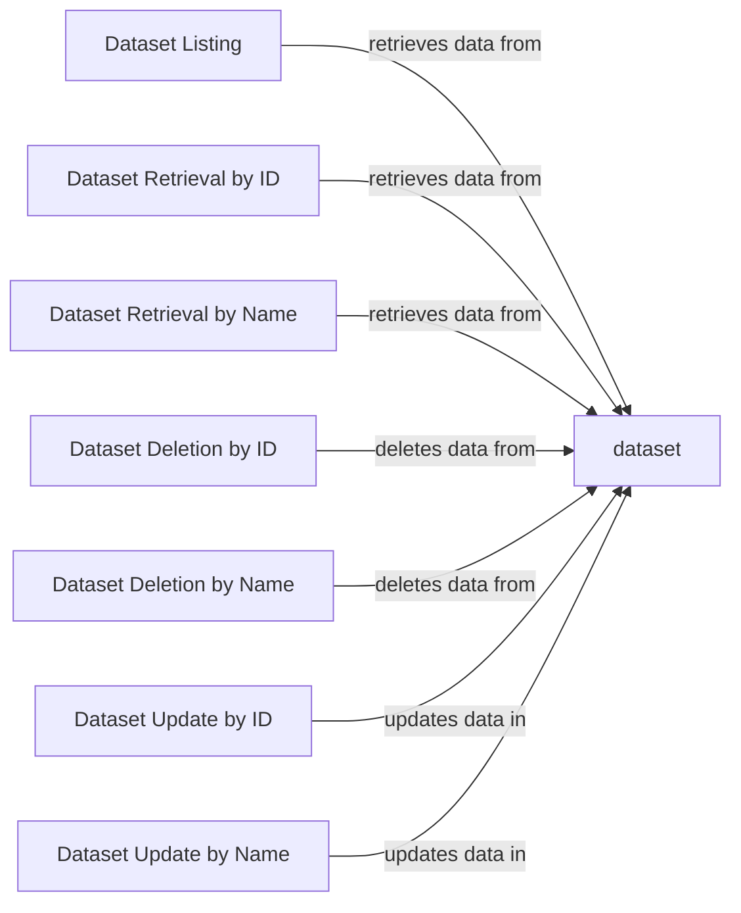

## Component Details

The Dataset Management component provides a centralized interface for managing datasets within the application. It encompasses functionalities for creating, retrieving, updating, and deleting datasets, as well as listing all available datasets. The component interacts with the database to persist and retrieve dataset information, ensuring data integrity and consistency. It serves as the core module for all dataset-related operations, providing a consistent and reliable way to interact with dataset resources.

### Dataset Listing
This component is responsible for retrieving and listing all available datasets from the database. It queries the database for all datasets and returns a list of dataset objects, which can then be displayed to the user or used by other components.
- **Related Classes/Methods**: `explorer.app-api.routes.dataset.list:list_datasets`

### Dataset Retrieval by ID
This component retrieves a specific dataset from the database based on its unique ID. It takes the dataset ID as input, queries the database for a dataset with that ID, and returns the dataset object if found. If no dataset with the given ID exists, it returns an error.
- **Related Classes/Methods**: `explorer.app-api.routes.dataset.crud:get_dataset_by_id`

### Dataset Retrieval by Name
This component retrieves a specific dataset from the database based on its name. It takes the dataset name as input, queries the database for a dataset with that name, and returns the dataset object if found. If no dataset with the given name exists, it returns an error.
- **Related Classes/Methods**: `explorer.app-api.routes.dataset.crud:get_dataset_by_name`

### Dataset Deletion by ID
This component deletes a dataset from the database based on its unique ID. It takes the dataset ID as input, queries the database for a dataset with that ID, and deletes the dataset if found. If no dataset with the given ID exists, it returns an error.
- **Related Classes/Methods**: `explorer.app-api.routes.dataset.crud:delete_dataset_by_id`

### Dataset Deletion by Name
This component deletes a dataset from the database based on its name. It takes the dataset name as input, queries the database for a dataset with that name, and deletes the dataset if found. If no dataset with the given name exists, it returns an error.
- **Related Classes/Methods**: `explorer.app-api.routes.dataset.crud:delete_dataset_by_name`

### Dataset Update by ID
This component updates an existing dataset in the database based on its unique ID. It takes the dataset ID and the updated dataset information as input, queries the database for a dataset with that ID, and updates the dataset with the new information. If no dataset with the given ID exists, it returns an error.
- **Related Classes/Methods**: `explorer.app-api.routes.dataset.crud:update_dataset_by_id`

### Dataset Update by Name
This component updates an existing dataset in the database based on its name. It takes the dataset name and the updated dataset information as input, queries the database for a dataset with that name, and updates the dataset with the new information. If no dataset with the given name exists, it returns an error.
- **Related Classes/Methods**: `explorer.app-api.routes.dataset.crud:update_dataset_by_name`
