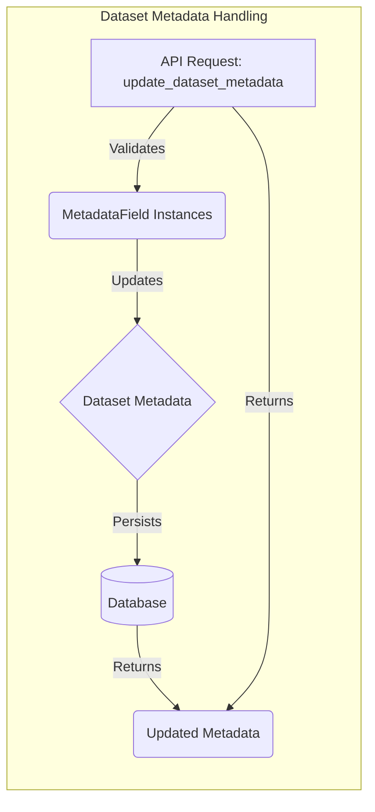

## Dataset Metadata Handling Overview

This component handles the validation and updating of dataset metadata fields. It defines various metadata field types and their validation rules. The core of this component revolves around the `update_dataset_metadata` function, which orchestrates the validation and updating of different metadata fields based on the provided metadata dictionary and update mode (incremental or replace_all).

Here's a data flow diagram illustrating the process:

**Component Descriptions:**

*   **API Request: `update_dataset_metadata`**
    *   *Description*: Entry point for updating dataset metadata. Receives the request, extracts metadata, and orchestrates the validation and update process.
    *   *Functionality*: Receives dataset name, user ID, metadata, and update mode. It then calls the appropriate `MetadataField` instances to validate and update the metadata.
    *   *Interaction*: Receives requests from the API layer, calls `MetadataField` instances, and returns the updated metadata.
    *   *Relevant source files*: `repos.explorer.app-api.routes.dataset_metadata:update_dataset_metadata`

*   **`MetadataField` Instances**
    *   *Description*: A collection of `MetadataField` subclasses, each responsible for validating and updating a specific type of metadata field.
    *   *Functionality*: Each instance implements the `validate` and `update` methods, providing type-specific validation and update logic.
    *   *Interaction*: Called by `update_dataset_metadata` to validate and update specific metadata fields. Interacts with the Dataset Metadata to apply changes.
    *   *Relevant source files*:
        *   `repos.explorer.app-api.routes.dataset_metadata.MetadataField`
        *   `repos.explorer.app-api.routes.dataset_metadata.PrimitiveMetadataField`
        *   `repos.explorer.app-api.routes.dataset_metadata.NonEmptyStringMetadataField`
        *   `repos.explorer.app-api.routes.dataset_metadata.PositiveNumber`
        *   `repos.explorer.app-api.routes.dataset_metadata.TestReportField`
        *   `repos.explorer.app-api.routes.dataset_metadata.ReadOnlyMetadataField`

*   **Dataset Metadata**
    *   *Description*: The actual metadata associated with a dataset, stored as a dictionary.
    *   *Functionality*: Holds the metadata values. Updated by the `MetadataField` instances.
    *   *Interaction*: Updated by `MetadataField` instances. Persisted to the database.
    *   *Relevant source files*: `models.datasets_and_traces`

*   **Database**
    *   *Description*: The database where the dataset metadata is stored.
    *   *Functionality*: Persists the updated metadata.
    *   *Interaction*: Receives updated metadata from the Dataset Metadata component.
    *   *Relevant source files*: `models.datasets_and_traces`

*   **Updated Metadata**
    *   *Description*: The updated metadata dictionary, ready to be returned to the client.
    *   *Functionality*: Contains the updated metadata values, filtered based on the `include_in_response` flag.
    *   *Interaction*: Returned to the API layer.
    *   *Relevant source files*: `repos.explorer.app-api.routes.dataset_metadata:update_dataset_metadata`
