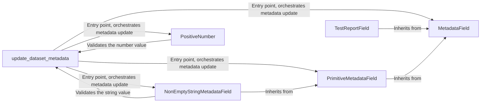

## Component Details

The Dataset Metadata Management component is responsible for handling updates and validation of metadata associated with datasets. It defines the structure and rules for metadata fields, ensuring data integrity and consistency. The main flow involves receiving an update request, validating the provided metadata against predefined field types and rules, and then persisting the updated metadata. This system relies on a hierarchy of classes to define metadata fields and their validation logic.

### update_dataset_metadata
This function serves as the entry point for updating dataset metadata. It receives a request, validates the input data against predefined metadata field types and rules, and then updates the dataset's metadata accordingly. It orchestrates the validation process using the various MetadataField subclasses.
- **Related Classes/Methods**: `explorer.app-api.routes.dataset_metadata:update_dataset_metadata`

### MetadataField
This is an abstract base class for all metadata fields. It defines the interface for metadata fields, including a validation method. Concrete metadata field classes inherit from this class and implement specific validation logic.
- **Related Classes/Methods**: `explorer.app-api.routes.dataset_metadata.MetadataField`

### PrimitiveMetadataField
This class serves as a base for primitive metadata fields like strings and numbers. It likely provides common validation and processing logic applicable to primitive data types. It inherits from MetadataField.
- **Related Classes/Methods**: `explorer.app-api.routes.dataset_metadata.PrimitiveMetadataField`

### NonEmptyStringMetadataField
This class represents a metadata field that must be a non-empty string. It inherits from PrimitiveMetadataField and implements specific validation to ensure the string is not empty. It uses the validate method to check the string's content.
- **Related Classes/Methods**: `explorer.app-api.routes.dataset_metadata.NonEmptyStringMetadataField:validate`

### PositiveNumber
This class represents a metadata field that must be a positive number. It provides validation logic to ensure that the number is positive. It uses the validate method to check the number's value.
- **Related Classes/Methods**: `explorer.app-api.routes.dataset_metadata.PositiveNumber:validate`

### TestReportField
This class represents a metadata field specifically designed for test reports. It likely contains specific validation and processing logic relevant to test report metadata. It inherits from MetadataField.
- **Related Classes/Methods**: `explorer.app-api.routes.dataset_metadata.TestReportField:__init__`
