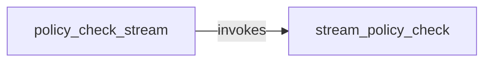

## Component Details

The Dataset Policy Enforcement component ensures that datasets adhere to predefined policies. It provides a mechanism for compliance and quality control by checking datasets against these policies. The process begins with the `policy_check_stream` function, which initiates the policy check on a data stream, setting up configurations for stream processing, including authentication, dataset identification, and policy retrieval. Subsequently, the `stream_policy_check` function processes the data stream, applying the defined policies, validating each record, and reporting any violations. This component supports streaming policy checks for efficient processing of large datasets.

### policy_check_stream
This function serves as the entry point for initiating policy checks on a data stream. It configures the necessary parameters for stream processing, including authentication details, dataset identification, and policy retrieval mechanisms. It prepares the environment for the subsequent policy evaluation process.
- **Related Classes/Methods**: `explorer.app-api.routes.dataset.policy_checking:policy_check_stream`

### stream_policy_check
This function is responsible for the core logic of processing the data stream and enforcing the defined policies. It iterates through the stream, validating each record against the policies, and reports any violations encountered. It handles the actual policy evaluation and action execution based on the evaluation results.
- **Related Classes/Methods**: `explorer.app-api.routes.dataset.policy_checking:stream_policy_check`
