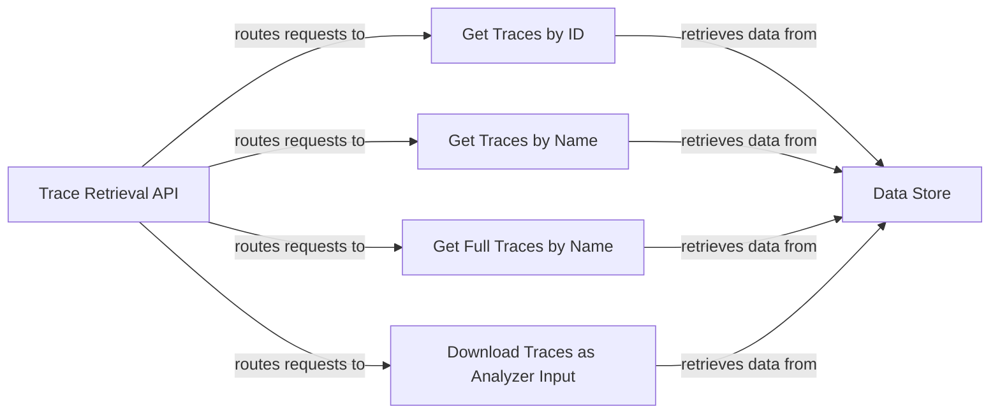

## Component Details

The Dataset Trace Retrieval subsystem provides functionalities to retrieve and download traces associated with a specific dataset. It supports retrieval based on dataset ID or name, offering options to retrieve full traces or traces formatted for analyzer input. The core purpose is to enable users to access and analyze dataset behavior and performance through its traces.

### Trace Retrieval API
This component serves as the entry point for all trace retrieval requests. It defines the API endpoints for retrieving traces by ID, name, full name, and downloading traces for analyzer input. It receives requests, calls the appropriate retrieval components, and returns the results.
- **Related Classes/Methods**: `explorer.app-api.routes.dataset.traces:get_traces_by_id`, `explorer.app-api.routes.dataset.traces:get_traces_by_name`, `explorer.app-api.routes.dataset.traces:get_traces_by_name_full`, `explorer.app-api.routes.dataset.traces:download_traces_as_analyzer_input`

### Get Traces by ID
This component retrieves trace data based on a given dataset ID. It interacts with the data store to fetch traces associated with the specified ID and returns the trace data to the Trace Retrieval API.
- **Related Classes/Methods**: `explorer.app-api.routes.dataset.traces:get_traces_by_id`

### Get Traces by Name
This component retrieves trace data based on a given dataset name. It queries the data store for traces associated with the specified name and returns the trace data to the Trace Retrieval API.
- **Related Classes/Methods**: `explorer.app-api.routes.dataset.traces:get_traces_by_name`

### Get Full Traces by Name
This component retrieves complete trace data based on a dataset name. It fetches all available trace information associated with the specified name and returns it to the Trace Retrieval API.
- **Related Classes/Methods**: `explorer.app-api.routes.dataset.traces:get_traces_by_name_full`

### Download Traces as Analyzer Input
This component downloads trace data in a format suitable for input to an analyzer tool. It retrieves the trace data and formats it according to the analyzer's requirements before providing it for download through the Trace Retrieval API.
- **Related Classes/Methods**: `explorer.app-api.routes.dataset.traces:download_traces_as_analyzer_input`

### Data Store
This component represents the underlying data storage system where trace data is persisted. It provides the necessary interfaces and mechanisms for retrieving trace data based on IDs or names. The other components use this component to retrieve the trace data.
- **Related Classes/Methods**: _None_
