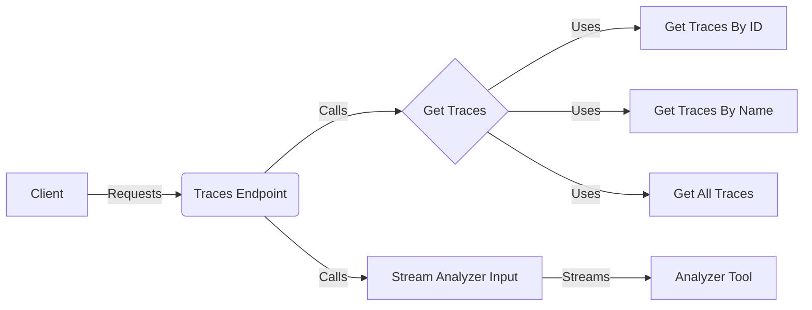

**Component: Client**
*Description*: The entity that initiates requests for dataset traces. This could be a user interface, another service, or an automated script.
*Interaction*: Sends requests to the `Traces Endpoint` to retrieve dataset traces.
*Relevant source files*: N/A

**Component: Traces Endpoint**
*Description*: Handles incoming requests for dataset traces, providing different ways to retrieve traces (by ID, name, or all traces) and offering the functionality to download traces in a format suitable for analyzer input.
*Interaction*: Receives requests from the `Client`, routes them to the appropriate `Get Traces` component, and calls the `Stream Analyzer Input` component when traces need to be downloaded for analysis.
*Relevant source files*:
    *   `repos.explorer.app-api.routes.dataset.traces:get_traces_by_id`
    *   `repos.explorer.app-api.routes.dataset.traces:get_traces_by_name`
    *   `repos.explorer.app-api.routes.dataset.traces:get_traces_by_name_full`
    *   `repos.explorer.app-api.routes.dataset.traces:download_traces_as_analyzer_input`

**Component: Get Traces**
*Description*: Abstracts the logic for retrieving traces based on a specific query. This component likely interacts with a data access layer to fetch the requested traces.
*Interaction*: Called by the `Traces Endpoint` to retrieve traces based on different criteria (ID, name, all traces). It then uses the specific retrieval components (`Get Traces By ID`, `Get Traces By Name`, `Get All Traces`) to fetch the data.
*Relevant source files*: `repos.explorer.app-api.routes.dataset.traces:get_traces`

**Component: Get Traces By ID**
*Description*: Retrieves traces based on their unique identifier.
*Interaction*: Used by the `Get Traces` component when a request specifies a trace ID.
*Relevant source files*: `repos.explorer.app-api.routes.dataset.traces:get_traces_by_id`

**Component: Get Traces By Name**
*Description*: Retrieves traces based on their name.
*Interaction*: Used by the `Get Traces` component when a request specifies a trace name.
*Relevant source files*: `repos.explorer.app-api.routes.dataset.traces:get_traces_by_name`, `repos.explorer.app-api.routes.dataset.traces:get_traces_by_name_full`

**Component: Get All Traces**
*Description*: Retrieves all available traces from the data store. This component might be used for administrative purposes or when a complete dataset overview is needed.
*Interaction*: Used by the `Get Traces` component when a request asks for all traces.
*Relevant source files*: `repos.explorer.app-api.routes.dataset.traces:get_all_traces`

**Component: Stream Analyzer Input**
*Description*: Transforms and streams traces in a specific format that can be directly consumed by an analyzer tool. This component optimizes the process of providing trace data for analysis.
*Interaction*: Called by the `Traces Endpoint` to format and stream traces to the `Analyzer Tool`.
*Relevant source files*: `repos.explorer.app-api.routes.dataset.traces.download_traces_as_analyzer_input.stream_analyzer_input`

**Component: Analyzer Tool**
*Description*: An external tool that consumes the streamed trace data for analysis.
*Interaction*: Receives the formatted trace data stream from the `Stream Analyzer Input` component.
*Relevant source files*: N/A