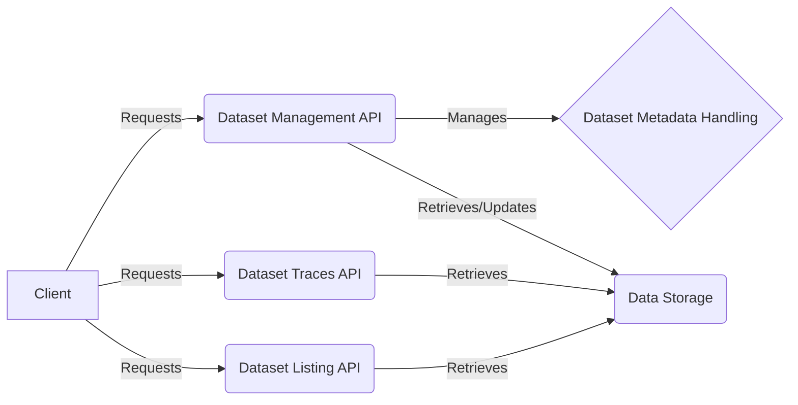

## Project Description
The `explorer` project provides an API for managing and accessing datasets and their traces. It includes functionalities for CRUD operations on datasets, handling dataset metadata, and retrieving dataset traces, with potential support for downloading traces for analyzer input. The API also supports listing datasets, including fetching datasets for the homepage.

## Data Flow Diagram

## Component Descriptions

**Dataset Management API:** This component serves as the central point for managing datasets. It receives requests from the client for creating, reading, updating, and deleting datasets. It interacts with the `Dataset Metadata Handling` component to validate and update dataset metadata and uses `Data Storage` to persist dataset information.

**Dataset Metadata Handling:** This component is responsible for validating and updating dataset metadata. It receives metadata updates from the `Dataset Management API` and applies validation rules to ensure data integrity. It does not directly interact with the client or data storage but provides essential data validation services to the `Dataset Management API`.

**Dataset Traces API:** This component handles requests for retrieving dataset traces. It receives requests from the client and fetches the requested traces from `Data Storage`. It then returns the traces to the client, potentially including functionality for downloading traces as analyzer input.

**Dataset Listing API:** This component provides endpoints for listing datasets. It receives requests from the client and retrieves dataset information from `Data Storage`. It then returns the list of datasets to the client, potentially including fetching datasets for the homepage.

**Data Storage:** This component represents the underlying data storage system where datasets and their metadata are stored. All other components use this component to persist and retrieve data.