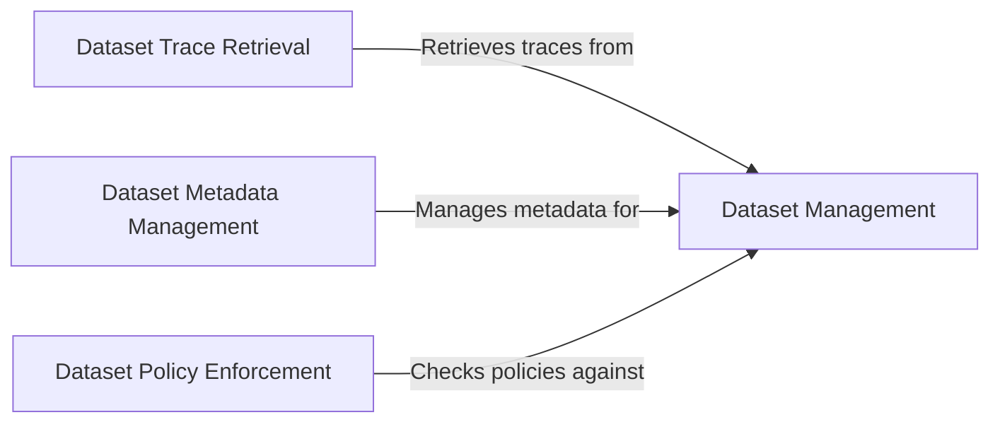

## Component Details

The Explorer project revolves around managing and interacting with datasets. The core functionality includes creating, retrieving, updating, and deleting datasets, along with managing associated metadata, retrieving traces, and enforcing policies. The system is designed to provide a comprehensive interface for dataset management and analysis.

### Dataset Management
This component provides the core functionality for managing datasets. It handles the creation, retrieval, update, and deletion of datasets, as well as listing available datasets. It serves as the central hub for dataset-related operations.
- **Related Classes/Methods**: `explorer.app-api.routes.dataset.crud:get_dataset_by_id`, `explorer.app-api.routes.dataset.crud:get_dataset_by_name`, `explorer.app-api.routes.dataset.crud:delete_dataset_by_id`, `explorer.app-api.routes.dataset.crud:delete_dataset_by_name`, `explorer.app-api.routes.dataset.crud:update_dataset_by_id`, `explorer.app-api.routes.dataset.crud:update_dataset_by_name`, `explorer.app-api.routes.dataset.list:list_datasets`

### Dataset Trace Retrieval
This component focuses on retrieving traces associated with a dataset. It allows users to access and download traces, enabling detailed analysis of dataset behavior and performance. It supports retrieval by ID and name, and offers options for full trace retrieval and downloading traces for analyzer input.
- **Related Classes/Methods**: `explorer.app-api.routes.dataset.traces:get_traces_by_id`, `explorer.app-api.routes.dataset.traces:get_traces_by_name`, `explorer.app-api.routes.dataset.traces:get_traces_by_name_full`, `explorer.app-api.routes.dataset.traces:download_traces_as_analyzer_input`

### Dataset Metadata Management
This component is responsible for managing the metadata associated with datasets. It includes functionalities for updating metadata and validating metadata fields, ensuring the integrity and consistency of dataset metadata. It defines metadata field types and validation rules.
- **Related Classes/Methods**: `explorer.app-api.routes.dataset_metadata:update_dataset_metadata`, `explorer.app-api.routes.dataset_metadata.TestReportField:__init__`, `explorer.app-api.routes.dataset_metadata.PrimitiveMetadataField:__init__`, `explorer.app-api.routes.dataset_metadata.NonEmptyStringMetadataField:validate`, `explorer.app-api.routes.dataset_metadata.PositiveNumber:validate`

### Dataset Policy Enforcement
This component enforces policies on datasets, ensuring that they adhere to defined rules and constraints. It checks datasets against these policies, providing a mechanism for compliance and quality control. It supports streaming policy checks for efficient processing.
- **Related Classes/Methods**: `explorer.app-api.routes.dataset.policy_checking:policy_check_stream`, `explorer.app-api.routes.dataset.policy_checking:stream_policy_check`