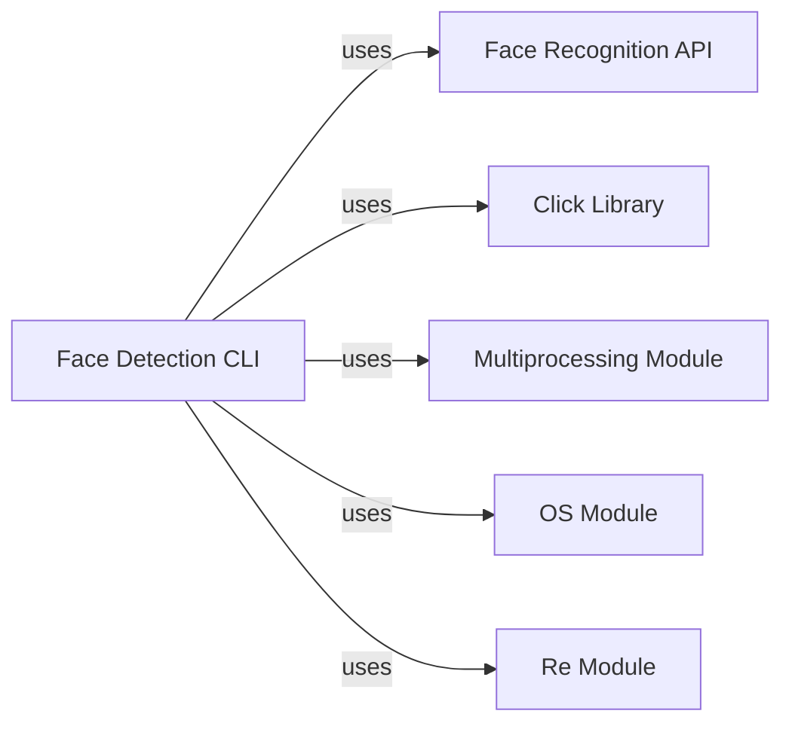

## Component Details

These components are fundamental because they collectively enable the `Face Detection CLI` to function as a complete and efficient tool: 1. **Face Detection CLI**: This is the user-facing entry point. It's fundamental because it provides the accessibility and ease of use for the underlying face detection capabilities, allowing non-programmers to utilize the system. Without it, users would need to write custom scripts. 2. **Face Recognition API**: This is the core engine. It's fundamental because it contains the actual algorithms and logic for face detection. The CLI is merely a wrapper; the API provides the essential functionality that makes the project valuable. 3. **Click Library**: This is fundamental for building a robust and standard command-line interface. It abstracts away the complexities of argument parsing, help message generation, and command dispatching, making the CLI user-friendly and maintainable. 4. **Multiprocessing Module**: This is fundamental for performance. For a task like image processing, which can be computationally intensive, parallelization is crucial. The `multiprocessing` module allows the CLI to leverage multiple CPU cores, significantly speeding up the processing of large image datasets. 5. **OS Module**: This is fundamental for any application that interacts with the file system. The CLI needs to read input files, determine if the input is a single file or a directory, and list files within directories. The `os` module provides these essential file system interaction capabilities. 6. **Re Module**: This is fundamental for input validation and filtering. When processing directories, the CLI needs to identify which files are actual images. The `re` module allows for robust pattern matching to ensure only relevant image files are processed, preventing errors and improving efficiency.

### Face Detection CLI
This component provides the command-line interface for users to perform face detection on images. It parses command-line arguments, validates input, and orchestrates the calls to the core face detection API. It supports processing single images or entire directories, with an option for parallel processing.

**Related Classes/Methods**:

- <a href="https://github.com/ageitgey/face_recognition/blob/master/face_recognition/face_detection_cli.py#L1-L1" target="_blank" rel="noopener noreferrer">`face_recognition.face_detection_cli` (1:1)</a>

### Face Recognition API
This component encapsulates the core logic and algorithms for face detection. It provides functions to load images and detect face locations within them. It serves as the programmatic interface for face detection capabilities.

**Related Classes/Methods**:

- <a href="https://github.com/ageitgey/face_recognition/blob/master/face_recognition/api.py#L1-L1" target="_blank" rel="noopener noreferrer">`face_recognition.api` (1:1)</a>

### Click Library
An external library used for building command-line interfaces. It simplifies argument parsing, command definition, and user interaction for the `Face Detection CLI`.

**Related Classes/Methods**: _None_

### Multiprocessing Module
A standard Python library used by the `Face Detection CLI` to enable parallel processing of images across multiple CPU cores, significantly improving performance when handling large sets of images.

**Related Classes/Methods**: _None_

### OS Module
A standard Python library used for interacting with the operating system, specifically for file system operations such as checking if a path is a directory, listing directory contents, and joining paths.

**Related Classes/Methods**: _None_

### Re Module
A standard Python library for regular expressions, used by the `Face Detection CLI` to filter and identify image files (e.g., .jpg, .jpeg, .png) within a given directory.

**Related Classes/Methods**: _None_

### [FAQ](https://github.com/CodeBoarding/GeneratedOnBoardings/tree/main?tab=readme-ov-file#faq)