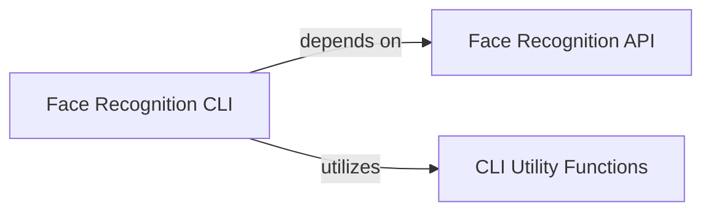

## Component Details

This subsystem is designed to provide a robust command-line interface for recognizing and identifying known individuals in images. It achieves this by first "learning" known faces (generating and storing their encodings) and then comparing new faces against this learned dataset.

### Face Recognition CLI
This component serves as the primary command-line interface for the face recognition application. It orchestrates the entire workflow, including scanning known individuals, processing input images, and displaying recognition results. It handles user input, manages multiprocessing for efficiency, and integrates with the core face recognition functionalities.

**Related Classes/Methods**:

- <a href="https://github.com/ageitgey/face_recognition/blob/master/face_recognition/api.py#L77-L88" target="_blank" rel="noopener noreferrer">`face_recognition.api:load_image_file` (77:88)</a>
- <a href="https://github.com/ageitgey/face_recognition/blob/master/face_recognition/api.py#L202-L213" target="_blank" rel="noopener noreferrer">`face_recognition.api:face_encodings` (202:213)</a>
- <a href="https://github.com/ageitgey/face_recognition/blob/master/face_recognition/api.py#L62-L74" target="_blank" rel="noopener noreferrer">`face_recognition.api:face_distance` (62:74)</a>
- <a href="https://github.com/ageitgey/face_recognition/blob/master/face_recognition/face_recognition_cli.py#L13-L31" target="_blank" rel="noopener noreferrer">`face_recognition_cli:scan_known_people` (13:31)</a>
- <a href="https://github.com/ageitgey/face_recognition/blob/master/face_recognition/face_recognition_cli.py#L41-L63" target="_blank" rel="noopener noreferrer">`face_recognition_cli:test_image` (41:63)</a>
- <a href="https://github.com/ageitgey/face_recognition/blob/master/face_recognition/face_recognition_cli.py#L34-L38" target="_blank" rel="noopener noreferrer">`face_recognition_cli:print_result` (34:38)</a>
- <a href="https://github.com/ageitgey/face_recognition/blob/master/face_recognition/face_recognition_cli.py#L66-L67" target="_blank" rel="noopener noreferrer">`face_recognition_cli:image_files_in_folder` (66:67)</a>
- <a href="https://github.com/ageitgey/face_recognition/blob/master/face_recognition/face_recognition_cli.py#L70-L91" target="_blank" rel="noopener noreferrer">`face_recognition_cli:process_images_in_process_pool` (70:91)</a>

### Face Recognition API
This component provides the foundational, low-level functionalities for face detection, face encoding, and face comparison. It acts as the core library that the CLI components leverage to perform the actual image processing and facial analysis.

**Related Classes/Methods**: _None_

### CLI Utility Functions
These are internal helper functions within the `Face Recognition CLI` component that support its operation. They handle tasks suchs as filtering image files within a folder, printing formatted results to the console, and managing the multiprocessing pool for parallel image processing.

**Related Classes/Methods**: _None_

### [FAQ](https://github.com/CodeBoarding/GeneratedOnBoardings/tree/main?tab=readme-ov-file#faq)