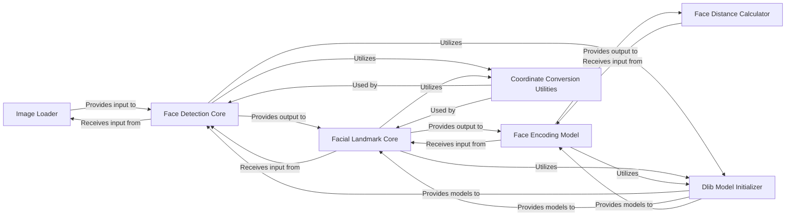

## Component Details

The Face Recognition Core API component, primarily implemented in face_recognition/api.py, serves as the foundational layer for the face_recognition library. It encapsulates the low-level, computationally intensive operations required for face detection, facial landmark identification, and face encoding generation. This component acts as a central engine, exposing high-level functions that abstract away the complexities of underlying computer vision tasks, making it accessible for higher-level applications and command-line interfaces within the library.

### Image Loader
This component is responsible for loading various image file formats (e.g., JPG, PNG) into a NumPy array, which is the standard data structure for image processing within the library. It ensures images are in a consistent format (e.g., RGB) for subsequent operations.

**Related Classes/Methods**:

- `load_image_file` (78:89)

### Face Detection Core
This component implements the primary logic for identifying the bounding boxes of human faces within an image. It supports both the less accurate but faster HOG (Histogram of Oriented Gradients) model and the more accurate, GPU-accelerated CNN (Convolutional Neural Network) model, including batched processing for efficiency.

**Related Classes/Methods**:

- `_raw_face_locations` (92:151)
- `face_locations` (92:151)
- `_raw_face_locations_batched` (92:151)
- `batch_face_locations` (92:151)

### Facial Landmark Core
This component is responsible for pinpointing key facial features (e.g., eyes, nose, mouth, chin outline) within the detected face regions. It uses pre-trained Dlib models (68-point for detailed landmarks or 5-point for faster, less detailed results).

**Related Classes/Methods**:

- `_raw_face_landmarks` (154:198)
- `face_landmarks` (154:198)

### Face Encoding Model
This component leverages a pre-trained Dlib deep learning model to transform the detected facial landmarks into a 128-dimensional face embedding (a unique numerical vector). This embedding captures the distinctive features of a face, making it suitable for comparison.

**Related Classes/Methods**:

- `face_encoder` (29:29)

### Face Distance Calculator
This component calculates the Euclidean distance between two or more face encodings. The distance value quantifies the similarity between faces, with smaller distances indicating higher similarity.

**Related Classes/Methods**:

- <a href="https://github.com/ageitgey/face_recognition/blob/master/examples/face_distance.py#L63-L75" target="_blank" rel="noopener noreferrer">`face_distance` (63:75)</a>

### Dlib Model Initializer
This component is responsible for loading and initializing the various pre-trained Dlib models required for face detection, facial landmark prediction, and face encoding. It ensures that the underlying C++ libraries and models are ready for use.

**Related Classes/Methods**:

- `Dlib Model Initializer` (17:29)

### Coordinate Conversion Utilities
This set of internal helper functions manages the conversion between Dlib's `rect` object format and a more user-friendly CSS-like tuple format (top, right, bottom, left). It also includes utilities to ensure that coordinates remain within the image boundaries.

**Related Classes/Methods**:

- `_rect_to_css` (32:60)
- `_css_to_rect` (32:60)
- `_trim_css_to_bounds` (32:60)

### [FAQ](https://github.com/CodeBoarding/GeneratedOnBoardings/tree/main?tab=readme-ov-file#faq)