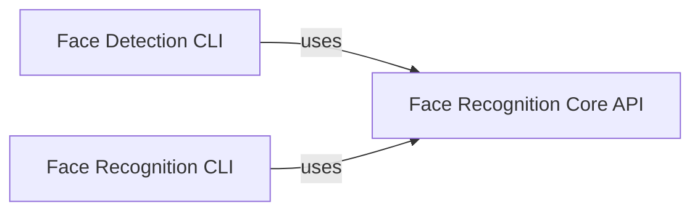

## Component Details

The `face_recognition` project is structured around a core API that provides fundamental face processing capabilities, which are then leveraged by two distinct command-line interface (CLI) applications. These three components were chosen because they represent the distinct and critical functionalities within the `face_recognition` project, as identified by both the Control Flow Graph (CFG) and the file structure. `face_recognition.api` (Face Recognition Core API) is fundamental because it is the producer of all core face processing capabilities. Both CLI tools directly depend on it to perform their operations. Its absence would render the entire project non-functional. The CFG clearly shows both CLI components "using" this API. `face_recognition.face_detection_cli` (Face Detection CLI) is fundamental as it serves as a direct application of the core API for a specific, common task: face detection. It provides a user-friendly entry point for this functionality, abstracting away the underlying complexities. `face_recognition.face_recognition_cli` (Face Recognition CLI) is fundamental because it represents the most comprehensive application of the core API, enabling full face identification. This involves not just detection but also learning and comparison, making it a complete solution for a key problem domain. The relationships are clear: both CLI tools act as consumers of the `Face Recognition Core API`, demonstrating a clean separation of concerns between the core logic and its application interfaces. This architecture allows for modularity and reusability of the core face recognition functionalities.

### Face Recognition Core API
This is the foundational component of the `face_recognition` library. It encapsulates all the low-level, computationally intensive operations related to face detection, landmark identification, and encoding generation. It acts as the central engine, providing essential functionalities that higher-level applications consume.

**Related Classes/Methods**:

- <a href="https://github.com/ageitgey/face_recognition/blob/master/face_recognition/api.py#L0-L0" target="_blank" rel="noopener noreferrer">`face_recognition/api.py` (0:0)</a>

### Face Detection CLI
This component provides a command-line interface specifically designed for detecting face locations within images. It simplifies the process of using the core API's face detection capabilities, allowing users to easily identify faces in single images or entire directories without writing code.

**Related Classes/Methods**:

- <a href="https://github.com/ageitgey/face_recognition/blob/master/face_recognition/face_detection_cli.py#L0-L0" target="_blank" rel="noopener noreferrer">`face_recognition/face_detection_cli.py` (0:0)</a>

### Face Recognition CLI
This component offers a comprehensive command-line tool for recognizing and identifying known individuals in images. It extends beyond simple detection by first "learning" known faces (generating and storing their encodings) and then comparing new faces against this learned dataset to identify individuals.

**Related Classes/Methods**:

- <a href="https://github.com/ageitgey/face_recognition/blob/master/face_recognition/face_recognition_cli.py#L0-L0" target="_blank" rel="noopener noreferrer">`face_recognition/face_recognition_cli.py` (0:0)</a>

### [FAQ](https://github.com/CodeBoarding/GeneratedOnBoardings/tree/main?tab=readme-ov-file#faq)