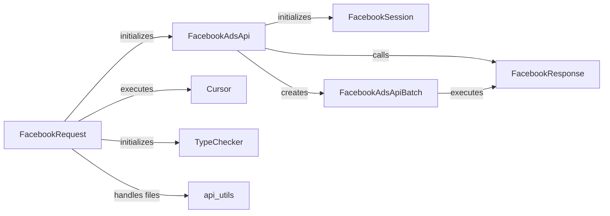

## Component Details

### FacebookSession
Manages the session with the Facebook API, including access token handling, app secret proof generation, and API versioning. It is responsible for initializing the session and providing methods for refreshing the access token. It encapsulates the authentication details and provides a secure context for API interactions.
- **Related Classes/Methods**: `facebook_business.session.FacebookSession`

### FacebookAdsApi
The main entry point for interacting with the Facebook Ads API. It handles API initialization, session management, and calling different API endpoints. It also enables crash reporting and handles errors. It acts as a central hub, coordinating requests and responses with the Facebook API.
- **Related Classes/Methods**: `facebook_business.api.FacebookAdsApi`

### FacebookRequest
Represents a single API request to Facebook. It handles parameter encoding, file uploads, request execution, and error handling. It also interacts with the TypeChecker to validate parameters. It encapsulates the details of a specific API call, ensuring proper formatting and execution.
- **Related Classes/Methods**: `facebook_business.api.FacebookRequest`

### FacebookResponse
Represents the response from a Facebook API request. It handles error checking, JSON parsing, and returning the data. It also raises exceptions for API errors. It provides a structured way to access the data returned by the Facebook API, handling potential errors and data transformations.
- **Related Classes/Methods**: `facebook_business.api.FacebookResponse`

### FacebookAdsApiBatch
Enables batch execution of multiple API requests. It handles adding requests to the batch and executing the batch. It interacts with the FacebookAdsApi to execute the requests. It optimizes API interactions by grouping multiple requests into a single call, improving efficiency.
- **Related Classes/Methods**: `facebook_business.api.FacebookAdsApiBatch`

### Cursor
Handles pagination of API responses, allowing iteration over large datasets. It fetches the next page of data and parses the objects. It interacts with the ObjectParser to parse the objects. It simplifies the process of retrieving large amounts of data by automatically handling pagination.
- **Related Classes/Methods**: `facebook_business.api.Cursor`

### TypeChecker
Validates the types of parameters passed to the API requests. It handles type conversion and raises exceptions for invalid parameter types. It is used by the FacebookRequest to validate parameters. It ensures data integrity by verifying that the parameters passed to the API are of the correct type.
- **Related Classes/Methods**: `facebook_business.typechecker.TypeChecker`

### api_utils
Provides utility functions for the API, such as handling warnings and file uploads. It is used by the FacebookRequest to handle files and parameters. It offers a collection of helper functions that streamline common API tasks.
- **Related Classes/Methods**: `facebook_business.utils.api_utils`
