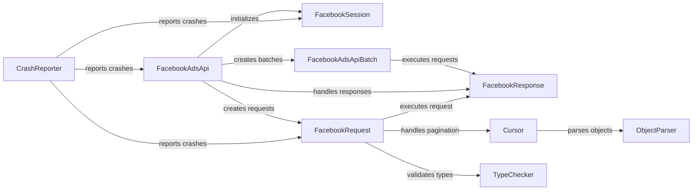

## Component Details

### FacebookSession
Manages the session with the Facebook API, handling access tokens and app secret proofs. It encapsulates the authentication details required for making API requests, ensuring secure communication with Facebook's servers. It is initialized with the app ID, app secret, and access token.
- **Related Classes/Methods**: `facebook_business.session.FacebookSession`

### FacebookAdsApi
The primary interface for interacting with the Facebook Ads API. It initializes the API with session details obtained from `FacebookSession` and provides methods for creating `FacebookRequest` and `FacebookAdsApiBatch` objects. It acts as the entry point for most API operations.
- **Related Classes/Methods**: `facebook_business.api.FacebookAdsApi`

### FacebookRequest
Represents a single API request to Facebook. It handles the construction of the request, including parameters, file uploads, and execution. It uses `TypeChecker` to validate parameters and `api_utils` for encoding. Upon execution, it receives a `FacebookResponse`.
- **Related Classes/Methods**: `facebook_business.api.FacebookRequest`

### FacebookResponse
Represents the response received from a Facebook API request. It handles error checking, JSON parsing, and returns the data. It is created by `FacebookRequest` after executing the API call and provides the data or error information.
- **Related Classes/Methods**: `facebook_business.api.FacebookResponse`

### FacebookAdsApiBatch
Enables the execution of multiple API requests in a single batch. It optimizes the process of sending multiple requests to Facebook, reducing overhead. It contains a list of `FacebookRequest` objects and returns a list of `FacebookResponse` objects upon execution.
- **Related Classes/Methods**: `facebook_business.api.FacebookAdsApiBatch`

### Cursor
Handles pagination of API responses, allowing iteration over large datasets. It fetches subsequent pages of data using cursors provided in the API responses. It uses `ObjectParser` to parse the objects in the response.
- **Related Classes/Methods**: `facebook_business.api.Cursor`

### TypeChecker
Validates the types of parameters passed to the API requests. It ensures that the data being sent to Facebook conforms to the expected types, preventing errors. It is used by `FacebookRequest` before sending the request.
- **Related Classes/Methods**: `facebook_business.typechecker.TypeChecker`

### ObjectParser
Parses the JSON responses from the API into Python objects, making the data easier to work with in Python code. It is used by `Cursor` to convert the raw JSON data into usable objects.
- **Related Classes/Methods**: `facebook_business.adobjects.objectparser.ObjectParser`

### CrashReporter
Reports crashes and exceptions to Facebook, aiding in debugging and improving the SDK. It is used by `FacebookAdsApi`, `FacebookSession`, and `FacebookRequest` to report any errors encountered during their operation.
- **Related Classes/Methods**: `facebook_business.crashreporter.CrashReporter`
