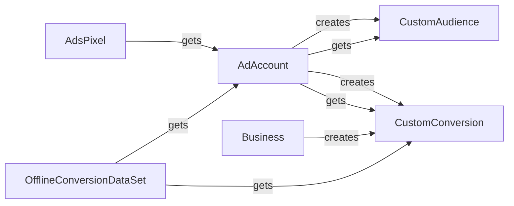

## Component Details

The Audience Management subsystem in the Facebook Marketing API revolves around managing custom audiences for targeted advertising. The core flow involves creating, updating, and deleting custom audiences, as well as adding or removing users. This system interacts with AdAccounts, Businesses, AdsPixels, CustomConversions, and OfflineConversionDataSets to facilitate precise ad targeting and conversion tracking.

### CustomAudience
Represents a Facebook Custom Audience, enabling advertisers to target specific groups of people. It provides methods for creating, updating, deleting, and retrieving custom audiences, as well as managing associated ad accounts and users. This is the central component for audience management.
- **Related Classes/Methods**: `facebook_business.adobjects.customaudience.CustomAudience`

### AdAccount
Represents a Facebook Ad Account. It provides methods for creating and retrieving custom audiences and custom conversions associated with the ad account. AdAccount is essential for managing advertising campaigns and related resources.
- **Related Classes/Methods**: `facebook_business.adobjects.adaccount.AdAccount`

### Business
Represents a Facebook Business. It provides methods for creating custom conversions associated with the business. Business accounts are used to manage multiple ad accounts and related resources.
- **Related Classes/Methods**: `facebook_business.adobjects.business.Business`

### AdsPixel
Represents a Facebook Ads Pixel, which tracks website events for advertising purposes. It provides methods for managing ad accounts, agencies, users, events, and shared accounts associated with the pixel. AdsPixel is crucial for tracking user behavior and optimizing ad campaigns.
- **Related Classes/Methods**: `facebook_business.adobjects.adspixel.AdsPixel`

### CustomConversion
Represents a Facebook Custom Conversion, which tracks specific actions on a website or app. It provides methods for creating, updating, deleting, and retrieving custom conversions, as well as retrieving statistics. CustomConversion helps in measuring the effectiveness of ad campaigns.
- **Related Classes/Methods**: `facebook_business.adobjects.customconversion.CustomConversion`

### OfflineConversionDataSet
Represents a Facebook Offline Conversion Data Set, which allows advertisers to upload offline conversion data. It provides methods for retrieving information about ad accounts, agencies, audiences, custom conversions, and uploads associated with the data set. OfflineConversionDataSet enables advertisers to integrate offline data with online advertising efforts.
- **Related Classes/Methods**: `facebook_business.adobjects.offlineconversiondataset.OfflineConversionDataSet`
