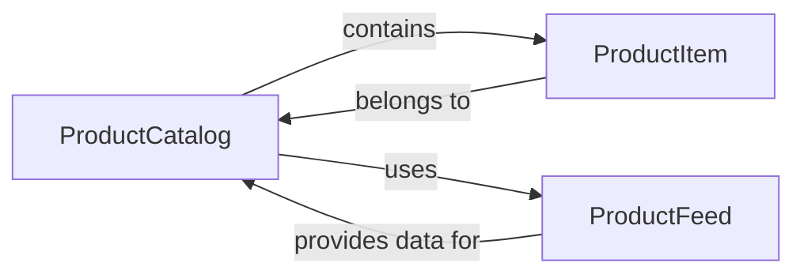

## Component Details

The Catalog Management component is responsible for managing product catalogs, product items, and product feeds within the Facebook advertising ecosystem. It allows users to create, update, and delete catalogs, as well as manage the products and data feeds associated with them. This enables businesses to effectively organize and present their product inventory for dynamic product ads, facilitating personalized advertising experiences for potential customers.

### ProductCatalog
Represents a product catalog in Facebook's advertising system. It provides methods for managing the catalog's metadata, associating it with agencies and users, organizing products into categories, and connecting it to product feeds. It serves as the central hub for managing a collection of products for advertising purposes.
- **Related Classes/Methods**: `facebook_business.adobjects.productcatalog.ProductCatalog`

### ProductItem
Represents a single product within a product catalog. It allows for managing individual product details, such as title, description, price, and availability. It also provides methods for associating the product with product sets, enabling targeted advertising based on product groupings.
- **Related Classes/Methods**: `facebook_business.adobjects.productitem.ProductItem`

### ProductFeed
Represents a data feed that provides product information to a product catalog. It allows for managing the feed's configuration, including its source URL, update schedule, and data format. It also provides methods for managing feed rules and upload history, ensuring that the catalog stays up-to-date with the latest product information.
- **Related Classes/Methods**: `facebook_business.adobjects.productfeed.ProductFeed`
