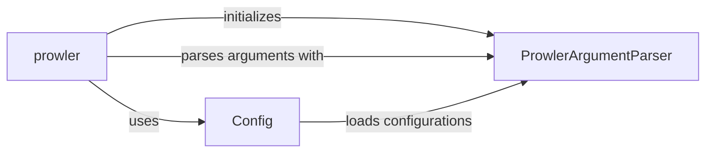

## Component Details

The Configuration and Input Management subsystem is responsible for configuring Prowler before a scan. It involves parsing command-line arguments using `ProwlerArgumentParser`, loading configuration files, managing environment variables, and merging configurations from different sources using the `Config` class. The `prowler` main function initializes the argument parser, parses arguments, and initializes the configuration based on the parsed arguments, providing a centralized access point for retrieving configuration values throughout the application.

### ProwlerArgumentParser
Defines and parses command-line arguments for Prowler using the `argparse` module. It specifies available options and their expected values, providing a user-friendly interface for configuring Prowler's behavior. It handles the definition of arguments and their parsing from the command line.
- **Related Classes/Methods**: `prowler.lib.cli.parser.ProwlerArgumentParser`

### Config
Manages Prowler's configuration settings, including loading configuration files, handling environment variables, and merging configurations from different sources. It provides a centralized access point for retrieving configuration values throughout the application. It is responsible for loading, merging, and providing access to configuration parameters.
- **Related Classes/Methods**: `prowler.config.config`

### prowler
The main function of the Prowler application. It initializes the argument parser, parses the command-line arguments, and initializes the configuration based on the parsed arguments. It orchestrates the configuration process by using `ProwlerArgumentParser` and `Config`.
- **Related Classes/Methods**: `prowler.prowler.__main__:prowler`
